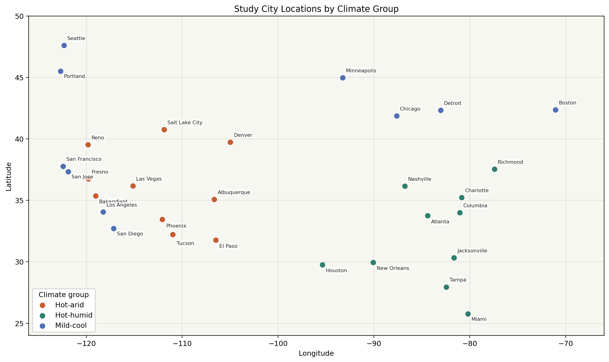
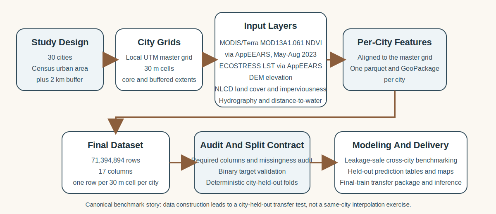
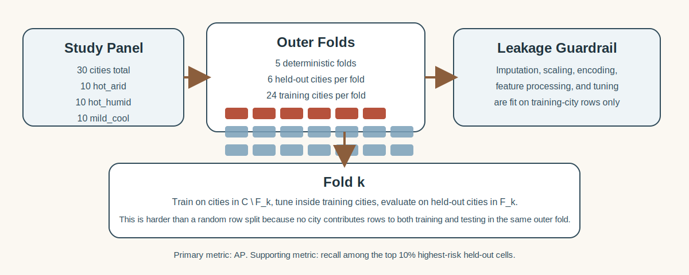
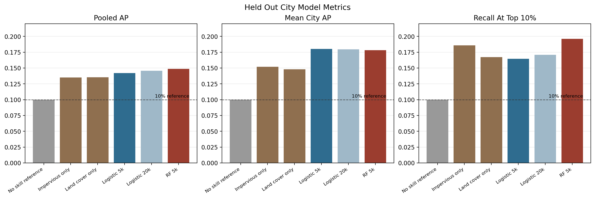
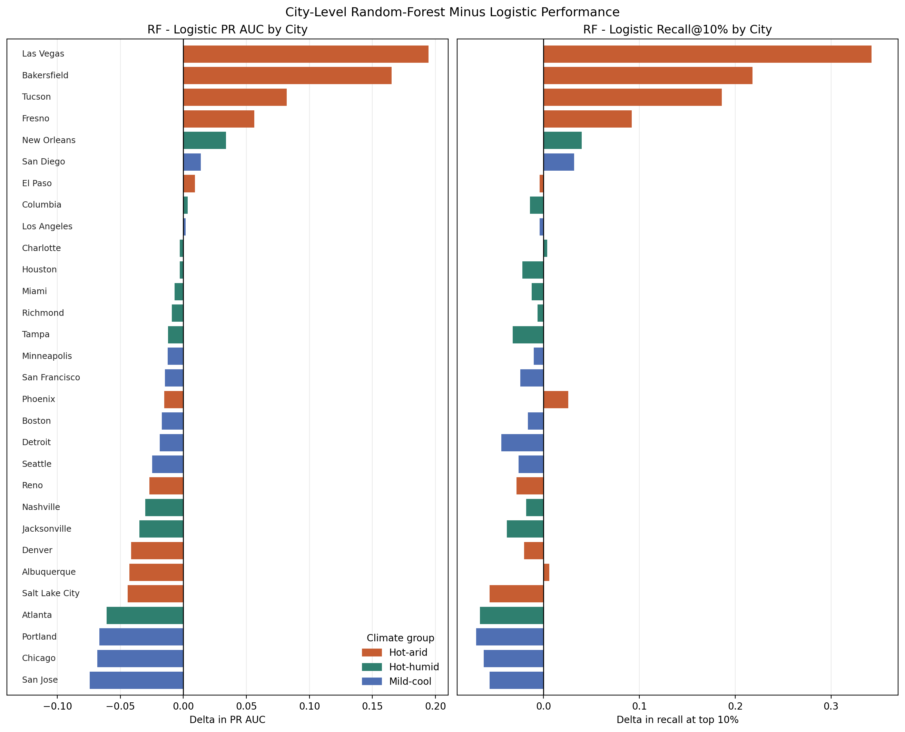
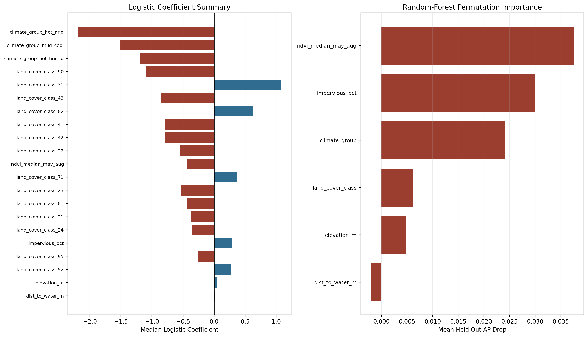
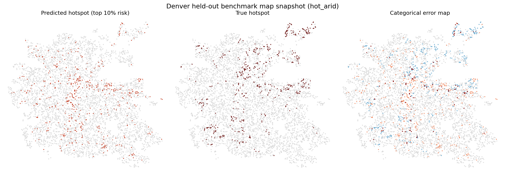
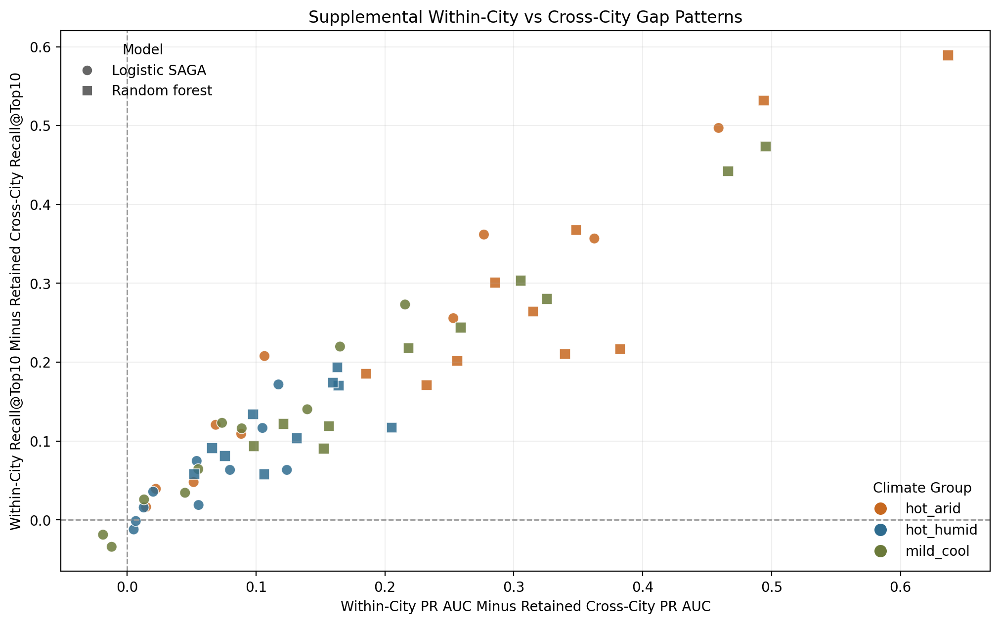

# Cross-City Urban Heat Hotspot Prediction

## Data Construction, City-Held-Out Evaluation, and Current Transfer-Learning Evidence

Prepared from retained project artifacts in the repository as of 2026-04-18.

## Executive Summary

This project asks whether urban heat hotspots can be predicted in cities that were not seen during model training. That is a substantially harder question than conventional within-city prediction, because a model must transfer across differences in climate regime, land-cover composition, vegetation, terrain, and built form rather than exploiting city-specific spatial regularities that appear in both training and testing.

The current pipeline produces an audited 30 m cell-level dataset for 30 U.S. cities. The canonical merged dataset contains 71,394,894 rows and 17 columns, with one row per grid cell per city. Features combine aligned measures of imperviousness, land cover, elevation, distance to water, vegetation, and climate context, while the target marks whether a cell belongs to the hottest within-city decile of summertime land surface temperature after row-level quality filtering. The modeling benchmark then evaluates cross-city transfer with five outer folds, each holding out six entire cities at a time.

The headline result is encouraging but qualified. All tuned models outperform the strongest simple transfer baselines on pooled precision-recall performance. In the retained matched 5,000-rows-per-city comparison, random forest improves pooled PR AUC from 0.1421 to 0.1486 and recall among the top 10% highest-risk cells from 0.1647 to 0.1961 relative to logistic regression. However, logistic regression remains slightly stronger on mean city PR AUC (0.1803 versus 0.1781), and performance varies substantially across climate groups and cities. The report therefore supports a defensible conclusion that cross-city hotspot screening is feasible, but still moderate in difficulty and not yet uniformly reliable.

The most important caveat is that the retained benchmark is a sampled all-fold evaluation path rather than exhaustive scoring over all 71.4 million rows. That choice is documented in the repository as the practical benchmark path on the available workstation. The most practical implication is that the project has already progressed beyond a pure preprocessing exercise into a transferable screening framework, complete with a final-train transfer package and inference workflow, but model selection and deployment claims still need to be interpreted with care.

## Problem Motivation

Urban heat is a public-health, infrastructure, and planning problem. Fine-scale differences in land cover, vegetation, built intensity, and water proximity can create sharp thermal contrasts within the same metropolitan area, and those contrasts matter for heat exposure, resilience planning, and environmental justice work. A high-resolution screening model that identifies likely hotspot cells could help focus measurement, mitigation, and adaptation efforts.

Within-city prediction is the easier problem. When a model is trained and tested inside the same city, it can rely on recurring local patterns in urban form, topography, and vegetation structure that are specific to that place. Those same-city evaluations are useful for debugging, but they do not answer the practical transfer question. If the goal is to support a city that has not already contributed labeled training data, then the benchmark must ask whether signal learned from other cities carries into a truly unseen one.

This project is therefore framed as a transfer-learning and generalization problem. The aim is not merely to interpolate heat patterns within a known city. It is to estimate where the hottest cells are likely to occur in cities whose hotspot labels were not available when the model was fit.

## Research Question

The core research question is:

Can a model trained on a multi-city urban heat dataset identify hotspot cells in a city that was entirely excluded from training?

That question can be unpacked into three more specific claims that the benchmark tests:

1. Whether spatial predictors such as imperviousness, land cover, vegetation, elevation, distance to water, and broad climate context contain transfer-relevant signal for hotspot screening.
2. Whether a nonlinear model adds useful cross-city predictive structure beyond a linear probabilistic baseline.
3. Whether observed performance is strong enough, and stable enough across cities, to support the practical use of a transferable screening workflow.

## Data Construction And Modeling Dataset

The modeling dataset is built from a full geospatial workflow rather than from an ad hoc modeling table. Each city begins with a Census urban area containing the city center, then expands to a buffered study area, by default 2 km beyond the core urban geometry. A master 30 m grid is built in a local UTM coordinate system for each city, and all raster- and vector-derived predictors are aligned to that grid before per-city feature assembly.

The city set covers 30 U.S. cities, balanced across three climate groups: 10 hot-arid, 10 hot-humid, and 10 mild-cool cities. The final merged dataset contains 71,394,894 rows and 17 columns. Row counts vary substantially by city, from 382,964 cells in Bakersfield to 7,081,699 cells in Atlanta, which reflects real differences in study-area extent rather than a uniform sample size target.

*Figure 1. The 30 benchmark cities span the western, southern, and northern United States. The repository groups them into three broad climate categories to support transfer-oriented analysis rather than purely local modeling.*

The core feature families are:

- built environment: NLCD impervious percentage and land-cover class
- terrain and hydrology: elevation and distance to water
- vegetation: median May-Aug NDVI
- thermal outcome source: median May-Aug daytime ECOSTRESS land surface temperature
- contextual metadata: city identifier, city name, and climate group
- bounded expansion features already materialized in the canonical dataset: neighborhood tree-cover proxy, neighborhood vegetated-cover proxy, and neighborhood impervious-context mean within an approximately 270 m window

The primary benchmark intentionally freezes a smaller six-feature predictive contract for transfer modeling: imperviousness, land-cover class, elevation, distance to water, NDVI, and climate group. The broader dataset still retains the richer features so that expansion checkpoints can be tested explicitly rather than silently altering the headline benchmark.

The project also applies explicit row-level filtering rules during final assembly. Open-water cells are dropped when land-cover information identifies them as water, cells with fewer than three valid ECOSTRESS passes are excluded when land surface temperature is available, and the hotspot label is recomputed within each city after filtering. Those rules matter because they define both the quality-controlled modeling population and the final target.

The final dataset audit recorded the following high-level checks:

- 30 cities present in the merged parquet
- required columns present
- binary validation of `hotspot_10pct` passing
- 7,139,588 positive cells and 64,255,306 negative cells after final filtering

Missingness in the retained modeling features is low. Imperviousness, distance to water, land-cover class, and climate group are complete in the audit. Elevation is missing in 3,426 rows (0.0048%), NDVI is missing in 99,625 rows (0.1395%), and the Phase 3A neighborhood-context features are missing in 30,112 rows (0.0422%). In other words, the dataset supports cross-city evaluation with only minor residual incompleteness in the audited predictors.

*Figure 2. The project is an end-to-end workflow: buffered study areas and 30 m grids feed aligned per-city feature assembly, which feeds a canonical final dataset, which in turn feeds audit, fold construction, benchmarking, and transfer-package generation.*

## Prediction Target And Task Definition

The target is a city-relative hotspot indicator called `hotspot_10pct`. Let \(c\) index city and let \(S_c\) denote the set of valid cells remaining in city \(c\) after the project's final row filters. For each cell \(i \in S_c\), let \(y_{ic}\) be the filtered median May-Aug ECOSTRESS land surface temperature.

Define the within-city hotspot threshold as the 90th percentile of valid LST values:

$$
q_c = Q_{0.9}\left(\{y_{ic}: i \in S_c\}\right).
$$

The binary target is then

$$
\text{hotspot}_{ic} =
\begin{cases}
1, & y_{ic} \ge q_c \\
0, & y_{ic} < q_c .
\end{cases}
$$

This construction is important for interpretation. A positive case does not mean the cell exceeds one national absolute temperature threshold. It means the cell belongs to the hottest tail of its own city's filtered temperature distribution. That makes the label appropriate for within-city screening under cross-city climate differences, but it also means the task is about relative thermal risk inside each city, not direct comparison of absolute surface temperature severity across cities.

Because the threshold is computed from an empirical quantile, the positive share is approximately, rather than perfectly, 10% in each city. At full-dataset scale the audited prevalence is effectively 10.0%, which is why precision-recall metrics are more informative than raw accuracy.

The prediction task is therefore: given the non-thermal predictor set, estimate the probability that a held-out cell belongs to the hottest within-city decile. The model is not allowed to use `lst_median_may_aug`, `n_valid_ecostress_passes`, or geographic identifiers and coordinates as first-pass predictive inputs, because those variables would either leak target construction or undermine the intended portable feature contract.

## Evaluation Design

The evaluation design is the defining methodological choice in the project. The 30 cities are partitioned into five deterministic outer folds, with six held-out cities in each fold. For outer fold \(k\), let \(F_k\) denote the held-out set of cities. Training and evaluation are then defined as

$$
\mathcal{D}_{\text{train}}^{(k)} = \{(x_{ic}, y_{ic}) : c \notin F_k\},
\qquad
\mathcal{D}_{\text{test}}^{(k)} = \{(x_{ic}, y_{ic}) : c \in F_k\}.
$$

All preprocessing, imputation, scaling, encoding, feature engineering inside the model pipeline, and hyperparameter tuning are fit using training-city rows only. The repository's modeling contract explicitly treats random row splits as invalid for the main research question because a row-level split would allow the same city to contribute cells to both training and testing, thereby overstating generalization to a truly unseen city.

*Figure 3. Each outer fold withholds six entire cities and trains on the remaining 24. The crucial constraint is that preprocessing and tuning are learned only from training-city rows, which makes the benchmark a transfer test rather than a same-city interpolation exercise.*

The fold table in the repository confirms the five-fold, six-held-out-cities-per-fold structure. For example, one fold holds out Denver, Salt Lake City, Fresno, Portland, Chicago, and Minneapolis, while another holds out Albuquerque, El Paso, Nashville, Los Angeles, San Diego, and Detroit. Across all five folds every city is held out exactly once.

The primary metric is PR AUC, which is appropriate because the target is intentionally imbalanced at roughly 10% positives. The report also uses recall among the top 10% highest-risk cells because that metric maps well to a screening use case: if a city were to inspect only the cells the model ranks highest, how many true hotspots would be recovered?

If \(T_k\) is the set of held-out cells in fold \(k\) that fall in the top 10% of predicted risk, then recall at top 10% is

$$
\text{Recall@Top10\%}^{(k)} =
\frac{\sum_{i \in T_k} \mathbf{1}(y_i = 1)}
{\sum_{i \in \mathcal{D}_{\text{test}}^{(k)}} \mathbf{1}(y_i = 1)}.
$$

Calibration-curve tables are also retained in the modeling outputs, although the current headline narrative is driven mainly by ranking and retrieval performance.

## Models

The project compares a linear probabilistic baseline and a nonlinear tree ensemble under the same leakage-safe feature contract.

### Logistic Regression

The logistic baseline models hotspot probability as

$$
\Pr(Y=1 \mid x) = \sigma(\beta_0 + x^\top \beta),
\qquad
\sigma(z)=\frac{1}{1+e^{-z}}.
$$

In plain language, logistic regression assumes that predictors contribute additively to the log-odds of hotspot status. The implementation uses an sklearn pipeline with train-only preprocessing: median imputation and standardization for numeric variables, plus most-frequent imputation and one-hot encoding for categorical variables. The classifier is fit with the `saga` solver, and the tuning grid spans regularization strength and the effective regularization family through `l1_ratio`, allowing L2, L1, and elastic-net variants.

This model is a strong reference point because it is interpretable, computationally manageable, and often competitive when the transferable signal is mostly additive.

### Random Forest

The random-forest model predicts probability by averaging across many decision trees:

$$
\hat{p}(x) = \frac{1}{B}\sum_{b=1}^{B} T_b(x),
$$

where \(T_b(x)\) is the class-probability estimate from tree \(b\) and \(B\) is the number of trees in the ensemble.

A tree-based ensemble can represent nonlinear response surfaces, threshold effects, and interactions among predictors that a linear logit model cannot capture directly. In the repository implementation, numeric variables are median-imputed, categorical variables are imputed and ordinal-encoded inside the training fold, and the forest itself is tuned over tree count, depth, feature subsampling, and minimum leaf size.

This makes random forest the natural nonlinear benchmark: it preserves the same feature contract while relaxing the assumption that heat-risk relationships are additive and globally linear.

### Supplementary Model Checkpoints

The repository also contains bounded supplementary checkpoints that do not replace the headline benchmark:

- a histogram-gradient-boosting smoke run on the same six-feature contract
- a climate-conditioned logistic variant with training-only climate-by-numeric interactions
- a richer-feature logistic run that adds neighborhood-context NLCD features to the retained six-feature contract

Those experiments are useful for interpretation and next-step prioritization, but the canonical reporting story in the repository still centers on the retained logistic-versus-random-forest benchmark.

## Results

### Headline Benchmark

Table 1 summarizes the retained benchmark checkpoints most relevant to the current project narrative.

| Model checkpoint | Rows per city | Pooled PR AUC | Mean city PR AUC | Recall at top 10% | Runtime (min) | Interpretation |
| --- | ---: | ---: | ---: | ---: | ---: | --- |
| Impervious-only baseline | all available | 0.1351 | 0.1519 | 0.1858 | n/a | strongest simple baseline on recall |
| Land-cover-only baseline | all available | 0.1353 | 0.1479 | 0.1672 | n/a | strongest simple baseline on pooled PR AUC |
| Logistic SAGA, retained 5k rung | 5,000 | 0.1421 | 0.1803 | 0.1647 | 35.6 | matched linear reference for RF comparison |
| Logistic SAGA, retained 20k rung | 20,000 | 0.1457 | 0.1796 | 0.1709 | 156.6 | strongest retained linear rung on this workstation |
| Random forest, frontier | 5,000 | 0.1486 | 0.1781 | 0.1961 | 97.2 | strongest retained nonlinear checkpoint |

The first broad conclusion is that learned models do beat the simple transfer baselines. Both logistic regression and random forest improve pooled PR AUC over the best baseline figure of roughly 0.135. That matters because it shows that the non-thermal feature set carries real cross-city signal even when the model is denied direct use of land surface temperature.

The most defensible direct model comparison is the matched 5,000-rows-per-city slice. On that comparison, random forest improves pooled PR AUC by 0.0065 relative to logistic regression and improves recall among the top 10% predicted cells by 0.0314. Those are modest gains in absolute terms, but meaningful in a difficult transfer setting with only 10% positives.

At the same time, the models optimize different aspects of performance. Logistic regression still has slightly better mean city PR AUC, by 0.0023, which means the nonlinear gain is not uniform across cities. The headline result is therefore not "random forest wins everywhere." The more defensible statement is that random forest improves aggregate hotspot retrieval while logistic remains slightly more even across the average held-out city.

*Figure 4. The benchmark figure shows the main ranking and retrieval metrics side by side. The most policy-relevant contrast is between logistic 5k and random-forest frontier at the same sampled city size, where random forest improves pooled PR AUC and top-decile hotspot recall but not mean city PR AUC.*

The logistic ladder also helps contextualize computational tradeoffs. Increasing the retained logistic sample from 5,000 to 20,000 rows per city improves pooled PR AUC from 0.1421 to 0.1457, but runtime grows from 35.6 minutes to 156.6 minutes. That is a real gain, but a relatively incremental one. Random forest frontier exceeds the best retained logistic pooled PR AUC while still using 5,000 rows per city, although that cross-run comparison is less controlled than the matched 5k comparison and should be interpreted accordingly.

### City-Level Heterogeneity

Aggregate metrics hide substantial heterogeneity. Random forest frontier beats logistic 5k on PR AUC in 9 cities and trails in 21, while the analogous split for recall at top 10% is also 9 wins versus 21 losses. The gains that produce the better pooled ranking are concentrated in a subset of cities rather than being spread evenly across the benchmark.

Climate-group summaries make that pattern clearer. Relative to logistic 5k, random forest has positive mean deltas in hot-arid cities: +0.0336 in PR AUC and +0.0762 in recall at top 10%. By contrast, hot-humid and mild-cool cities favor logistic regression on average. The project therefore appears to contain real climate-dependent transfer structure rather than a single universally best model.

The most dramatic random-forest improvements occur in hot-arid cities such as Las Vegas, Bakersfield, Tucson, and Fresno. The strongest random-forest losses occur in cities such as San Jose, Chicago, Portland, and Atlanta. Those losses are not incidental; they are part of the main result because they show that the nonlinear benefit is uneven.

*Figure 5. The improvement from random forest is highly concentrated. Several hot-arid cities gain substantially, but many hot-humid and mild-cool cities favor logistic regression. This figure is central to interpreting why pooled metrics and mean city metrics tell somewhat different stories.*

### Supplemental Benchmark-Strengthening Checkpoints

The repository contains three bounded follow-up experiments that are informative even though they do not replace the headline benchmark.

The histogram-gradient-boosting smoke checkpoint reaches pooled PR AUC 0.1408 and recall at top 10% of 0.1751. That is useful as a negative-result control: a more flexible learner does not automatically improve the benchmark. In its current bounded configuration, HGB does not beat the retained random-forest frontier on the main pooled metrics.

The climate-conditioned logistic checkpoint reaches pooled PR AUC 0.1480 and mean city PR AUC 0.1814. This is interesting because it roughly matches random forest on pooled ranking while slightly exceeding both retained headline models on mean city PR AUC. However, the gains are not consistent city by city, and the checkpoint is explicitly labeled in the repository as a bounded supplemental experiment rather than a replacement benchmark. Its most useful substantive message is that climate-conditioned effects may be a promising direction, especially because the climate-group disparity range narrows modestly under that model.

The richer-feature logistic checkpoint, which adds neighborhood-context NLCD features, reaches pooled PR AUC 0.1450 and mean city PR AUC 0.1807 on the retained 5k slice. That is only a modest improvement over the original logistic baseline, but it is still important: it suggests that the canonical six-feature contract is not fully saturated, and carefully chosen local context features may help without changing the basic transfer framing.

### What The Models Appear To Use

Supplementary interpretation artifacts in the repository summarize logistic coefficients and random-forest held-out permutation importance. These should not be read causally, but they are still useful for understanding where transferable signal is currently coming from.

Under the retained random-forest frontier run, the strongest average held-out PR AUC drops occur for NDVI, imperviousness, and climate group, followed by land-cover class and elevation. Distance to water is much weaker in the current permutation summary. The logistic summary likewise indicates strong dependence on climate-group indicators and specific land-cover classes. Taken together, those interpretation artifacts support a plausible substantive story: vegetation, built intensity, and broad climatic context are the strongest portable predictors under the current feature contract.

*Figure 6. These interpretation artifacts were generated from saved benchmark winners and should not be interpreted causally. They nevertheless suggest that vegetation, imperviousness, and climate context dominate the transferable signal under the current six-feature contract.*

## Held-Out City Spatial Example

The repository retains three representative held-out-city triptychs derived from saved benchmark predictions. Denver is the clearest audience-facing example and is explicitly documented as a representative hot-arid city from the retained random-forest frontier run.

*Figure 7. The Denver triptych shows predicted hotspot cells, true hotspot cells, and the categorical error pattern for a representative held-out city. This map comes from the retained random-forest frontier checkpoint on a sampled 5,000-cell held-out slice and should be interpreted as a representative benchmark snapshot rather than an exhaustive citywide prediction surface.*

For this sampled held-out slice, Denver has PR AUC 0.1508 and recall at top 10% of 0.2000. The top-decile decision rule marks 500 cells as predicted hotspots and the benchmark slice contains 500 true hotspots, yielding 100 true positives, 400 false positives, 400 false negatives, and 4,100 true negatives.

These counts show immediately that the model is far from a perfect reconstruction. But the spatial pattern is more informative than the confusion counts alone. The errors are not simply isolated salt-and-pepper points scattered across the map. Predicted risk concentrates in coherent corridors and clusters, and the false-negative and false-positive structure remains spatially patterned. That is useful evidence in a transfer setting because it suggests the model has learned some portable urban heat structure even when cell-level classification is incomplete.

The Denver figure is therefore best read as a bridge between the quantitative benchmark and geographic interpretability. It does not prove deployment readiness. It shows what partial but nontrivial transfer looks like in one held-out city.

## Limitations

The strongest limitation is that the headline benchmark is a sampled all-fold evaluation path rather than exhaustive scoring on the full 71.4 million-row dataset. The repository is explicit that sampled all-fold runs, typically 5,000 to 20,000 rows per city, are the practical benchmark path on the current workstation. That makes the results meaningful and reproducible, but it also means they should not be overstated as full-population confirmation.

A second limitation is the unevenness of transfer performance. The benchmark does not support the conclusion that one model dominates across all places. Random forest improves pooled metrics, but many individual cities, especially outside the hot-arid group, still favor logistic regression. This is a substantive limitation, not just statistical noise, because it affects how confidently one can recommend a universal transfer model.

A third limitation is that the target is city-relative. `hotspot_10pct` is well suited to identifying locally extreme cells within a city, but it does not represent a nationally comparable absolute heat threshold. A cell labeled positive in a cool city and a cell labeled positive in a hot city both occupy the upper tail of their local distributions, yet they may not imply the same absolute thermal burden.

A fourth limitation is the intentionally narrow first-pass feature contract. Excluding LST and pass-count information is necessary to avoid leakage, but the resulting predictor set is still fairly small. The modest improvement from the richer-feature Phase 3A checkpoint suggests there is room for more informative spatial context, but the current evidence does not yet show a dramatic breakthrough from those additions.

Finally, the within-city supplemental diagnostics make clear how much harder cross-city transfer really is. Those results are explicitly non-canonical and easier than the main benchmark, but they are still valuable as a diagnostic: performance rises sharply when the model is allowed to train and test within the same city. For example, mean city RF PR AUC in the within-city supplement is 0.515 for hot-arid cities, 0.324 for hot-humid cities, and 0.425 for mild-cool cities, compared with retained cross-city means of 0.1675, 0.2020, and 0.1647 respectively. That gap reinforces the core methodological point that transfer is the hard part.

*Figure 8. This figure is supplemental and easier than the canonical benchmark because it uses repeated within-city random splits. It is included here only as a diagnostic. The large positive gaps show why random row or within-city splits would give a misleadingly optimistic picture of transfer performance.*

## Practical Next Steps

The immediate practical next step is to decide what the project wants the selected benchmark model to optimize. If the priority is pooled hotspot retrieval in a screening workflow, the retained random-forest frontier checkpoint is currently the strongest headline option. If the priority is steadier city-average performance or easier interpretability, logistic regression remains competitive. That distinction should be resolved explicitly rather than hidden inside one aggregate number.

The second next step is benchmark confirmation. Because the current headline results are sampled all-fold runs, a future confirmation pass with broader scoring, larger sampled slices, or narrower follow-up runs in especially informative cities would strengthen the external defensibility of model selection.

The third next step is structured benchmark expansion rather than open-ended model proliferation. The repository already provides two credible directions: climate-conditioned modeling and richer local-context features. The former appears especially relevant because the current results differ by climate group; the latter appears relevant because the first richer-feature checkpoint produced small but real gains without violating the leakage-safe contract.

The fourth next step is operationalization. The repository already contains a final-train random-forest transfer package and a separate inference path that scores a new-city feature parquet and produces deterministic risk outputs. Once benchmark selection is fixed, that packaging and inference workflow can be turned into the practical transfer handoff for additional cities. The important caveat is that the El Paso-style inference artifact in the repository is an application output, not a new benchmark result.

The fifth next step is post-model decision support. Calibration review, threshold selection, and spatial error analysis should continue alongside any model expansion so that a future screening tool can translate model scores into realistic actions rather than just ranked probabilities.

## Conclusion

The current repository supports a clear but bounded answer to the research question. Cross-city urban heat hotspot prediction appears feasible: the audited multi-city dataset contains transferable signal, and learned models outperform simple baselines when evaluated on cities that were fully excluded from training.

The strongest current nonlinear result is the retained random-forest frontier checkpoint, which improves pooled PR AUC and top-decile hotspot recall relative to the matched logistic baseline. But the transfer signal is not uniform. Logistic regression remains slightly stronger on mean city PR AUC, model advantages vary by climate group, and the headline benchmark is still a sampled all-fold evaluation rather than exhaustive full-dataset scoring.

The right overall conclusion is therefore neither pessimistic nor overstated. The project has moved beyond city-specific heat mapping into a credible transfer-learning framework with a reproducible dataset, leakage-safe evaluation design, and working transfer-package infrastructure. At the same time, consistency across unseen cities remains the central unresolved challenge.

## Appendix: Technical Notes And Artifact Provenance

### Key Repository Artifacts Used For This Report

- `data_processed/final/final_dataset_artifact_summary.json`
- `data_processed/modeling/final_dataset_audit_summary.json`
- `data_processed/modeling/final_dataset_audit.md`
- `data_processed/modeling/final_dataset_city_summary.csv`
- `data_processed/modeling/final_dataset_feature_missingness.csv`
- `data_processed/modeling/city_outer_folds.csv`
- `outputs/modeling/reporting/cross_city_benchmark_report.md`
- `outputs/modeling/reporting/tables/cross_city_benchmark_report_benchmark_table.csv`
- `outputs/modeling/reporting/tables/cross_city_benchmark_report_city_error_comparison.csv`
- `outputs/modeling/reporting/heldout_city_maps/heldout_city_maps.md`
- `outputs/modeling/reporting/cross_city_benchmark_report_phase2_smoke.md`
- `outputs/modeling/reporting/cross_city_benchmark_report_phase3a_nlcd_context.md`
- `outputs/modeling/supplemental/within_city_all_cities/within_city_all_cities_summary.md`
- `outputs/modeling/supplemental/feature_importance/feature_importance_summary.md`

### Figures Reused Or Repackaged For This Report

- `figures/data_processing/reference/study_city_points.png`
- `figures/modeling/reporting/cross_city_benchmark_report_benchmark_metrics.png`
- `figures/modeling/reporting/cross_city_benchmark_report_city_metric_deltas.png`
- `figures/modeling/heldout_city_maps/denver_heldout_map_triptych.png`
- `figures/modeling/supplemental/within_city_all_cities/within_city_all_cities_within_vs_cross_gap.png`
- `figures/modeling/supplemental/feature_importance/feature_importance_ranked_summary.png`

### Assumptions And Reporting Choices

- No new model runs were executed for this report. All quantitative values come from retained repository artifacts.
- The report treats `outputs/modeling/reporting/cross_city_benchmark_report.md` as the headline benchmark reference because the README explicitly designates it as the primary modeling narrative.
- Supplemental within-city, climate-interaction, richer-feature, and feature-importance artifacts are labeled as supplemental throughout and are not presented as replacement benchmark evidence.
- The Denver map is described as representative because the held-out-city map summary explicitly documents it that way.
- Comparisons between logistic 20k and random-forest frontier are treated as informative but less controlled than the matched 5k logistic-versus-RF comparison, because the sample sizes and tuning budgets differ.
