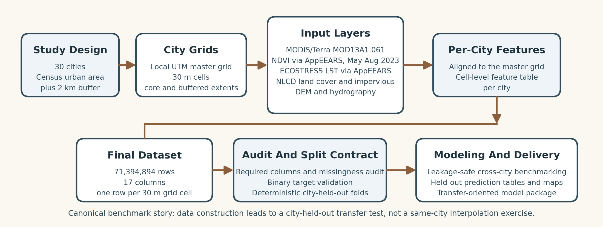
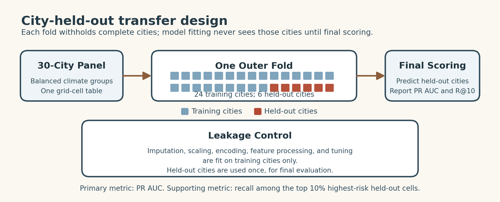
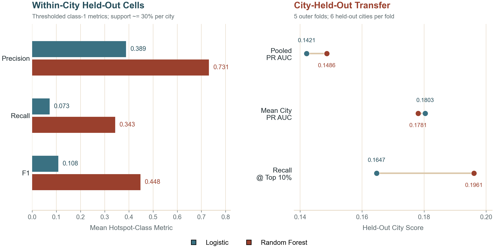
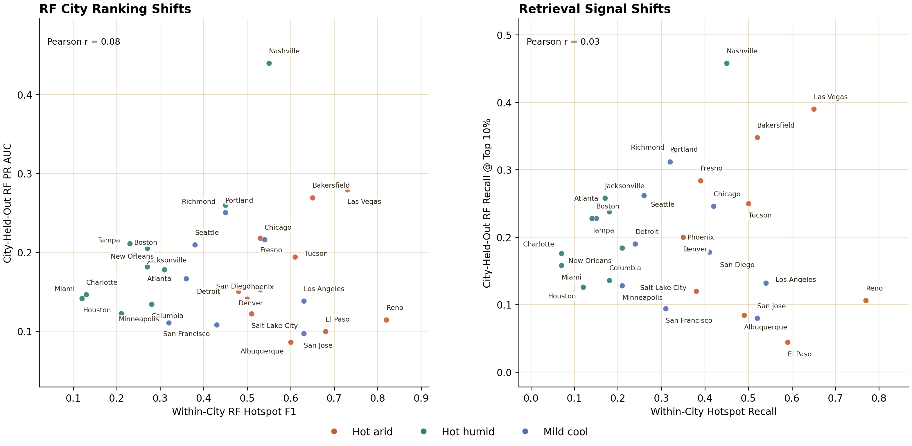
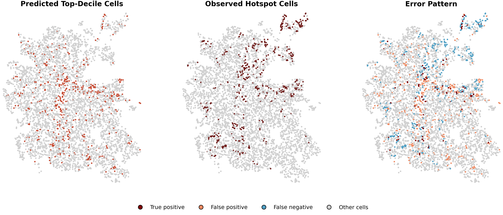
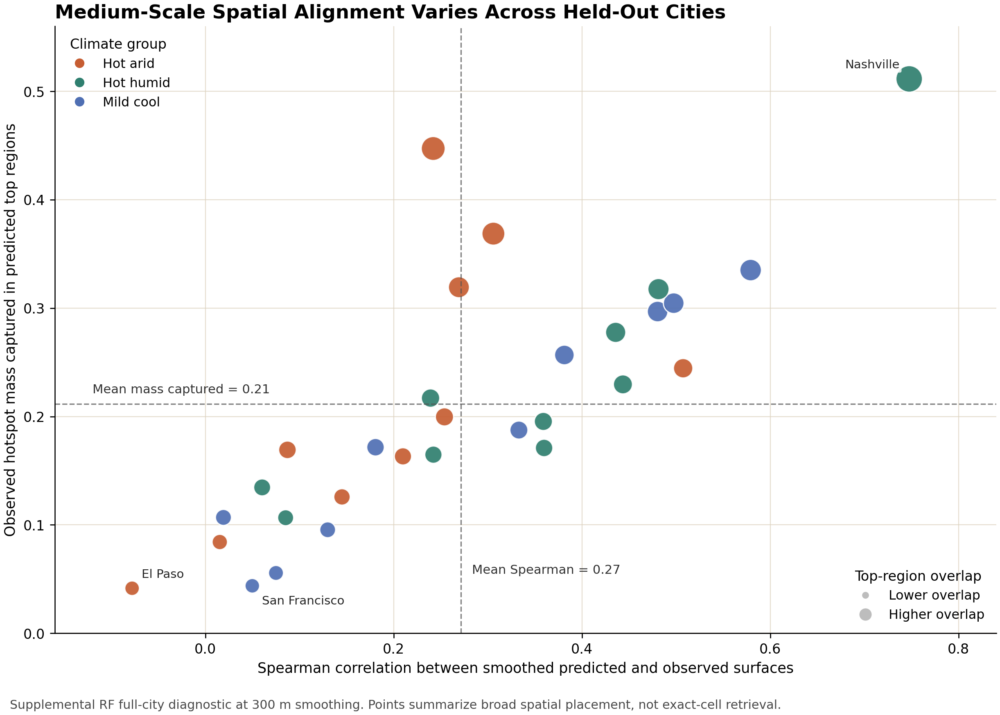
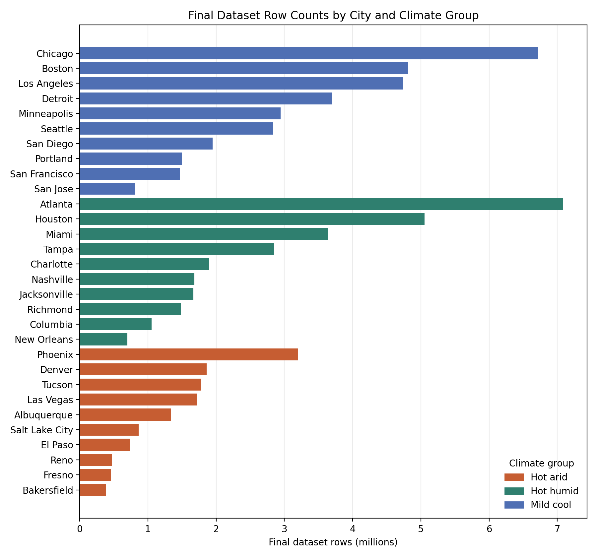
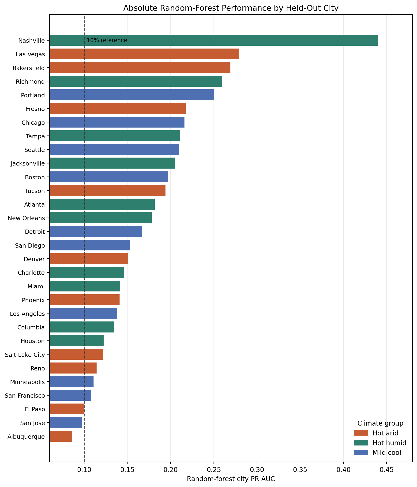
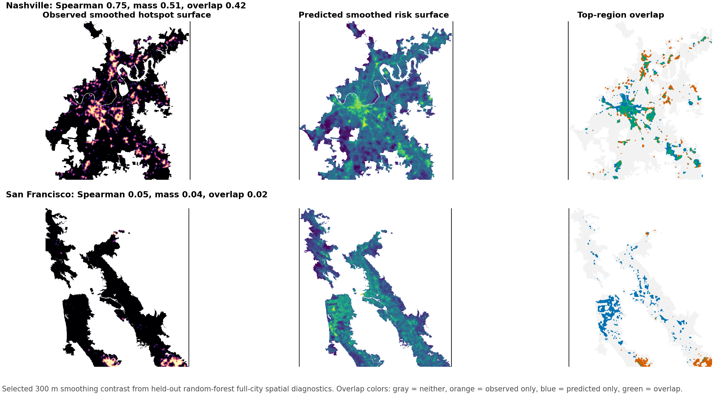

\begin{titlepage}
\centering
\vspace*{0.75in}

{\Large STAT 5630 Statistical Machine Learning\par}
\vspace{0.65in}

{\huge\bfseries Cross-City Urban Heat Hotspot Screening:\par}
\vspace{0.12in}
{\huge\bfseries Same-City Learning, City-Held-Out Transfer,\par}
\vspace{0.12in}
{\huge\bfseries and Spatial Alignment\par}
\vspace{0.75in}

{\Large Final Report\par}
\vspace{0.5in}

{\large Collaborators\par}
\vspace{0.12in}
{\Large Max Clements and Nicholas Machado\par}

\vfill

{\large April 26, 2026\par}
\end{titlepage}

\newpage

## Main Text

### 1. Background Information

Extreme urban heat is a public-health, infrastructure, and planning problem because surface heat is not distributed evenly within cities. Pavement, roofs, vegetation, water proximity, terrain, and land cover can create large temperature contrasts across nearby neighborhoods. A citywide average therefore hides the local places where heat-mitigation investment, additional monitoring, or planning attention may be most useful. For statistical learning, the practical question is whether public spatial variables can rank local grid cells for hotspot screening when direct thermal measurement is unavailable, incomplete, or reserved for evaluation.

This report builds a standardized 30-city, 30 m grid-cell dataset and tests whether six public non-thermal predictors can identify each city's hottest surface-temperature cells. The central finding is that validation design changes the scientific conclusion: random forest performs strongly for same-city screening, but transfer to whole unseen cities is much weaker and only modestly better than simple imperviousness and land-cover baselines. A supplemental spatial-alignment diagnostic adds nuance by showing that weak exact-cell transfer does not always mean the prediction surface is spatially random.

The analysis separates three evaluation uses. Same-city screening asks whether held-out cells can be ranked within cities represented during model development. Exact-cell city-held-out transfer asks whether the model ranks the same 30 m cells as hotspots that the observed LST label identifies as hotspots in an unseen city. Broad spatial placement asks whether high predicted risk falls in the same smoothed parts of an unseen city as observed hotspot concentration, even when the exact 30 m cells do not match. These three ideas are related, but they answer different planning and validation questions.

Remote sensing makes the hotspot label possible because satellites can observe spatial surface-temperature patterns that ground stations alone cannot. Thermal infrared sensors measure emitted radiation from the land surface and can be converted into LST. LST is surface temperature, not two-meter air temperature: a roof, road, tree canopy, irrigated field, or bare-soil patch can heat differently from the surrounding air. NASA land-surface-temperature documentation emphasizes this distinction, and ECOSTRESS documentation describes a thermal mission that measures surface temperature at fine spatial detail from the International Space Station. The target in this report is therefore a surface-hotspot screening target, not a direct measure of human heat exposure.

Urban thermal remote sensing has a long history, but the literature also shows why this project needs a careful validation design. Voogt and Oke (2003) review thermal remote sensing of urban climates and note that many urban thermal studies historically emphasized qualitative maps of thermal patterns and simple correlations with surface descriptors. Later Landsat-based work gave more quantitative evidence for specific predictors. Weng, Lu, and Schubring (2004) studied the relationship between land surface temperature and vegetation abundance in Indianapolis, while Yuan and Bauer (2007) compared NDVI and impervious surface as indicators of surface urban heat-island effects in the Twin Cities. Stewart and Oke (2012) also show why urban thermal behavior depends on local surface form, land cover, and urban structure rather than climate alone. Together, this work motivates an interpretable feature set based on vegetation, imperviousness, land cover, terrain, water proximity, and broad climate context, while heat vulnerability also depends on people, resources, and exposure conditions beyond surface temperature itself (Harlan et al., 2006).

AppEEARS, NASA's tool for requesting and subsetting Earth observation products, supports the reproducible remote-sensing part of the workflow by subsetting MODIS/Terra NDVI and ECOSTRESS LST to the same city study regions and May-August 2023 window used for modeling. The dataset therefore relies on consistent area requests and preprocessing rules rather than manually selected images.

The validation design follows from the transfer question. Ordinary row or cell splits can be too easy for spatial data because nearby cells and cells from the same city can appear in both training and testing. Roberts et al. (2017) argue that ignoring spatial, temporal, or hierarchical structure in cross-validation can underestimate predictive error, and Meyer et al. (2018) show that target-oriented validation can reveal weaker performance when models must predict beyond familiar locations. This project applies the same principle at the city scale while also reporting the same-city screening question that planners often face inside a mapped city.

The urban-heat literature motivates the feature set, while the spatial-validation literature motivates the evaluation design. Prior LST studies show that vegetation, imperviousness, land cover, and urban form can explain local thermal variation, but those relationships are often estimated within a single familiar city. The transfer question is harder: a model may interpolate well within a city yet lose accuracy when every cell in the evaluation city is outside the fitting process.

The model comparison is deliberately modest. Logistic regression provides a linear benchmark, while random forest provides a nonlinear comparison that can capture threshold effects and interactions without adding a more complex deep-learning or spatial-statistical architecture. Because hotspots make up roughly one tenth of eligible cells, the city-held-out benchmark emphasizes precision-recall metrics rather than overall accuracy.

The report proceeds in four steps. First, it constructs a standardized 30-city grid-cell dataset from public geospatial and remote-sensing sources. Second, it defines a city-relative hotspot label based on the hottest 10% of valid May-August ECOSTRESS LST cells within each city. Third, it compares logistic regression and random forest under same-city screening and city-held-out transfer. Finally, it uses city-level and spatial diagnostics to show where transfer succeeds, where it weakens, and when broad spatial placement remains visible despite exact-cell errors.

The contribution has four linked pieces: a 30-city aligned dataset, an explicit validation-design comparison, a transparent transfer benchmark using simple baselines, logistic regression, and random forest, and a supplemental full-city spatial-placement diagnostic for the random-forest transfer model. The completed dataset contains 71,394,894 rows and 17 columns, with one row representing one analytic 30 m grid cell in one selected U.S. city. The cities are balanced across three broad climate groups: 10 hot arid, 10 hot humid, and 10 mild cool cities. Figure 1 shows the selected city locations, and Table 2 summarizes the final audited dataset by climate group.

The resulting dataset combines public geospatial and remote-sensing sources summarized in Table 1. The modeling specification excludes thermal variables, using ECOSTRESS LST to define the outcome rather than to predict it. The final modeling dataset was constructed by the authors from public source layers rather than downloaded as a single preexisting study dataset; source products are cited in the References, and reproducibility notes at the end of the report list the generated artifacts used to produce the report tables and figures.

### 2. Research Questions

The primary research question has two parts:

Can basic environmental and built-environment features identify urban heat hotspots across a multi-city dataset? How does performance change when evaluation moves from within-city held-out cells to city-held-out transfer?

The within-city held-out design asks whether a model can identify held-out hotspot cells from cities represented during model development. The city-held-out transfer design asks whether a model can rank cells in a whole unseen city by hotspot risk. In this report, transfer means training on one set of cities and evaluating on complete cities withheld from all model fitting and preprocessing. The unit of analysis is a 30 m grid cell, but the strict transfer evaluation groups by city: every cell from a held-out city is excluded from training, preprocessing, and tuning.

Three secondary questions organize the results. First, do non-thermal geospatial predictors contain useful signal for the locally hottest urban grid cells? Second, does a nonlinear random forest improve hotspot screening compared with logistic regression and simple baselines, especially under city-held-out transfer? Third, do full-city prediction surfaces show evidence of broad spatial alignment with observed hotspot concentration when exact-cell transfer is limited?

The target population for inference is the set of eligible 30 m grid cells in the 30 selected U.S. urban-area study regions. The outcome is `hotspot_10pct`, a city-relative binary label. A positive cell is one of the hottest 10% of valid eligible cells within its own city, based on median May-August ECOSTRESS LST after final filtering. A top-10% label creates a common within-city screening task across cities with different absolute temperature distributions and matches a practical prioritization frame: if a city inspected or targeted only the highest-risk decile of cells, how many true local hotspots would be recovered? This surface-temperature target supports local hotspot screening; national heat exposure, air-temperature risk, and vulnerability remain outside this benchmark's scope.

### 3. Dataset Construction

The dataset construction workflow starts with city selection and study-region definition. The project uses 30 U.S. cities balanced across three broad climate groups: hot arid, hot humid, and mild cool. Cities were selected to provide geographic and climate variation while remaining feasible for a standardized acquisition and modeling pipeline, so the set is a purposive benchmark panel. The coarse climate groups help structure the transfer comparison and later heterogeneity discussion; formal climatology and local meteorological analysis remain separate tasks.

For each selected city, the study region begins with the 2020 Census urban area containing the city center. That urban-area polygon is preserved as the core geometry, and the default study area applies a 2 km buffer around it. The 2 km distance is a pragmatic fixed rule that captures near-urban land-cover and water-adjacency transitions without redefining each city manually; buffer sensitivity is left for future work. The unbuffered core remains available for core-city filters.

Each city receives a city-specific 30 m analytic grid built in a local UTM coordinate reference system, which makes distances and cell areas meaningful within that city. The grid is the analytic backbone of the project: every final row is one grid cell, and every raster or vector source is converted into a value for that same cell.

The phrase "30 m dataset" refers to the analytic grid and row unit, not the native resolution of every source variable. NLCD aligns closely with the grid, while MODIS/Terra NDVI is coarser, ECOSTRESS has its own thermal-pixel and overpass structure, and vector quantities such as distance to water are summarized to cell centroids or geometry. The common grid gives every city the same modeling unit rather than native 30 m measurement for every variable.

The source layers are then prepared against this grid. NLCD 2021 land cover supplies a categorical surface class for each cell, and NLCD 2021 imperviousness supplies a continuous percent-impervious value. USGS 3DEP elevation is aligned to the grid to provide terrain context. NHDPlus HR hydrography is handled as vector information: water features are clipped to the city study area and converted to a distance from each grid cell to the nearest selected hydro feature. MODIS/Terra NDVI and ECOSTRESS LST are acquired through AppEEARS using the city area of interest and summarized for May-August 2023. The project uses median May-August NDVI as the vegetation predictor and median May-August ECOSTRESS LST as the thermal outcome ingredient.

The May-August seasonal summary is a compromise between heat relevance and data robustness. It focuses the target and vegetation feature on the warm season, when surface heat is most relevant to the urban heat problem, while aggregating over multiple observations rather than depending on one satellite pass. ECOSTRESS also has irregular overpass timing because it is mounted on the International Space Station, so the analysis records `n_valid_ecostress_passes` as a quality-support field. Cells are retained for labeling only when at least three valid ECOSTRESS observations contribute to the May-August LST summary. This filter reduces the chance that a cell is labeled from an unstable or nearly missing thermal summary, but pass count alone does not make all cities observationally identical. Overpass time, clouds, seasonality within May-August, and weather conditions can still vary across cities and remain part of the remote-sensing limitation.

The final assembly step merges the per-city feature tables into a single modeling-ready dataset. Open-water cells are removed when NLCD land cover identifies class 11, so the hotspot label is not driven by water surfaces that are outside the intended land-focused screening task. After this open-water filter and the ECOSTRESS quality filter, `hotspot_10pct` is recomputed within each city. Concretely, eligible cells in a city are ranked by median May-August LST, the hottest decile is labeled 1, and the remaining eligible cells are labeled 0.

The final dataset contains the city identifier and name, broad climate group, cell identifier, centroid longitude and latitude, six primary predictors, ECOSTRESS-derived LST and pass count, the `hotspot_10pct` label, and three neighborhood-context variables reserved for supplemental modeling. The primary six-predictor benchmark keeps the feature specification fixed and does not use those neighborhood variables in the logistic-versus-random-forest comparison. The neighborhood-context variables are excluded from this benchmark to keep the first model comparison simple and to separate the value of basic cell-level public predictors from more engineered spatial-context features.

The completed audit confirms 30 cities, 71,394,894 rows, and 7,139,588 hotspot-positive cells. Because `hotspot_10pct` is recomputed within city, overall prevalence is approximately 10% by construction, though it is not exactly 10% because rare ties can occur around the city-specific LST threshold. Each climate group has nearly the same hotspot prevalence despite large differences in total row count. Missingness is low for the primary predictors: imperviousness, land cover, distance to water, and climate group have no missing values in the final table; elevation is missing for only 3,426 cells, and median May-August NDVI is missing for 99,625 cells, about 0.14% of the dataset. The row-count distribution is uneven across cities because study-area extents differ substantially; Appendix Figure A1 is included as support for that point.

The large row count should be interpreted with the analytic-grid caveat above: nearby cells can share source summaries, sensor conditions, and spatial context, so the effective independent information is smaller than the raw row count.

Figure 2 summarizes the end-to-end dataset construction workflow. The key modeling implication is that the final table is a standardized, reproducible grid-cell dataset rather than a manually assembled collection of city-specific summaries: it starts from public data sources, aligns every layer to a 30 m city grid, applies explicit row filters, and creates a target suitable for testing generalization to unseen cities.

### 4. Model and Method

Using this constructed dataset, the statistical learning task is to estimate, for each grid cell, a screening score for whether the cell belongs to the hottest 10% of valid eligible cells in its own city. The response variable is `hotspot_10pct`, and the primary six-predictor benchmark uses only these non-thermal predictors: `impervious_pct`, `land_cover_class`, `elevation_m`, `dist_to_water_m`, `ndvi_median_may_aug`, and `climate_group`. Climate group is included as a broad, preassigned city-level descriptor rather than a city identifier; it does not identify individual held-out cities but may capture coarse regional thermal context and support later city-group interpretation.

Several columns are intentionally excluded from the predictive feature set. The target itself, `hotspot_10pct`, is the response. The thermal variables `lst_median_may_aug` and `n_valid_ecostress_passes` are excluded because LST defines the label and ECOSTRESS pass count is a data-quality support variable used in dataset construction rather than a stable urban-form predictor. Cell identifiers, city identifiers, city names, and centroid coordinates are excluded to focus the benchmark on portable surface-characteristic relationships rather than location identity. Location-aware and spatial-context predictors are logical future extensions once they can be evaluated separately from this six-feature public-predictor benchmark.

The two validation designs answer different scientific questions. The first is same-city held-out evaluation: cities are represented during model development, and models are evaluated on held-out cells from those same cities. The same-city summary uses a verified 70/30 held-out structure, with approximately 30% of each city's final filtered cells appearing in the evaluation support. It reports class-1 hotspot precision, recall, and F1 for logistic regression and random forest using thresholded class predictions. These results are central to the validation-design comparison because they estimate the easier screening task in cities represented during fitting. The city-held-out pipeline below is the more fully artifacted transfer benchmark, so Figure 4 should be read as a contrast between validation designs rather than a symmetric comparison of identical rerunnable experiments.

The second design is city-held-out transfer, shown schematically in Figure 3. The 30 cities are partitioned into five deterministic outer folds, with six complete cities held out in each fold and the remaining 24 cities used for training. Every city is held out exactly once. For each outer fold, preprocessing, imputation, scaling, categorical encoding, and hyperparameter tuning are fit using training-city rows only. Inner cross-validation also holds out groups of training cities rather than randomly splitting individual cells. The final held-out prediction table is therefore a transfer test at the city level, not a same-city interpolation exercise.

The analysis compares simple transfer baselines, logistic regression, and random forest. The simple baselines provide checks for whether a learned model improves beyond simple ranking rules. The baseline set includes a no-skill prevalence reference, a global-mean baseline, a land-cover-only baseline, an impervious-only baseline, and a climate-only baseline. These baselines show how much transfer performance can be obtained from single-feature or prevalence-style rules before fitting a richer model.

The logistic regression model is the linear comparison in the primary six-predictor benchmark. Missing-value imputation, numeric scaling, one-hot encoding of categorical features, and the classifier are fit together inside each training fold. The classifier uses the `saga` solver to support regularized L1, L2, and elastic-net logistic models over the same feature specification. Logistic regression models hotspot log-odds as an additive function of the predictors, making it an interpretable reference point for asking whether nonlinear structure adds value.

The random forest model is the nonlinear comparison in the primary six-predictor benchmark. It uses the same training-only preprocessing rule. Numeric predictors are imputed, categorical predictors are encoded inside the training fold, and the forest is tuned over tree count, tree depth, feature subsampling, and minimum leaf size. A random forest averages predictions from many decision trees, allowing threshold effects and interactions among variables such as land cover, vegetation, imperviousness, and climate group. The model is therefore a natural test of whether nonlinear relationships improve city-held-out screening under the fixed six-predictor feature specification.

The two validation settings use related but not identical metrics, so the report compares patterns rather than treating all numbers as one leaderboard. Within-city held-out results are summarized with thresholded hotspot precision, recall, and F1. City-held-out transfer is evaluated primarily with average precision (AP), reported in the tables and figures as PR AUC, and recall at the top 10% predicted risk. Because hotspots make up roughly 10% of each city's eligible cells, a PR-ranking score near 0.10 corresponds to little useful ranking beyond prevalence; values above 0.10 indicate that true hotspots tend to receive higher scores than non-hotspots.

City-held-out performance is also summarized with mean city PR AUC and recall at the top 10% predicted risk. Pooled PR AUC weights cities roughly by their sampled held-out row counts, so larger cities can influence the aggregate more strongly. Mean city PR AUC first computes PR AUC for each held-out city and then averages across cities, giving each city equal interpretive weight. Recall at top 10% predicted risk is a screening-oriented metric: it asks what fraction of true hotspots would be recovered if a city inspected only the cells the model ranked in the highest-risk decile. Because the target itself is also a top-decile label, this metric is easy to interpret as top-decile retrieval. The benchmark uses target-rate-stratified samples, so the reported scores are interpreted primarily as rankings for screening rather than calibrated probabilities of hotspot status in the full city population.

Sampling and benchmark scope are important for interpreting the city-held-out numbers. The main transfer comparison uses 5,000 rows sampled per city with target-rate stratification: 500 positives and 4,500 negatives per city, using random state 42. Each outer fold therefore trains on 120,000 sampled rows from 24 cities and tests on 30,000 sampled rows from six held-out cities. The matched 5k comparison is the primary logistic-versus-random-forest comparison because both models share the same sample cap and fold design; the 20,000 rows-per-city logistic run is higher-sample linear context. This controlled sampled benchmark gives each city equal sample size while preserving the grouped city-held-out validation design. Exhaustive full-city scoring would answer a broader operational question and is left for later work; the larger logistic run suggests that increasing row count alone does not eliminate the transfer challenge.

The spatial diagnostic asks a different question from the sampled transfer benchmark. Each outer-fold random-forest model is trained and tuned only on training cities, then used to score all eligible rows in the held-out cities for spatial analysis. Observed hotspot and predicted-risk surfaces are reconstructed on each city's 30 m grid and smoothed at 150 m, 300 m, and 600 m. These radii act as neighborhood-scale checks: 150 m is a fine local surface, 300 m is the medium scale emphasized in the main interpretation, and 600 m tests whether broader gradients persist. The metrics summarize Spearman surface correlation, overlap between observed and predicted top smoothed regions, observed hotspot mass captured by the predicted top region, centroid distance, and median nearest-region distance. These full-city scores are supplemental diagnostics, not replacements for sampled AP and recall-at-top-10% transfer metrics.

### 5. Results and Discussion

#### 5.1 Same-City Screening

The analysis first considers the same-city held-out setting. In the 70/30 same-city evaluation summarized in Figure 4, random forest clearly outperforms logistic regression on class-1 hotspot precision, recall, and F1. Averaged across the 30 cities, random forest reaches mean hotspot precision 0.7310, recall 0.3433, and F1 0.4480, compared with logistic regression means of 0.3887, 0.0727, and 0.1083. This result shows that the six non-thermal predictors contain useful same-city hotspot-screening signal and that nonlinear or interaction-like structure helps when local city examples are available during model development. The combination of high precision and lower recall also suggests that the same-city random forest identifies a selective subset of hotspot-like cells more successfully than it recovers all hotspot cells.

#### 5.2 City-Held-Out Exact-Cell Transfer

The city-held-out transfer benchmark gives a weaker and much closer model comparison. The models rank hotspots above the prevalence reference in held-out cities, but gains over imperviousness and land-cover baselines are small and concentrate mainly in selected hot arid cities. As shown in Table 3, the random-forest 5k model reaches pooled PR AUC 0.1486, above the 0.1000 prevalence reference and above the 0.1353 land-cover-only baseline. The logistic SAGA 5k model reaches 0.1421.

The matched 5,000 rows-per-city comparison is the primary logistic-versus-random-forest comparison. On pooled PR AUC, random forest improves from 0.1421 to 0.1486. On recall at the top 10% predicted risk, random forest improves from 0.1647 to 0.1961. At the same time, logistic regression remains slightly stronger on mean city PR AUC, with 0.1803 for logistic compared with 0.1781 for random forest. The 20,000 rows-per-city logistic run reaches pooled PR AUC 0.1457 and recall at top 10% of 0.1709, which provides useful context but is not the matched comparison because it uses a larger sample than the 5k random-forest run.

Because the outcome is a top-decile label, the transfer result is best read as a ranking result rather than a cell-by-cell classification result. In the sampled transfer benchmark, random forest recovers about 19.6% of true hotspots when only the top 10% of predicted-risk cells are inspected. That is nearly double the 10% no-skill reference, but only modestly above the 18.6% recall from the impervious-only baseline. In practical screening terms, much of the transferable retrieval signal in the primary six-predictor benchmark is already captured by simple built-intensity information.

The two validation settings lead to different model comparisons. Random forest shows a clear advantage under same-city held-out evaluation, while city-held-out transfer is weaker, closer between models, and more heterogeneous. Figure 4 should therefore be read as a validation-design contrast rather than a single metric scale: both panels matter to the research question, but they estimate different uses of the model.

#### 5.3 Transfer Heterogeneity and Signal Shift

Figure 5 makes that point at the city level. The city-level correlation between within-city random-forest hotspot F1 and city-held-out random-forest PR AUC is 0.08. The correlation between within-city random-forest hotspot recall and city-held-out random-forest recall at top 10% is 0.03. In plain terms, cities that are easy when the model has seen that city are not necessarily easy when the model has never seen that city. Nashville is comparatively strong in both views, but the overall pattern is weak enough that same-city learnability should not be treated as a reliable proxy for transfer success.

Transfer heterogeneity is the main caution against overreading the pooled result. Appendix Tables A5-A7 show that random forest gains are not uniform: it improves folds 0, 3, and 4 but underperforms in folds 1 and 2, and logistic regression wins most city-level PR AUC comparisons. Appendix Figure A4 shows a visible climate-group pattern in the RF-minus-logistic deltas: RF gains are concentrated in hot arid cities, while hot humid and mild cool cities more often favor logistic regression or show weaker RF gains. This pattern is hypothesis-generating, not causal. One possible explanation is that the six predictors have more consistent hotspot relationships in the arid cities, but climate group is confounded with geography, urban morphology, fold composition, and unmeasured local factors. Appendix Figure A5 shows absolute random-forest city PR AUC.

#### 5.4 Broad Spatial-Placement Diagnostic

Figure 6 provides a spatial diagnostic view of one held-out city, Denver. The figure shows predicted top-decile cells, observed hotspot cells, and categorical error types for a random-forest fold in which Denver was excluded from training. The errors are not randomly scattered; missed hotspots and false positives appear in spatial bands or clusters. That pattern motivates the all-city spatial-alignment diagnostic: a single map cannot establish general spatial placement, but it shows why exact-cell errors and broad spatial structure are not identical evaluation questions.

The all-city spatial-alignment diagnostic gives a cautious answer to that follow-up question. At the 300 m medium smoothing scale, the random-forest full-city prediction surfaces have mean Spearman surface correlation of 0.2713, mean top-region overlap of 0.1353, and mean observed hotspot mass captured of 0.2114. Figure 7 summarizes this city-level variation. These values suggest partial broad-scale alignment, not strong general spatial transfer. City-to-city variation is wide: Nashville, Portland, Fresno, Chicago, and Richmond show stronger medium-scale surface alignment, while El Paso, Albuquerque, Minneapolis, San Francisco, and Columbia are among the weakest. Appendix Figure A7 provides a selected high/low map contrast. The result complicates the exact-cell transfer story without overturning it. The model often misses the exact hotspot cells; in some cities, however, its high-risk surface still falls in roughly the right parts of the city.

This distinction matters for planning interpretation. Exact-cell retrieval and broad spatial screening correspond to different uses: one asks which individual 30 m cells should be selected, while the other asks whether the model can flag the general neighborhoods or zones where hotspot concentration is elevated. The random forest is not ready for operational targeting in unseen cities, but the spatial diagnostic shows that transfer failure is not always pure spatial noise. Future models should therefore be evaluated at both cell and neighborhood or zone scales, with the spatial scale matched to the planning decision.

#### 5.5 Predictive Interpretation

Appendix Figure A2 provides predictive interpretation diagnostics: random-forest permutation importance emphasizes NDVI and imperviousness, while logistic coefficients are more sensitive to categorical encoding and the omitted land-cover reference level. These summaries are predictive rather than causal because the predictors are correlated with broader urban form, land management, local climate, and sensor-observation conditions.

These results support the central interpretation of the report. Public non-thermal geospatial predictors contain useful hotspot-screening signal, but the apparent strength of that signal depends strongly on the validation design. Same-city screening is comparatively strong, exact-cell transfer to unseen cities is weaker and heterogeneous, and the spatial diagnostic shows partial broad placement in some cities without overturning the weak exact-cell result.

### 6. Limitations and Future Work

Several validity limits shape the interpretation. Leakage control is strongest for the city-held-out transfer benchmark because complete cities are held out and preprocessing and tuning are fit using training cities only. Sampling validity is bounded by the 5,000-row-per-city benchmark rather than exhaustive all-row scoring; the sample preserves target prevalence and city balance, but not every detail of each city's full spatial distribution. The spatial-alignment diagnostic uses full eligible held-out rows for random-forest spatial placement only. Spatial dependence and clustered errors can remain within held-out cities. Construct validity is limited because LST measures surface temperature rather than air temperature or direct human exposure, and because the 30 m grid is a common analytic unit rather than the native resolution of every source variable. The city-relative hotspot label also means that a positive cell is locally hot within its city, not necessarily equally hot in absolute LST or equally severe for public-health exposure across cities. External validity is limited because the 30 selected cities form a purposive benchmark set rather than a representative sample of all U.S. urban forms, climates, coastal settings, and topographies.

Future work should extend both sides of the evaluation contrast. For exact-cell retrieval, the most direct next step is a full-row held-out-city benchmark to test whether the sampled AP and recall patterns hold across each city's complete spatial distribution. Raw latitude and longitude were intentionally excluded from this benchmark because they could encode location identity rather than portable surface relationships. A future location-aware benchmark should test those choices explicitly by adding centroid coordinates, distance to coast, distance to urban core, neighborhood context, and spatial or hierarchical model families. The goal would be to separate portable surface relationships from city-specific spatial effects rather than simply giving the model more ways to memorize place. For broader placement, future work should compare spatial-alignment metrics across model families, test neighborhood-context predictors such as surrounding vegetation and imperviousness, and add uncertainty summaries across cities and smoothing scales. Finally, the LST-based target should be compared with air-temperature, exposure, or vulnerability outcomes where such data are available, because surface hotspots are only one component of heat risk.

### 7. Conclusion

This project contributes a reproducible 30-city aligned dataset and a validation framework for urban heat hotspot screening. Same-city learning overstates what should be expected in unseen cities: the same public predictors look strong when each city contributes training examples, but transfer much more modestly under whole-city holdout. Simple public predictors do transfer some hotspot-ranking signal, yet random forest is not a universal solution; its nonlinear gains are selective, with clearer advantages in some hot arid cities than in the full benchmark panel. Broad spatial alignment adds a useful diagnostic layer because weak exact-cell retrieval is not always spatial noise, but that signal is heterogeneous and does not justify operational targeting on its own. The main contribution is the evaluation framework and the evidence that validation design changes the scientific conclusion.

### References

Harlan, S. L., Brazel, A. J., Prashad, L., Stefanov, W. L., & Larsen, L. (2006). Neighborhood microclimates and vulnerability to heat stress. *Social Science & Medicine, 63*(11), 2847-2863. https://doi.org/10.1016/j.socscimed.2006.07.030

Meyer, H., Reudenbach, C., Hengl, T., Katurji, M., & Nauss, T. (2018). Improving performance of spatio-temporal machine learning models using forward feature selection and target-oriented validation. *Environmental Modelling & Software, 101*, 1-9. https://doi.org/10.1016/j.envsoft.2017.12.001

NASA Earthdata. (n.d.). *AppEEARS*. https://www.earthdata.nasa.gov/data/tools/appeears

NASA Earthdata. (n.d.). *ECOSTRESS Swath Land Surface Temperature and Emissivity Instantaneous L2 Global 70 m V002*. https://www.earthdata.nasa.gov/data/catalog/lpcloud-eco-l2-lste-002

NASA Science. (n.d.). *Land Surface Temperature*. https://science.nasa.gov/earth/earth-observatory/global-maps/land-surface-temperature/

Roberts, D. R., Bahn, V., Ciuti, S., Boyce, M. S., Elith, J., Guillera-Arroita, G., Hauenstein, S., Lahoz-Monfort, J. J., Schroeder, B., Thuiller, W., Warton, D. I., Wintle, B. A., Hartig, F., & Dormann, C. F. (2017). Cross-validation strategies for data with temporal, spatial, hierarchical, or phylogenetic structure. *Ecography, 40*(8), 913-929. https://doi.org/10.1111/ecog.02881

Stewart, I. D., & Oke, T. R. (2012). Local climate zones for urban temperature studies. *Bulletin of the American Meteorological Society, 93*(12), 1879-1900. https://doi.org/10.1175/BAMS-D-11-00019.1

Voogt, J. A., & Oke, T. R. (2003). Thermal remote sensing of urban climates. *Remote Sensing of Environment, 86*(3), 370-384. https://doi.org/10.1016/S0034-4257(03)00079-8

Weng, Q., Lu, D., & Schubring, J. (2004). Estimation of land surface temperature-vegetation abundance relationship for urban heat island studies. *Remote Sensing of Environment, 89*(4), 467-483. https://doi.org/10.1016/j.rse.2003.11.005

Yuan, F., & Bauer, M. E. (2007). Comparison of impervious surface area and normalized difference vegetation index as indicators of surface urban heat island effects in Landsat imagery. *Remote Sensing of Environment, 106*(3), 375-386. https://doi.org/10.1016/j.rse.2006.09.003

## Tables and Figures

Tables and figures are organized here rather than interleaved with the main text. Appendix tables and figures provide additional city, fold, model-specification, and transfer-diagnostic details. Detailed heterogeneity tables are kept in the appendix so the main tables section preserves the core source, dataset, and benchmark results.

### Table 1. Data Sources and Constructed Variables

\begingroup
\footnotesize
\setlength{\tabcolsep}{4.5pt}
\renewcommand{\arraystretch}{1.14}

\begin{tabular}{p{0.18\textwidth}p{0.28\textwidth}p{0.26\textwidth}p{0.18\textwidth}}
\hline
Source & Product/layer & Constructed variable(s) & Role \\
\hline
U.S. Census urban areas & 2020 TIGERweb urban-area polygon & Study-area and core-city geometry; 30 m city grid & Study region and grid target \\
NLCD & 2021 land-cover raster & \texttt{land\_cover\_class} & Predictor; open-water filter \\
NLCD & 2021 impervious percentage raster & \texttt{impervious\_pct} & Built-intensity predictor \\
USGS 3DEP & 1 arc-second DEM & \texttt{elevation\_m} & Terrain predictor \\
NHDPlus HR & High-resolution hydrography & \texttt{dist\_to\_water\_m} & Water-proximity predictor \\
MODIS/Terra via AppEEARS & MOD13A1.061 NDVI, May-Aug. 2023 & \texttt{ndvi\_median\_may\_aug} & Vegetation predictor \\
ECOSTRESS via AppEEARS & ECO\_L2T\_LSTE.002 LST, May-Aug. 2023 & \texttt{lst\_median\_may\_aug}; \texttt{n\_valid\_ecostress\_passes}; \texttt{hotspot\_10pct} & Outcome source and quality support \\
\hline
\end{tabular}

\endgroup

All constructed variables in Table 1 are ultimately summarized to the common 30 m analytic grid. The table lists each source's main role; Section 3 describes the spatial alignment logic and row filters in prose.

### Table 2. Final Dataset Summary by Climate Group

\begingroup
\footnotesize
\setlength{\tabcolsep}{5.2pt}
\renewcommand{\arraystretch}{1.12}

| Climate group | City count | Total rows | Hotspot count | Hotspot prev. | Min rows | Median rows | Max rows | Median valid passes |
| --- | ---: | ---: | ---: | ---: | ---: | ---: | ---: | ---: |
| Hot arid | 10 | 12,814,143 | 1,281,427 | 0.1000 | 382,964 | 1,100,156 | 3,199,440 | 30.0 |
| Hot humid | 10 | 27,098,157 | 2,709,866 | 0.1000 | 700,063 | 1,788,622 | 7,081,699 | 21.5 |
| Mild cool | 10 | 31,482,594 | 3,148,295 | 0.1000 | 817,627 | 2,889,018 | 6,722,963 | 33.0 |

\endgroup

\newpage

### Table 3. Main City-Held-Out Benchmark Metrics

Rows labeled 5k sampled use the same target-rate-stratified per-city sample and can be compared directly. With 10% positives, PR AUC values near 0.1000 indicate little useful ranking beyond prevalence.

\begingroup
\small

| Model | Rows/city | Pooled PR AUC | Mean city PR AUC | Recall@top10 | Runtime (min) |
| --- | --- | ---: | ---: | ---: | ---: |
| No-skill ref. | 5k sampled | 0.1000 | 0.1000 | 0.1000 | n/a |
| Global mean | 5k sampled | 0.0982 | 0.0997 | 0.0971 | n/a |
| Climate only | 5k sampled | 0.0982 | 0.0997 | 0.0975 | n/a |
| Impervious only | 5k sampled | 0.1351 | 0.1519 | 0.1858 | n/a |
| Land cover only | 5k sampled | 0.1353 | 0.1479 | 0.1672 | n/a |
| Logistic 5k | 5k sampled | 0.1421 | 0.1803 | 0.1647 | 35.6 |
| Logistic 20k | 20k sampled | 0.1457 | 0.1796 | 0.1709 | 156.6 |
| RF 5k | 5k sampled | 0.1486 | 0.1781 | 0.1961 | 97.2 |

\endgroup

Notes: `RF` = random forest. The impervious-only baseline is the strongest simple baseline on recall, and the land-cover-only baseline is the strongest simple baseline on pooled PR AUC. The 5k logistic model is the matched linear comparison for the 5k random forest; the 20k logistic row is higher-sample linear context. Small deviations around 0.1000 for near-constant baselines reflect tie handling.

### Figure 1. Study City Locations

{width=0.95\textwidth}

The 30 benchmark cities span western, southern, and northern U.S. regions and are colored by broad climate group. Appendix Table A4 lists full city names, climate groups, row counts, and fold assignments.

### Figure 2. Dataset Construction Workflow

{width=0.95\textwidth}

Buffered Census urban-area study regions and local 30 m grids feed aligned per-city feature assembly, including MODIS/Terra MOD13A1.061 NDVI and ECOSTRESS LST acquired through AppEEARS for May-August 2023, followed by final dataset generation, audit, city-held-out folds, and model evaluation.

### Figure 3. City-Held-Out Evaluation Design

{width=0.95\textwidth}

Each outer fold holds out six complete cities and trains on the remaining 24 cities. All preprocessing and tuning are fit using training-city rows only, so held-out cities remain unseen until final scoring.

### Figure 4. Validation Design Contrast: Same-City and City-Held-Out Results

{width=0.95\textwidth}

Figure 4 compares same-city held-out screening with city-held-out transfer. Random forest has a large advantage over logistic regression in the same-city setting, while exact-cell transfer to unseen cities is closer between models and only modestly above simple baselines. The panels use different metrics, so the figure shows how the conclusion changes across validation designs rather than a direct point-for-point metric comparison.

The right-panel AUC values are average precision (reported as PR AUC), not ROC AUC. Because the hotspot label is a top-decile outcome, the relevant no-skill reference is the approximately 0.10 positive prevalence rather than 0.50.

### Figure 5. Same-City Success Does Not Reliably Predict Transfer Success

{width=0.95\textwidth}

Each point is one city. The weak city-level correlations show that cities with stronger within-city random-forest performance are not necessarily the cities with stronger city-held-out random-forest performance. The left panel compares within-city RF hotspot F1 with transfer PR AUC; the right panel compares within-city RF hotspot recall with transfer recall at top 10%.

\newpage

### Figure 6. Held-Out Denver Map Example

{width=1.0\textwidth}

Held-out Denver benchmark snapshot from a random-forest fold in which Denver was not included in training. The panels show top-decile predicted-risk cells, observed hotspot cells, and error categories. The point map is a spatial diagnostic, not a claim of operational targeting accuracy; missed hotspots and false positives appear in bands or clusters, motivating the all-city spatial-alignment check.

### Figure 7. Medium-Scale All-City Spatial-Alignment Summary

{width=1.0\textwidth}

Figure 7 summarizes broad spatial alignment for full-city random-forest predictions at 300 m smoothing. The x-axis is Spearman correlation between smoothed predicted and observed surfaces, and the y-axis is observed hotspot mass captured inside predicted top regions. Larger points have greater overlap between predicted and observed top smoothed regions. Cities in the upper-right show stronger broad placement; lower-left cities show weak alignment.

\newpage

## Appendix

### Appendix Table A1. Final Dataset Columns

The final dataset has 17 columns. They are grouped here rather than shown as a dense schema table so long variable names remain readable.

**Metadata and evaluation grouping**

- `city_id`: city grouping identifier for joins and grouped cross-validation.
- `city_name`: human-readable city name.
- `climate_group`: broad climate-group label; used as a predictor and stratifier.
- `cell_id`: grid-cell identifier within a city.
- `centroid_lon`, `centroid_lat`: WGS84 cell-centroid coordinates used for mapping, not first-pass prediction.

**Primary non-thermal predictors**

- `impervious_pct`: NLCD impervious percentage.
- `land_cover_class`: NLCD land-cover class; also used for the open-water filter.
- `elevation_m`: DEM-derived elevation in meters.
- `dist_to_water_m`: distance to nearest selected hydro feature.
- `ndvi_median_may_aug`: median May-August NDVI from MODIS/Terra AppEEARS inputs.
- `climate_group`: included as a broad city-level context feature.

**Target and quality fields**

- `lst_median_may_aug`: median May-August ECOSTRESS LST; used to define the label, not as a predictor.
- `n_valid_ecostress_passes`: count of valid ECOSTRESS observations contributing to LST; used for quality filtering.
- `hotspot_10pct`: city-relative top-decile LST hotspot label and model target.

**Supplemental context features**

- `tree_cover_proxy_pct_270m`: nearby forest-class share within an approximately 270 m neighborhood.
- `vegetated_cover_proxy_pct_270m`: nearby vegetated-class share within an approximately 270 m neighborhood.
- `impervious_pct_mean_270m`: neighborhood mean imperviousness within an approximately 270 m window.

### Appendix Table A2. Model Run Metadata

\begingroup
\small
\setlength{\tabcolsep}{4.5pt}
\renewcommand{\arraystretch}{1.08}

\begin{tabular}{llrlrrrl}
\hline
Model & Preset & Rows/city & Outer folds & Inner CV & Candidates & Inner fits & Scoring \\
\hline
Logistic SAGA 5k & full & 5,000 & 0-4 & 4 & 20 & 400 & AP \\
Random forest 5k & targeted RF search & 5,000 & 0-4 & 3 & 8 & 120 & AP \\
\hline
\end{tabular}

\endgroup

Note: AP = average precision.

Metrics: Logistic SAGA 5k reached PR AUC 0.1421, mean city PR AUC 0.1803, and top 10% recall 0.1647. Random forest 5k reached PR AUC 0.1486, mean city PR AUC 0.1781, and top 10% recall 0.1961.

The logistic run tuned regularization strength and `l1_ratio` values corresponding to L2, L1, and elastic-net variants. The random-forest run tuned tree count, maximum depth, feature subsampling, and minimum leaf size. Selected hyperparameters varied by outer fold.

### Appendix Table A3. Model and Baseline Specifications

R@10 denotes recall among the top 10% highest-risk held-out cells. AP denotes average precision.

\begingroup
\footnotesize
\setlength{\tabcolsep}{4.5pt}
\renewcommand{\arraystretch}{1.15}

\begin{tabular}{p{0.20\textwidth}p{0.24\textwidth}p{0.28\textwidth}p{0.18\textwidth}}
\hline
Model / baseline & Predictors & Preprocessing or rule & Grouped fit \\
\hline
No-skill reference & None & 10\% prevalence reference & Reference only \\
Global mean & None & Training-city target mean & Outer city folds \\
Climate only & \texttt{climate\_group} & Training-city means by climate group & Outer city folds \\
Land cover only & \texttt{land\_cover\_class} & Training-city means by land-cover class & Outer city folds \\
Impervious only & \texttt{impervious\_pct} & Training-city means by imperviousness bin & Outer city folds \\
Logistic 5k & Six non-thermal predictors & Training-only imputation, scaling, one-hot encoding, and SAGA logistic regression & Outer folds and grouped inner CV \\
RF 5k & Same six predictors & Training-only imputation, one-hot encoding, and random forest & Outer folds and grouped inner CV \\
\hline
\end{tabular}

\endgroup

Tuning notes: the logistic run searched regularization strength and L1/L2/elastic-net mixing through `C` and `l1_ratio`. The random-forest run searched tree count, maximum depth, feature subsampling, and minimum leaf size. Both tuned models used inner-CV AP for model selection and held-out AP / R@10 for reporting.

### Appendix Table A4. City and Fold Composition

\begingroup
\scriptsize
\setlength{\tabcolsep}{3.2pt}
\renewcommand{\arraystretch}{1.06}

\begin{tabular}{rl@{\hspace{10pt}}lrrrr}
\hline
City ID & City & Climate group & Final rows & Hotspot count & Hotspot prev. & Outer fold \\
\hline
1 & Phoenix & Hot arid & 3,199,440 & 319,949 & 0.1000 & 2 \\
2 & Tucson & Hot arid & 1,779,906 & 177,991 & 0.1000 & 0 \\
3 & Las Vegas & Hot arid & 1,718,669 & 171,867 & 0.1000 & 3 \\
4 & Albuquerque & Hot arid & 1,336,755 & 133,676 & 0.1000 & 4 \\
5 & El Paso & Hot arid & 738,527 & 73,853 & 0.1000 & 4 \\
6 & Denver & Hot arid & 1,859,393 & 185,943 & 0.1000 & 1 \\
7 & Salt Lake City & Hot arid & 863,557 & 86,356 & 0.1000 & 1 \\
8 & Fresno & Hot arid & 459,104 & 45,912 & 0.1000 & 1 \\
9 & Bakersfield & Hot arid & 382,964 & 38,297 & 0.1000 & 0 \\
10 & Reno & Hot arid & 475,828 & 47,583 & 0.1000 & 2 \\
11 & Houston & Hot humid & 5,054,661 & 505,468 & 0.1000 & 2 \\
12 & Columbia & Hot humid & 1,055,916 & 105,626 & 0.1000 & 2 \\
13 & Richmond & Hot humid & 1,481,846 & 148,185 & 0.1000 & 0 \\
14 & New Orleans & Hot humid & 700,063 & 70,008 & 0.1000 & 3 \\
15 & Tampa & Hot humid & 2,847,118 & 284,712 & 0.1000 & 0 \\
16 & Miami & Hot humid & 3,635,068 & 363,510 & 0.1000 & 3 \\
17 & Jacksonville & Hot humid & 1,664,542 & 166,458 & 0.1000 & 2 \\
18 & Atlanta & Hot humid & 7,081,699 & 708,171 & 0.1000 & 0 \\
19 & Charlotte & Hot humid & 1,896,996 & 189,703 & 0.1000 & 3 \\
20 & Nashville & Hot humid & 1,680,248 & 168,025 & 0.1000 & 4 \\
21 & Seattle & Mild cool & 2,831,875 & 283,189 & 0.1000 & 2 \\
22 & Portland & Mild cool & 1,496,116 & 149,618 & 0.1000 & 1 \\
23 & San Francisco & Mild cool & 1,466,276 & 146,628 & 0.1000 & 3 \\
24 & San Jose & Mild cool & 817,627 & 81,764 & 0.1000 & 0 \\
25 & Los Angeles & Mild cool & 4,736,063 & 473,607 & 0.1000 & 4 \\
26 & San Diego & Mild cool & 1,948,679 & 194,869 & 0.1000 & 4 \\
27 & Chicago & Mild cool & 6,722,963 & 672,306 & 0.1000 & 1 \\
28 & Minneapolis & Mild cool & 2,946,162 & 294,619 & 0.1000 & 1 \\
29 & Detroit & Mild cool & 3,702,849 & 370,291 & 0.1000 & 4 \\
30 & Boston & Mild cool & 4,813,984 & 481,404 & 0.1000 & 3 \\
\hline
\end{tabular}

\endgroup

### Appendix Table A5. RF Minus Logistic Performance by Climate Group

Positive deltas mean the random forest performed better than the matched logistic model within that climate group. This table supports the heterogeneity discussion but remains secondary to the main benchmark table.

\begingroup
\small

| Climate group | Cities | RF PR AUC wins | Logit PR AUC wins | Mean PR AUC delta | RF recall wins | Logit recall wins | Mean recall delta |
| --- | ---: | ---: | ---: | ---: | ---: | ---: | ---: |
| Hot arid | 10 | 5 | 5 | +0.0336 | 6 | 4 | +0.0762 |
| Hot humid | 10 | 2 | 8 | -0.0123 | 2 | 8 | -0.0164 |
| Mild cool | 10 | 2 | 8 | -0.0281 | 1 | 9 | -0.0280 |

\endgroup

### Appendix Table A6. Fold-Level RF Minus Logistic Comparison

R@10 denotes recall among the top 10% highest-risk held-out cells.

\begingroup
\scriptsize

| Fold | Train rows | Test rows | Pos. | Test prev. | Logit PR AUC | RF PR AUC | RF - Logit PR AUC | Logit R@10 | RF R@10 | RF - Logit R@10 |
| ---: | ---: | ---: | ---: | ---: | ---: | ---: | ---: | ---: | ---: | ---: |
| 0 | 120,000 | 30,000 | 3,000 | 0.1000 | 0.1610 | 0.1773 | +0.0163 | 0.2170 | 0.2217 | +0.0047 |
| 1 | 120,000 | 30,000 | 3,000 | 0.1000 | 0.2006 | 0.1598 | -0.0408 | 0.2563 | 0.2087 | -0.0477 |
| 2 | 120,000 | 30,000 | 3,000 | 0.1000 | 0.1436 | 0.1301 | -0.0135 | 0.1777 | 0.1443 | -0.0333 |
| 3 | 120,000 | 30,000 | 3,000 | 0.1000 | 0.1267 | 0.1606 | +0.0340 | 0.1463 | 0.2133 | +0.0670 |
| 4 | 120,000 | 30,000 | 3,000 | 0.1000 | 0.1471 | 0.1493 | +0.0022 | 0.1640 | 0.2020 | +0.0380 |

\endgroup

### Appendix Table A7. City-Level Paired RF Minus Logistic Summary

\begingroup
\small

| Metric | Mean delta | Median delta | SD delta | Min delta | Max delta | RF wins | Logistic wins | Ties |
| --- | ---: | ---: | ---: | ---: | ---: | ---: | ---: | ---: |
| City PR AUC | -0.0023 | -0.0136 | 0.0602 | -0.0743 | 0.1945 | 9 | 21 | 0 |
| City R@10 | +0.0106 | -0.0150 | 0.0901 | -0.0700 | 0.3420 | 9 | 21 | 0 |

\endgroup

### Appendix Figure A1. Final Dataset Row Counts by City and Climate Group

{width=0.9\textwidth}

Final row counts vary substantially by city because buffered study-area extents differ.

### Appendix Figure A2. Supplemental Feature-Importance Summary

{width=0.9\textwidth}

Permutation importance and coefficient summaries are included as predictive diagnostics only. They are not causal estimates of how changing an urban feature would change LST. NLCD land-cover categories are encoded categorical levels, so logistic coefficient signs depend on the reference category.

### Appendix Figure A3. City-Held-Out Benchmark Metric Comparison

{width=0.9\textwidth}

Sampled city-held-out benchmark metrics compare the no-skill reference, simple baselines, matched 5k logistic and random-forest models, and the 20k logistic context run.

### Appendix Figure A4. City-Level RF Minus Logistic Deltas

{width=0.9\textwidth}

This transfer-heterogeneity diagnostic shows where random forest outperforms or underperforms logistic regression under whole-city holdout.

### Appendix Figure A5. Absolute Random-Forest City PR AUC

{width=0.82\textwidth}

Absolute random-forest PR AUC by held-out city, with the dashed line marking the 0.10 reference implied by the sampled 10% hotspot prevalence.

### Appendix Figure A6. Supplemental Within-City Versus Cross-City Gap

{width=0.92\textwidth}

This supplemental diagnostic visualizes how much easier same-city held-out prediction is than strict city-held-out transfer. The within-city split allows each city to be represented during model development, so the plot supports the validation-design contrast rather than replacing the transfer benchmark.

### Appendix Figure A7. Selected High/Low Spatial-Alignment Map Contrast

{width=0.95\textwidth}

Nashville and San Francisco provide a selected high/low contrast for the 300 m spatial-alignment diagnostic. Nashville shows much stronger broad alignment, while San Francisco illustrates a weak-alignment case where predicted and observed smoothed hotspot regions diverge. The maps show held-out random-forest full-city prediction surfaces for spatial diagnosis, not a new model benchmark.

### Data and Code Availability / Reproducibility Note

The workflow used for this report is maintained in the project repository: <https://github.com/goldember12-alt/urban-heat-mapping-dataset>. The code constructs the 30-city analytic grid, aligns public geospatial and remote-sensing inputs, defines the city-relative hotspot label, runs the same-city and city-held-out evaluations, and exports report tables and figures.

The repository should be read as the maintained workflow rather than as a complete bundle of every raw download and generated artifact. Public source products are listed in Table 1 and cited in the References, but regeneration may require external data acquisition, AppEEARS requests, local storage, and recomputation of generated outputs. The main city-held-out benchmark uses fixed outer city folds, target-rate-stratified sampled rows, and training-only preprocessing and tuning. The supplemental spatial-alignment diagnostic uses the same city-held-out training contract and scores full eligible held-out city rows for spatial analysis.
