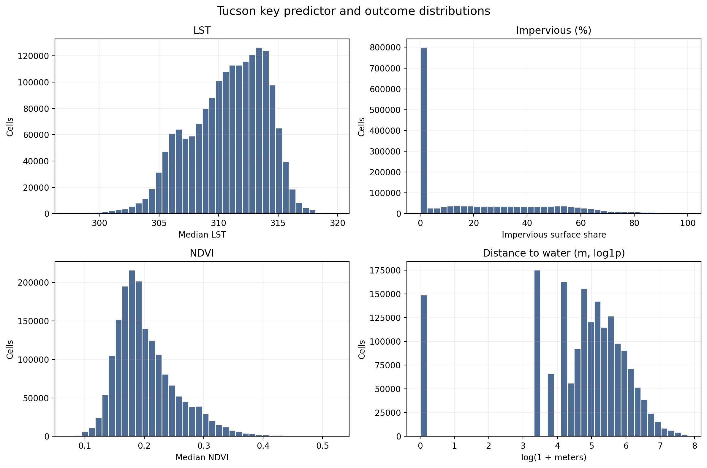
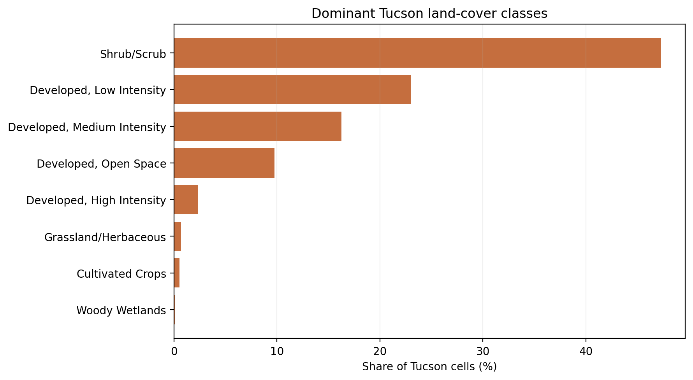
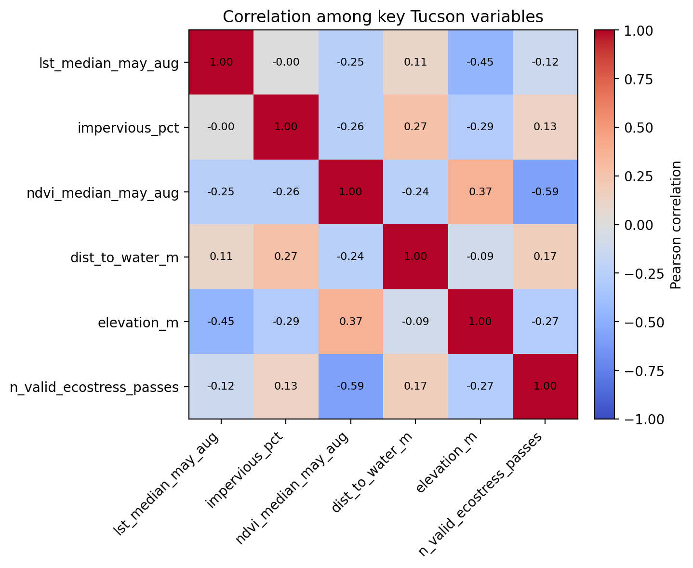
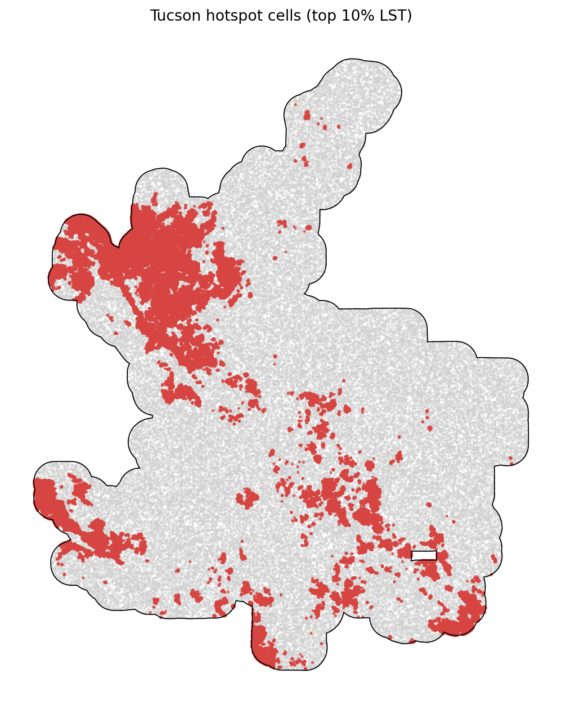

# Tucson Summary of Data

The Tucson summary uses `data_processed\city_features\02_tucson_az_features.parquet`, the canonical Tucson-only analysis-ready feature table. Each observation represents one filtered 30 m grid cell inside the buffered Tucson study area, with built-form, vegetation, elevation, hydrologic proximity, and warm-season surface-temperature attributes aligned to the same cell geometry. The table is intended for downstream urban heat modeling in a hot_arid city, including both continuous LST analysis and binary hotspot prediction.

## Overview

| metric | value |
| --- | --- |
| Primary Tucson analysis file | data_processed\city_features\02_tucson_az_features.parquet |
| Dataset choice rationale | Canonical per-city filtered output intended for downstream modeling. |
| Observations | 1779906 |
| Variables | 14 |
| Unit of analysis | One filtered 30 m grid cell in the buffered Tucson study area |
| Geometry / CRS | Cell polygons stored in EPSG:32612; centroids stored as WGS84 lon/lat |
| Projected spatial extent | [480660, 3545010, 528300, 3603930] |
| Study-area buffer | 2,000 m around the Census urban area |

## Key Variables

| variable_name | meaning | type_unit | why_it_matters |
| --- | --- | --- | --- |
| lst_median_may_aug | Median daytime land surface temperature across May-Aug ECOSTRESS observations. | continuous; ECOSTRESS LST units from source raster | Primary heat outcome for regression, classification, and hotspot analysis. |
| hotspot_10pct | Indicator for cells at or above the city-specific 90th percentile of LST. | binary flag | Natural target for hotspot classification and spatial risk mapping. |
| impervious_pct | NLCD impervious surface share for the 30 m cell. | continuous; percent | Core urban form exposure tied to heat retention and built intensity. |
| ndvi_median_may_aug | Median warm-season greenness index from Landsat/AppEEARS NDVI layers. | continuous; NDVI index | Vegetation is a likely protective predictor against elevated surface temperatures. |
| dist_to_water_m | Distance from the cell to the nearest mapped hydro feature. | continuous; meters | Captures proximity to possible local cooling influences and riparian structure. |
| land_cover_class | NLCD land cover class code for the cell. | categorical; NLCD class | Summarizes surface type and helps separate developed, barren, and vegetated cells. |
| n_valid_ecostress_passes | Count of valid ECOSTRESS observations contributing to the LST median. | count | Important quality-control covariate because low temporal coverage can weaken inference. |

## Targeted Descriptive Results

### Preprocessing audit

| stage | n_rows | share_of_unfiltered_pct |
| --- | --- | --- |
| unfiltered_input_rows | 1,785,506 | 100.00 |
| dropped_open_water_rows | 461 | 0.03 |
| dropped_lt3_ecostress_pass_rows | 263 | 0.01 |
| final_filtered_rows | 1,779,906 | 99.69 |

### Key numeric summary

| variable | n_non_missing | missing_pct | mean | median | std | p10 | p90 | skew |
| --- | --- | --- | --- | --- | --- | --- | --- | --- |
| impervious_pct | 1,779,906 | 0.00 | 21.10 | 10.02 | 24.76 | 0.00 | 58.96 | 0.87 |
| ndvi_median_may_aug | 1,779,902 | 0.00 | 0.20 | 0.19 | 0.05 | 0.15 | 0.28 | 1.25 |
| lst_median_may_aug | 1,779,906 | 0.00 | 310.77 | 311.17 | 3.20 | 306.17 | 314.55 | -0.48 |
| dist_to_water_m | 1,779,906 | 0.00 | 211.63 | 150.00 | 245.06 | 30.00 | 480.00 | 3.02 |
| elevation_m | 1,778,554 | 0.08 | 819.18 | 796.40 | 120.13 | 707.26 | 947.16 | 2.29 |
| n_valid_ecostress_passes | 1,779,906 | 0.00 | 29.79 | 30.00 | 2.43 | 27.00 | 33.00 | -0.16 |

### Land-cover composition

| land_cover_class | land_cover_label | n_rows | share_pct |
| --- | --- | --- | --- |
| 52 | Shrub/Scrub | 841,648 | 47.29 |
| 22 | Developed, Low Intensity | 408,963 | 22.98 |
| 23 | Developed, Medium Intensity | 289,560 | 16.27 |
| 21 | Developed, Open Space | 173,560 | 9.75 |
| 24 | Developed, High Intensity | 41,770 | 2.35 |
| 71 | Grassland/Herbaceous | 12,156 | 0.68 |
| 82 | Cultivated Crops | 9,884 | 0.56 |
| 90 | Woody Wetlands | 1,434 | 0.08 |

### Missingness for key variables

| variable | missing_n | missing_pct | non_missing_n |
| --- | --- | --- | --- |
| elevation_m | 1,352 | 0.0760 | 1,778,554 |
| ndvi_median_may_aug | 4 | 0.0002 | 1,779,902 |
| dist_to_water_m | 0 | 0.0000 | 1,779,906 |
| hotspot_10pct | 0 | 0.0000 | 1,779,906 |
| impervious_pct | 0 | 0.0000 | 1,779,906 |
| land_cover_class | 0 | 0.0000 | 1,779,906 |
| lst_median_may_aug | 0 | 0.0000 | 1,779,906 |
| n_valid_ecostress_passes | 0 | 0.0000 | 1,779,906 |

### Correlation matrix

| variable | lst_median_may_aug | impervious_pct | ndvi_median_may_aug | dist_to_water_m | elevation_m | n_valid_ecostress_passes |
| --- | --- | --- | --- | --- | --- | --- |
| lst_median_may_aug | 1.00 | -0.00 | -0.25 | 0.11 | -0.45 | -0.12 |
| impervious_pct | -0.00 | 1.00 | -0.26 | 0.27 | -0.29 | 0.13 |
| ndvi_median_may_aug | -0.25 | -0.26 | 1.00 | -0.24 | 0.37 | -0.59 |
| dist_to_water_m | 0.11 | 0.27 | -0.24 | 1.00 | -0.09 | 0.17 |
| elevation_m | -0.45 | -0.29 | 0.37 | -0.09 | 1.00 | -0.27 |
| n_valid_ecostress_passes | -0.12 | 0.13 | -0.59 | 0.17 | -0.27 | 1.00 |

## Figures

## Notable Patterns

- Missingness is limited overall; the highest missing share is `elevation_m` at 0.08%.
- `hotspot_10pct` is intentionally imbalanced at 10.00% positives because it marks the Tucson-specific top decile of LST.
- Land cover is concentrated in Shrub/Scrub cells, which make up 47.3% of the filtered Tucson dataset.
- The strongest linear relationship with LST among the key numeric variables is negative for `elevation_m` (r = -0.45).
- Hotspot prevalence varies by Tucson quadrant from 0.7% to 24.0%, which is consistent with non-random spatial concentration.
- `dist_to_water_m` is strongly skewed (skew = 3.02), so transformations or robust summaries may be useful in later modeling.

## Output Notes

- The Tucson-only per-city feature parquet was chosen over the merged final dataset when it was available because it is the direct analysis-ready output for this city and already reflects the row-drop rules used by the pipeline.
- Supporting CSV tables and PNG figures for this summary were generated deterministically by the companion CLI.
- City markdown and tables live under `outputs/data_processing/city_summaries/`, batch summary tables live under `outputs/data_processing/batch_reports/`, and figures live under `figures/data_processing/city_summaries/`.
- `outputs/modeling/` and `figures/modeling/` remain reserved for ML/evaluation artifacts.
