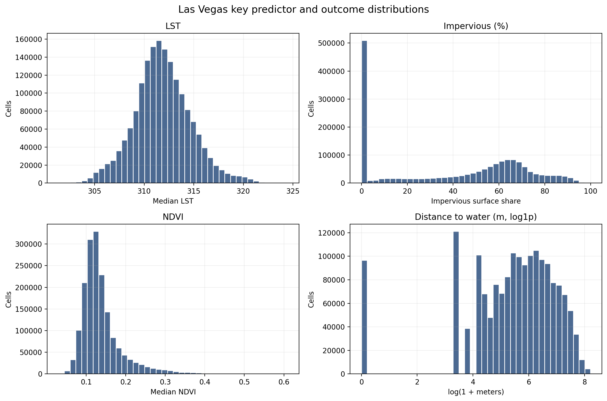
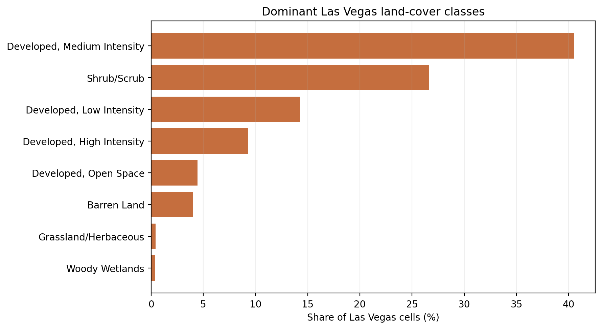
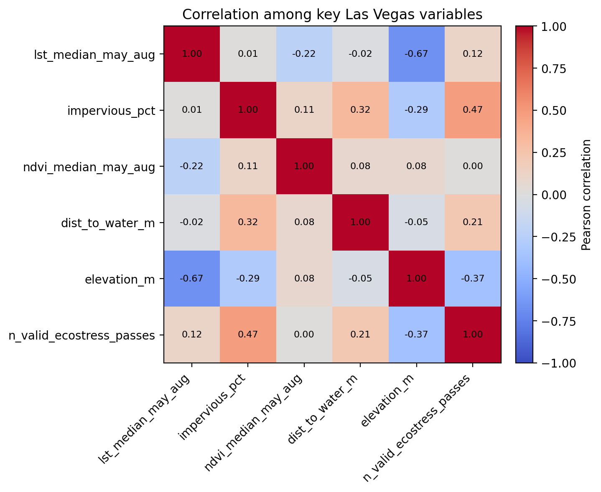
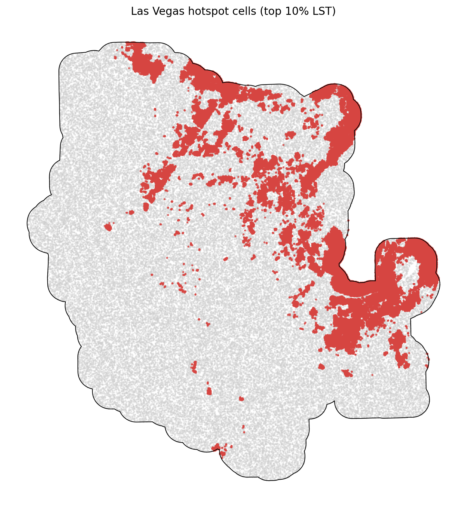

# Las Vegas Summary of Data

The Las Vegas summary uses `data_processed\city_features\03_las_vegas_nv_features.parquet`, the canonical Las Vegas-only analysis-ready feature table. Each observation represents one filtered 30 m grid cell inside the buffered Las Vegas study area, with built-form, vegetation, elevation, hydrologic proximity, and warm-season surface-temperature attributes aligned to the same cell geometry. The table is intended for downstream urban heat modeling in a hot_arid city, including both continuous LST analysis and binary hotspot prediction.

## Overview

| metric | value |
| --- | --- |
| Primary Las Vegas analysis file | data_processed\city_features\03_las_vegas_nv_features.parquet |
| Dataset choice rationale | Canonical per-city filtered output intended for downstream modeling. |
| Observations | 1718669 |
| Variables | 14 |
| Unit of analysis | One filtered 30 m grid cell in the buffered Las Vegas study area |
| Geometry / CRS | Cell polygons stored in EPSG:32611; centroids stored as WGS84 lon/lat |
| Projected spatial extent | [643980, 3974940, 690780, 4024620] |
| Study-area buffer | 2,000 m around the Census urban area |

## Key Variables

| variable_name | meaning | type_unit | why_it_matters |
| --- | --- | --- | --- |
| lst_median_may_aug | Median daytime land surface temperature across May-Aug ECOSTRESS observations. | continuous; ECOSTRESS LST units from source raster | Primary heat outcome for regression, classification, and hotspot analysis. |
| hotspot_10pct | Indicator for cells at or above the city-specific 90th percentile of LST. | binary flag | Natural target for hotspot classification and spatial risk mapping. |
| impervious_pct | NLCD impervious surface share for the 30 m cell. | continuous; percent | Core urban form exposure tied to heat retention and built intensity. |
| ndvi_median_may_aug | Median warm-season greenness index from Landsat/AppEEARS NDVI layers. | continuous; NDVI index | Vegetation is a likely protective predictor against elevated surface temperatures. |
| dist_to_water_m | Distance from the cell to the nearest mapped hydro feature. | continuous; meters | Captures proximity to possible local cooling influences and riparian structure. |
| land_cover_class | NLCD land cover class code for the cell. | categorical; NLCD class | Summarizes surface type and helps separate developed, barren, and vegetated cells. |
| n_valid_ecostress_passes | Count of valid ECOSTRESS observations contributing to the LST median. | count | Important quality-control covariate because low temporal coverage can weaken inference. |

## Targeted Descriptive Results

### Preprocessing audit

| stage | n_rows | share_of_unfiltered_pct |
| --- | --- | --- |
| unfiltered_input_rows | 1,724,686 | 100.00 |
| dropped_open_water_rows | 2,262 | 0.13 |
| dropped_lt3_ecostress_pass_rows | 277 | 0.02 |
| final_filtered_rows | 1,718,669 | 99.65 |

### Key numeric summary

| variable | n_non_missing | missing_pct | mean | median | std | p10 | p90 | skew |
| --- | --- | --- | --- | --- | --- | --- | --- | --- |
| impervious_pct | 1,718,669 | 0.00 | 39.79 | 49.07 | 31.21 | 0.00 | 77.35 | -0.13 |
| ndvi_median_may_aug | 1,718,666 | 0.00 | 0.14 | 0.13 | 0.05 | 0.09 | 0.20 | 2.15 |
| lst_median_may_aug | 1,718,669 | 0.00 | 311.86 | 311.72 | 2.89 | 308.32 | 315.49 | 0.24 |
| dist_to_water_m | 1,718,669 | 0.00 | 500.22 | 284.60 | 565.35 | 30.00 | 1,323.06 | 1.77 |
| elevation_m | 1,717,671 | 0.06 | 712.09 | 697.59 | 141.20 | 546.11 | 906.70 | 0.71 |
| n_valid_ecostress_passes | 1,718,669 | 0.00 | 32.73 | 33.00 | 1.84 | 30.00 | 35.00 | -0.36 |

### Land-cover composition

| land_cover_class | land_cover_label | n_rows | share_pct |
| --- | --- | --- | --- |
| 23 | Developed, Medium Intensity | 696,525 | 40.53 |
| 52 | Shrub/Scrub | 457,814 | 26.64 |
| 22 | Developed, Low Intensity | 244,879 | 14.25 |
| 24 | Developed, High Intensity | 159,270 | 9.27 |
| 21 | Developed, Open Space | 76,678 | 4.46 |
| 31 | Barren Land | 68,810 | 4.00 |
| 71 | Grassland/Herbaceous | 7,432 | 0.43 |
| 90 | Woody Wetlands | 6,489 | 0.38 |

### Missingness for key variables

| variable | missing_n | missing_pct | non_missing_n |
| --- | --- | --- | --- |
| elevation_m | 998 | 0.0581 | 1,717,671 |
| ndvi_median_may_aug | 3 | 0.0002 | 1,718,666 |
| dist_to_water_m | 0 | 0.0000 | 1,718,669 |
| hotspot_10pct | 0 | 0.0000 | 1,718,669 |
| impervious_pct | 0 | 0.0000 | 1,718,669 |
| land_cover_class | 0 | 0.0000 | 1,718,669 |
| lst_median_may_aug | 0 | 0.0000 | 1,718,669 |
| n_valid_ecostress_passes | 0 | 0.0000 | 1,718,669 |

### Correlation matrix

| variable | lst_median_may_aug | impervious_pct | ndvi_median_may_aug | dist_to_water_m | elevation_m | n_valid_ecostress_passes |
| --- | --- | --- | --- | --- | --- | --- |
| lst_median_may_aug | 1.00 | 0.01 | -0.22 | -0.02 | -0.67 | 0.12 |
| impervious_pct | 0.01 | 1.00 | 0.11 | 0.32 | -0.29 | 0.47 |
| ndvi_median_may_aug | -0.22 | 0.11 | 1.00 | 0.08 | 0.08 | 0.00 |
| dist_to_water_m | -0.02 | 0.32 | 0.08 | 1.00 | -0.05 | 0.21 |
| elevation_m | -0.67 | -0.29 | 0.08 | -0.05 | 1.00 | -0.37 |
| n_valid_ecostress_passes | 0.12 | 0.47 | 0.00 | 0.21 | -0.37 | 1.00 |

## Figures

## Notable Patterns

- Missingness is limited overall; the highest missing share is `elevation_m` at 0.06%.
- `hotspot_10pct` is intentionally imbalanced at 10.00% positives because it marks the Las Vegas-specific top decile of LST.
- Land cover is concentrated in Developed, Medium Intensity cells, which make up 40.5% of the filtered Las Vegas dataset.
- The strongest linear relationship with LST among the key numeric variables is negative for `elevation_m` (r = -0.67).
- Hotspot prevalence varies by Las Vegas quadrant from 0.3% to 21.8%, which is consistent with non-random spatial concentration.
- `ndvi_median_may_aug` is strongly skewed (skew = 2.15), so transformations or robust summaries may be useful in later modeling.

## Output Notes

- The Las Vegas-only per-city feature parquet was chosen over the merged final dataset when it was available because it is the direct analysis-ready output for this city and already reflects the row-drop rules used by the pipeline.
- Supporting CSV tables and PNG figures for this summary were generated deterministically by the companion CLI.
- City markdown and tables live under `outputs/data_processing/city_summaries/`, batch summary tables live under `outputs/data_processing/batch_reports/`, and figures live under `figures/data_processing/city_summaries/`.
- `outputs/modeling/` and `figures/modeling/` remain reserved for ML/evaluation artifacts.
