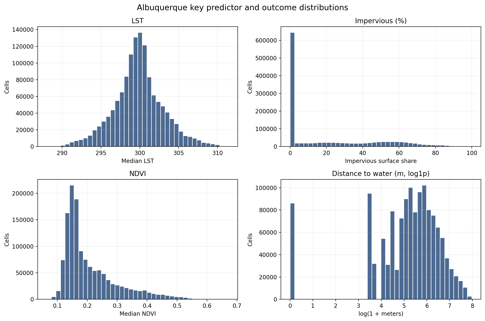
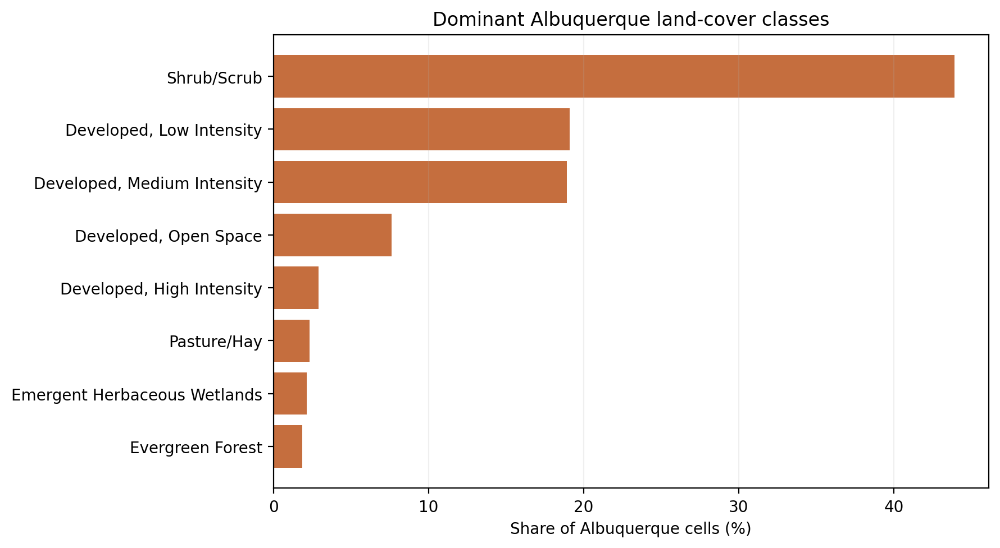
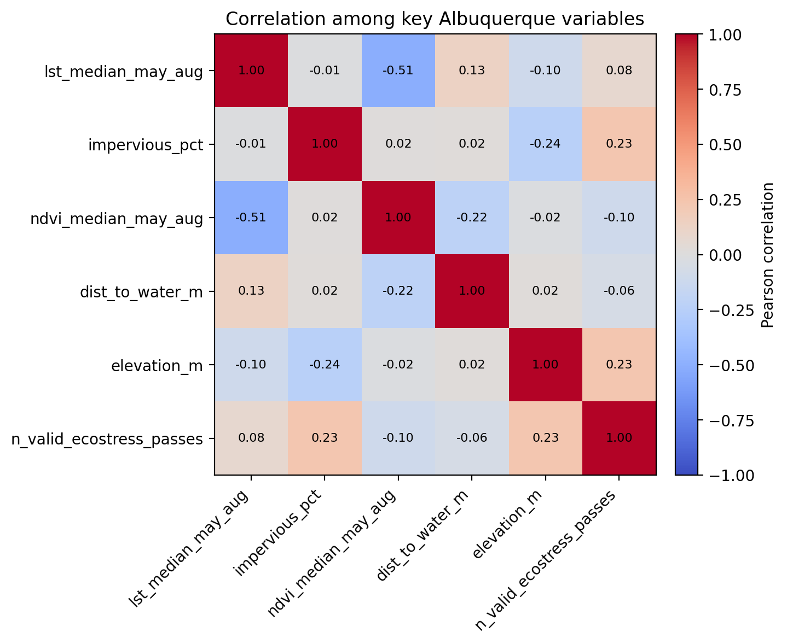
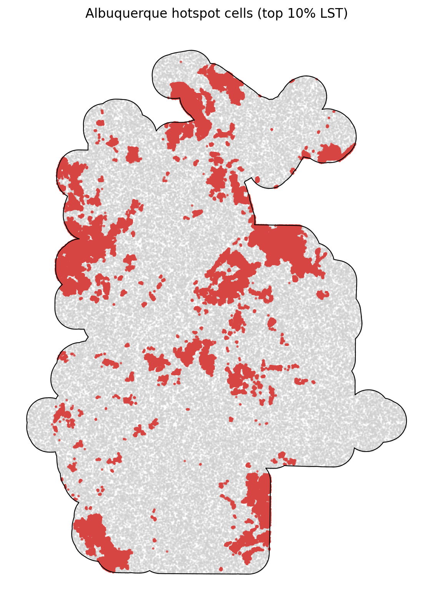

# Albuquerque Summary of Data

The Albuquerque summary uses `data_processed\city_features\04_albuquerque_nm_features.parquet`, the canonical Albuquerque-only analysis-ready feature table. Each observation represents one filtered 30 m grid cell inside the buffered Albuquerque study area, with built-form, vegetation, elevation, hydrologic proximity, and warm-season surface-temperature attributes aligned to the same cell geometry. The table is intended for downstream urban heat modeling in a hot_arid city, including both continuous LST analysis and binary hotspot prediction.

## Overview

| metric | value |
| --- | --- |
| Primary Albuquerque analysis file | data_processed\city_features\04_albuquerque_nm_features.parquet |
| Dataset choice rationale | Canonical per-city filtered output intended for downstream modeling. |
| Observations | 1336755 |
| Variables | 14 |
| Unit of analysis | One filtered 30 m grid cell in the buffered Albuquerque study area |
| Geometry / CRS | Cell polygons stored in EPSG:32613; centroids stored as WGS84 lon/lat |
| Projected spatial extent | [335070, 3866340, 372120, 3917310] |
| Study-area buffer | 2,000 m around the Census urban area |

## Key Variables

| variable_name | meaning | type_unit | why_it_matters |
| --- | --- | --- | --- |
| lst_median_may_aug | Median daytime land surface temperature across May-Aug ECOSTRESS observations. | continuous; ECOSTRESS LST units from source raster | Primary heat outcome for regression, classification, and hotspot analysis. |
| hotspot_10pct | Indicator for cells at or above the city-specific 90th percentile of LST. | binary flag | Natural target for hotspot classification and spatial risk mapping. |
| impervious_pct | NLCD impervious surface share for the 30 m cell. | continuous; percent | Core urban form exposure tied to heat retention and built intensity. |
| ndvi_median_may_aug | Median warm-season greenness index from Landsat/AppEEARS NDVI layers. | continuous; NDVI index | Vegetation is a likely protective predictor against elevated surface temperatures. |
| dist_to_water_m | Distance from the cell to the nearest mapped hydro feature. | continuous; meters | Captures proximity to possible local cooling influences and riparian structure. |
| land_cover_class | NLCD land cover class code for the cell. | categorical; NLCD class | Summarizes surface type and helps separate developed, barren, and vegetated cells. |
| n_valid_ecostress_passes | Count of valid ECOSTRESS observations contributing to the LST median. | count | Important quality-control covariate because low temporal coverage can weaken inference. |

## Targeted Descriptive Results

### Preprocessing audit

| stage | n_rows | share_of_unfiltered_pct |
| --- | --- | --- |
| unfiltered_input_rows | 1,345,653 | 100.00 |
| dropped_open_water_rows | 4,799 | 0.36 |
| dropped_lt3_ecostress_pass_rows | 265 | 0.02 |
| final_filtered_rows | 1,336,755 | 99.34 |

### Key numeric summary

| variable | n_non_missing | missing_pct | mean | median | std | p10 | p90 | skew |
| --- | --- | --- | --- | --- | --- | --- | --- | --- |
| impervious_pct | 1,336,755 | 0.00 | 21.84 | 5.51 | 26.55 | 0.00 | 63.36 | 0.84 |
| ndvi_median_may_aug | 1,336,737 | 0.00 | 0.21 | 0.17 | 0.09 | 0.13 | 0.35 | 1.48 |
| lst_median_may_aug | 1,336,755 | 0.00 | 299.82 | 299.80 | 3.20 | 295.79 | 303.89 | 0.07 |
| dist_to_water_m | 1,336,755 | 0.00 | 347.82 | 218.40 | 394.60 | 30.00 | 816.09 | 2.29 |
| elevation_m | 1,335,679 | 0.08 | 1,642.32 | 1,616.58 | 130.35 | 1,515.69 | 1,772.49 | 2.10 |
| n_valid_ecostress_passes | 1,336,755 | 0.00 | 29.44 | 30.00 | 1.76 | 27.00 | 32.00 | -0.36 |

### Land-cover composition

| land_cover_class | land_cover_label | n_rows | share_pct |
| --- | --- | --- | --- |
| 52 | Shrub/Scrub | 587,192 | 43.93 |
| 22 | Developed, Low Intensity | 255,228 | 19.09 |
| 23 | Developed, Medium Intensity | 252,893 | 18.92 |
| 21 | Developed, Open Space | 101,765 | 7.61 |
| 24 | Developed, High Intensity | 38,811 | 2.90 |
| 81 | Pasture/Hay | 31,433 | 2.35 |
| 95 | Emergent Herbaceous Wetlands | 28,957 | 2.17 |
| 42 | Evergreen Forest | 25,083 | 1.88 |

### Missingness for key variables

| variable | missing_n | missing_pct | non_missing_n |
| --- | --- | --- | --- |
| elevation_m | 1,076 | 0.0805 | 1,335,679 |
| ndvi_median_may_aug | 18 | 0.0013 | 1,336,737 |
| dist_to_water_m | 0 | 0.0000 | 1,336,755 |
| hotspot_10pct | 0 | 0.0000 | 1,336,755 |
| impervious_pct | 0 | 0.0000 | 1,336,755 |
| land_cover_class | 0 | 0.0000 | 1,336,755 |
| lst_median_may_aug | 0 | 0.0000 | 1,336,755 |
| n_valid_ecostress_passes | 0 | 0.0000 | 1,336,755 |

### Correlation matrix

| variable | lst_median_may_aug | impervious_pct | ndvi_median_may_aug | dist_to_water_m | elevation_m | n_valid_ecostress_passes |
| --- | --- | --- | --- | --- | --- | --- |
| lst_median_may_aug | 1.00 | -0.01 | -0.51 | 0.13 | -0.10 | 0.08 |
| impervious_pct | -0.01 | 1.00 | 0.02 | 0.02 | -0.24 | 0.23 |
| ndvi_median_may_aug | -0.51 | 0.02 | 1.00 | -0.22 | -0.02 | -0.10 |
| dist_to_water_m | 0.13 | 0.02 | -0.22 | 1.00 | 0.02 | -0.06 |
| elevation_m | -0.10 | -0.24 | -0.02 | 0.02 | 1.00 | 0.23 |
| n_valid_ecostress_passes | 0.08 | 0.23 | -0.10 | -0.06 | 0.23 | 1.00 |

## Figures

## Notable Patterns

- Missingness is limited overall; the highest missing share is `elevation_m` at 0.08%.
- `hotspot_10pct` is intentionally imbalanced at 10.00% positives because it marks the Albuquerque-specific top decile of LST.
- Land cover is concentrated in Shrub/Scrub cells, which make up 43.9% of the filtered Albuquerque dataset.
- The strongest linear relationship with LST among the key numeric variables is negative for `ndvi_median_may_aug` (r = -0.51).
- Hotspot prevalence varies by Albuquerque quadrant from 5.9% to 15.3%, which is consistent with non-random spatial concentration.
- `dist_to_water_m` is strongly skewed (skew = 2.29), so transformations or robust summaries may be useful in later modeling.

## Output Notes

- The Albuquerque-only per-city feature parquet was chosen over the merged final dataset when it was available because it is the direct analysis-ready output for this city and already reflects the row-drop rules used by the pipeline.
- Supporting CSV tables and PNG figures for this summary were generated deterministically by the companion CLI.
- City markdown and tables live under `outputs/data_processing/city_summaries/`, batch summary tables live under `outputs/data_processing/batch_reports/`, and figures live under `figures/data_processing/city_summaries/`.
- `outputs/modeling/` and `figures/modeling/` remain reserved for ML/evaluation artifacts.
