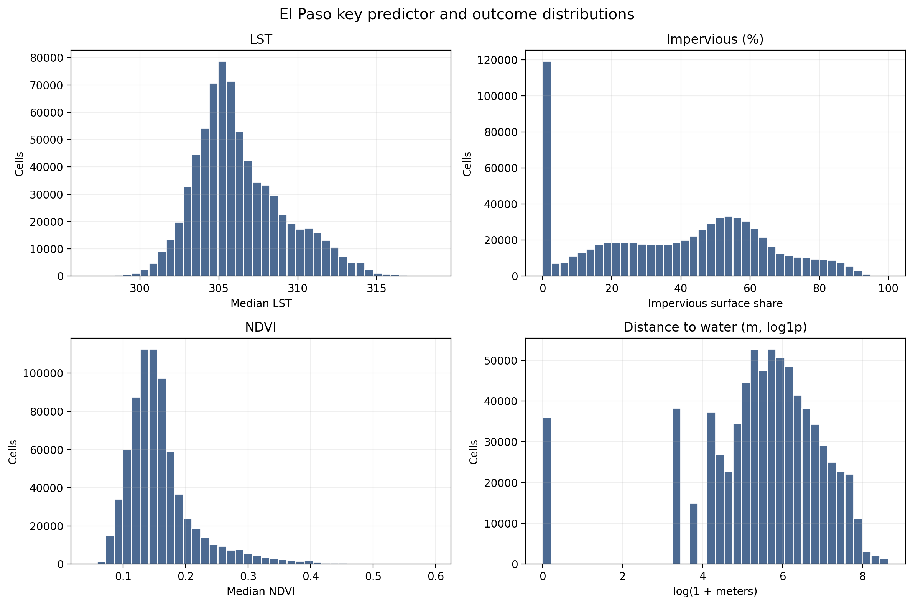
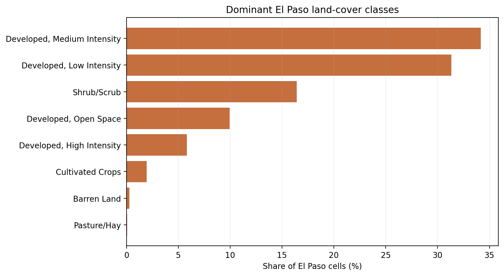
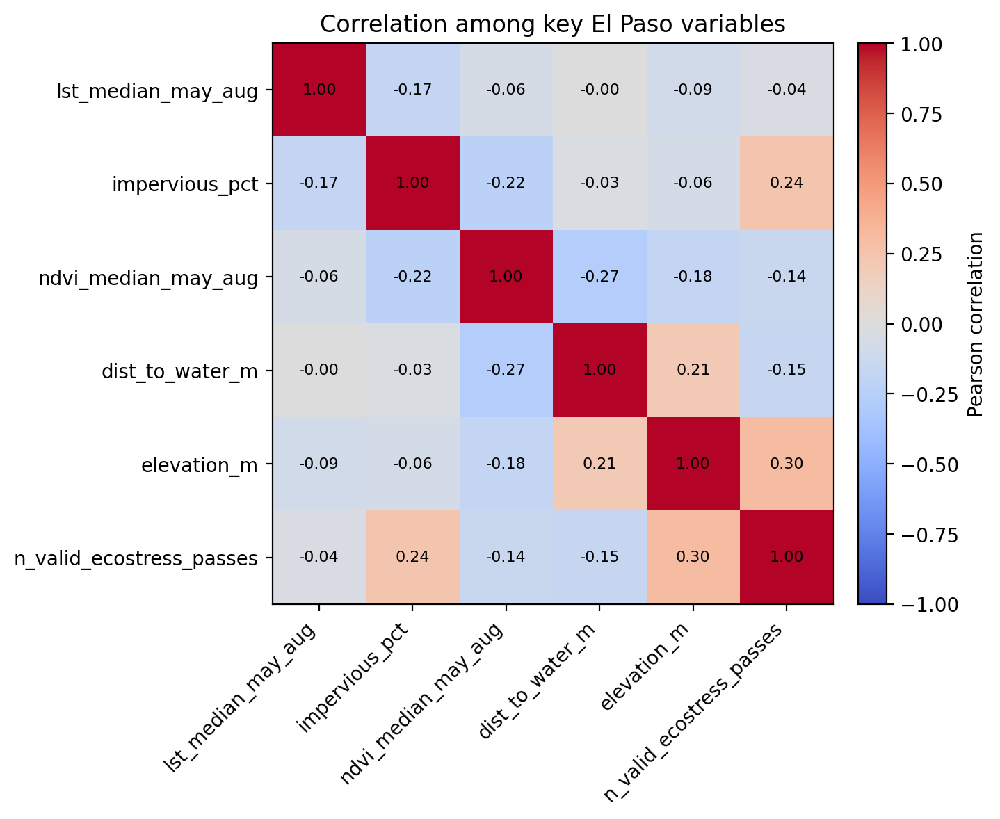
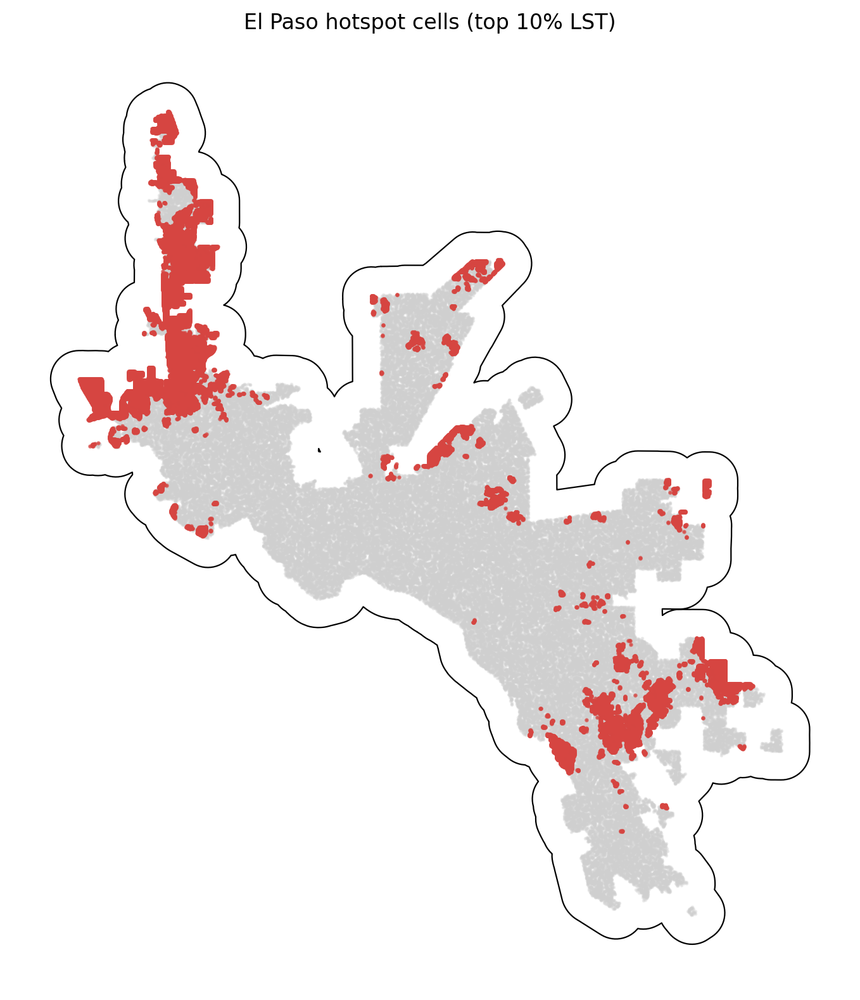

# El Paso Summary of Data

The El Paso summary uses `data_processed\city_features\05_el_paso_tx_features.parquet`, the canonical El Paso-only analysis-ready feature table. Each observation represents one filtered 30 m grid cell inside the buffered El Paso study area, with built-form, vegetation, elevation, hydrologic proximity, and warm-season surface-temperature attributes aligned to the same cell geometry. The table is intended for downstream urban heat modeling in a hot_arid city, including both continuous LST analysis and binary hotspot prediction.

## Overview

| metric | value |
| --- | --- |
| Primary El Paso analysis file | data_processed\city_features\05_el_paso_tx_features.parquet |
| Dataset choice rationale | Canonical per-city filtered output intended for downstream modeling. |
| Observations | 738527 |
| Variables | 16 |
| Unit of analysis | One filtered 30 m grid cell in the buffered El Paso study area |
| Geometry / CRS | Cell polygons stored in EPSG:32613; centroids stored as WGS84 lon/lat |
| Projected spatial extent | [342300, 3491070, 391980, 3547920] |
| Study-area buffer | 2,000 m around the Census urban area |

## Key Variables

| variable_name | meaning | type_unit | why_it_matters |
| --- | --- | --- | --- |
| lst_median_may_aug | Median daytime land surface temperature across May-Aug ECOSTRESS observations. | continuous; ECOSTRESS LST units from source raster | Primary heat outcome for regression, classification, and hotspot analysis. |
| hotspot_10pct | Indicator for cells at or above the city-specific 90th percentile of LST. | binary flag | Natural target for hotspot classification and spatial risk mapping. |
| impervious_pct | NLCD impervious surface share for the 30 m cell. | continuous; percent | Core urban form exposure tied to heat retention and built intensity. |
| ndvi_median_may_aug | Median warm-season greenness index from Landsat/AppEEARS NDVI layers. | continuous; NDVI index | Vegetation is a likely protective predictor against elevated surface temperatures. |
| dist_to_water_m | Distance from the cell to the nearest mapped hydro feature. | continuous; meters | Captures proximity to possible local cooling influences and riparian structure. |
| land_cover_class | NLCD land cover class code for the cell. | categorical; NLCD class | Summarizes surface type and helps separate developed, barren, and vegetated cells. |
| n_valid_ecostress_passes | Count of valid ECOSTRESS observations contributing to the LST median. | count | Important quality-control covariate because low temporal coverage can weaken inference. |

## Targeted Descriptive Results

### Preprocessing audit

| stage | n_rows | share_of_unfiltered_pct |
| --- | --- | --- |
| unfiltered_input_rows | 1,437,432 | 100.00 |
| dropped_open_water_rows | 1,410 | 0.10 |
| dropped_lt3_ecostress_pass_rows | 277 | 0.02 |
| final_filtered_rows | 738,527 | 51.38 |

### Key numeric summary

| variable | n_non_missing | missing_pct | mean | median | std | p10 | p90 | skew |
| --- | --- | --- | --- | --- | --- | --- | --- | --- |
| impervious_pct | 738,527 | 0.00 | 38.32 | 41.76 | 25.54 | 0.00 | 70.88 | -0.04 |
| ndvi_median_may_aug | 738,527 | 0.00 | 0.16 | 0.15 | 0.06 | 0.11 | 0.23 | 1.90 |
| lst_median_may_aug | 738,527 | 0.00 | 306.31 | 305.73 | 2.89 | 303.12 | 310.62 | 0.68 |
| dist_to_water_m | 738,527 | 0.00 | 533.05 | 295.47 | 660.16 | 30.00 | 1,406.17 | 2.49 |
| elevation_m | 738,527 | 0.00 | 1,185.98 | 1,190.13 | 62.90 | 1,116.00 | 1,228.30 | 2.74 |
| n_valid_ecostress_passes | 738,527 | 0.00 | 24.92 | 25.00 | 1.92 | 22.00 | 27.00 | -0.33 |

### Land-cover composition

| land_cover_class | land_cover_label | n_rows | share_pct |
| --- | --- | --- | --- |
| 23 | Developed, Medium Intensity | 252,268 | 34.16 |
| 22 | Developed, Low Intensity | 231,323 | 31.32 |
| 52 | Shrub/Scrub | 121,159 | 16.41 |
| 21 | Developed, Open Space | 73,456 | 9.95 |
| 24 | Developed, High Intensity | 42,994 | 5.82 |
| 82 | Cultivated Crops | 14,416 | 1.95 |
| 31 | Barren Land | 2,063 | 0.28 |
| 81 | Pasture/Hay | 505 | 0.07 |

### Missingness for key variables

| variable | missing_n | missing_pct | non_missing_n |
| --- | --- | --- | --- |
| dist_to_water_m | 0 | 0.0000 | 738,527 |
| elevation_m | 0 | 0.0000 | 738,527 |
| hotspot_10pct | 0 | 0.0000 | 738,527 |
| impervious_pct | 0 | 0.0000 | 738,527 |
| land_cover_class | 0 | 0.0000 | 738,527 |
| lst_median_may_aug | 0 | 0.0000 | 738,527 |
| n_valid_ecostress_passes | 0 | 0.0000 | 738,527 |
| ndvi_median_may_aug | 0 | 0.0000 | 738,527 |

### Correlation matrix

| variable | lst_median_may_aug | impervious_pct | ndvi_median_may_aug | dist_to_water_m | elevation_m | n_valid_ecostress_passes |
| --- | --- | --- | --- | --- | --- | --- |
| lst_median_may_aug | 1.00 | -0.17 | -0.06 | -0.00 | -0.09 | -0.04 |
| impervious_pct | -0.17 | 1.00 | -0.22 | -0.03 | -0.06 | 0.24 |
| ndvi_median_may_aug | -0.06 | -0.22 | 1.00 | -0.27 | -0.18 | -0.14 |
| dist_to_water_m | -0.00 | -0.03 | -0.27 | 1.00 | 0.21 | -0.15 |
| elevation_m | -0.09 | -0.06 | -0.18 | 0.21 | 1.00 | 0.30 |
| n_valid_ecostress_passes | -0.04 | 0.24 | -0.14 | -0.15 | 0.30 | 1.00 |

## Figures

## Notable Patterns

- None of the key modeling variables have missing values in the filtered El Paso table.
- `hotspot_10pct` is intentionally imbalanced at 10.00% positives because it marks the El Paso-specific top decile of LST.
- Land cover is concentrated in Developed, Medium Intensity cells, which make up 34.2% of the filtered El Paso dataset.
- The strongest linear relationship with LST among the key numeric variables is negative for `impervious_pct` (r = -0.17).
- Hotspot prevalence varies by El Paso quadrant from 0.4% to 17.2%, which is consistent with non-random spatial concentration.
- `elevation_m` is strongly skewed (skew = 2.74), so transformations or robust summaries may be useful in later modeling.

## Output Notes

- The El Paso-only per-city feature parquet was chosen over the merged final dataset when it was available because it is the direct analysis-ready output for this city and already reflects the row-drop rules used by the pipeline.
- Supporting CSV tables and PNG figures for this summary were generated deterministically by the companion CLI.
- City markdown and tables live under `outputs/data_processing/city_summaries/`, batch summary tables live under `outputs/data_processing/batch_reports/`, and figures live under `figures/data_processing/city_summaries/`.
- `outputs/modeling/` and `figures/modeling/` remain reserved for ML/evaluation artifacts.
