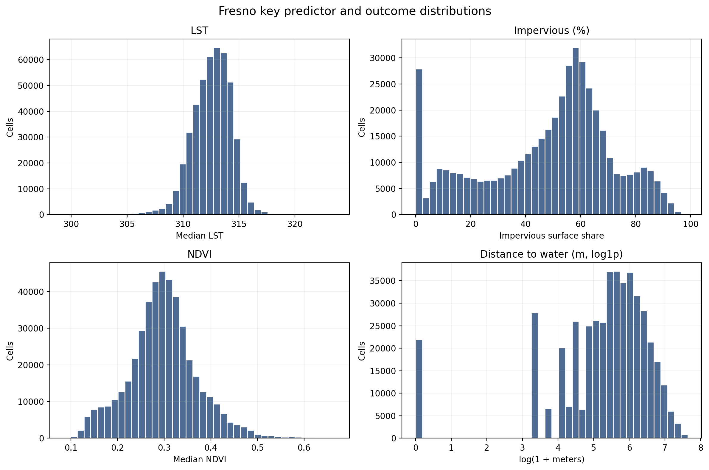
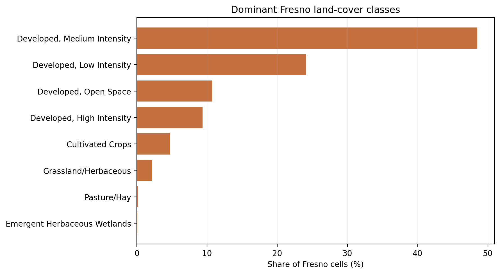
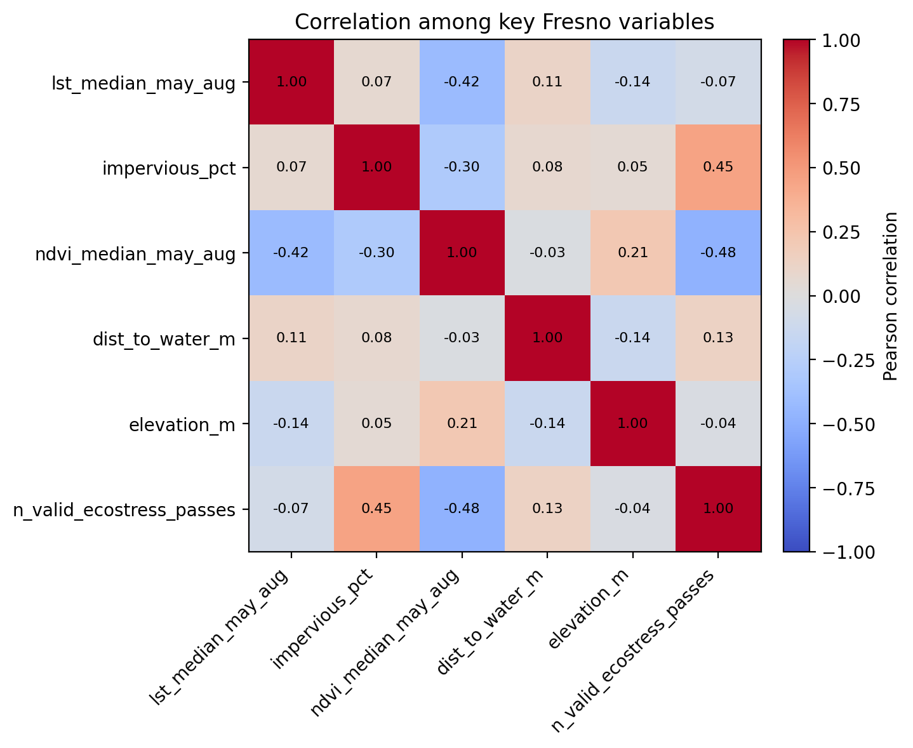
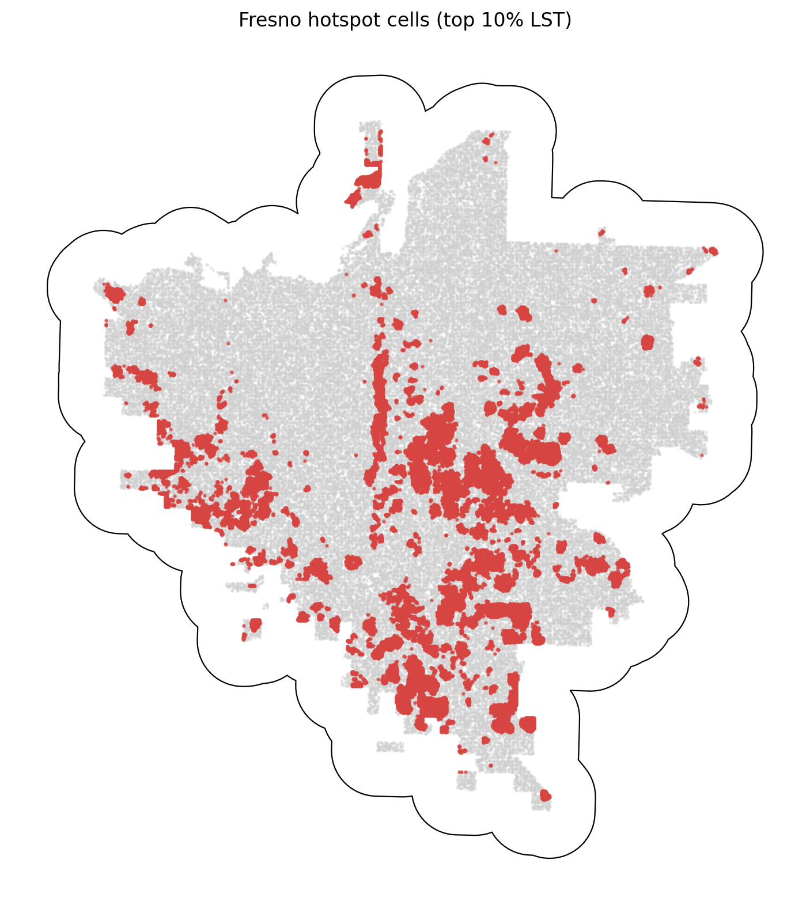

# Fresno Summary of Data

The Fresno summary uses `data_processed\city_features\08_fresno_ca_features.parquet`, the canonical Fresno-only analysis-ready feature table. Each observation represents one filtered 30 m grid cell inside the buffered Fresno study area, with built-form, vegetation, elevation, hydrologic proximity, and warm-season surface-temperature attributes aligned to the same cell geometry. The table is intended for downstream urban heat modeling in a hot_arid city, including both continuous LST analysis and binary hotspot prediction.

## Overview

| metric | value |
| --- | --- |
| Primary Fresno analysis file | data_processed\city_features\08_fresno_ca_features.parquet |
| Dataset choice rationale | Canonical per-city filtered output intended for downstream modeling. |
| Observations | 459104 |
| Variables | 16 |
| Unit of analysis | One filtered 30 m grid cell in the buffered Fresno study area |
| Geometry / CRS | Cell polygons stored in EPSG:32611; centroids stored as WGS84 lon/lat |
| Projected spatial extent | [238500, 4058430, 266010, 4088880] |
| Study-area buffer | 2,000 m around the Census urban area |

## Key Variables

| variable_name | meaning | type_unit | why_it_matters |
| --- | --- | --- | --- |
| lst_median_may_aug | Median daytime land surface temperature across May-Aug ECOSTRESS observations. | continuous; ECOSTRESS LST units from source raster | Primary heat outcome for regression, classification, and hotspot analysis. |
| hotspot_10pct | Indicator for cells at or above the city-specific 90th percentile of LST. | binary flag | Natural target for hotspot classification and spatial risk mapping. |
| impervious_pct | NLCD impervious surface share for the 30 m cell. | continuous; percent | Core urban form exposure tied to heat retention and built intensity. |
| ndvi_median_may_aug | Median warm-season greenness index from Landsat/AppEEARS NDVI layers. | continuous; NDVI index | Vegetation is a likely protective predictor against elevated surface temperatures. |
| dist_to_water_m | Distance from the cell to the nearest mapped hydro feature. | continuous; meters | Captures proximity to possible local cooling influences and riparian structure. |
| land_cover_class | NLCD land cover class code for the cell. | categorical; NLCD class | Summarizes surface type and helps separate developed, barren, and vegetated cells. |
| n_valid_ecostress_passes | Count of valid ECOSTRESS observations contributing to the LST median. | count | Important quality-control covariate because low temporal coverage can weaken inference. |

## Targeted Descriptive Results

### Preprocessing audit

| stage | n_rows | share_of_unfiltered_pct |
| --- | --- | --- |
| unfiltered_input_rows | 778,720 | 100.00 |
| dropped_open_water_rows | 5,183 | 0.67 |
| dropped_lt3_ecostress_pass_rows | 0 | 0.00 |
| final_filtered_rows | 459,104 | 58.96 |

### Key numeric summary

| variable | n_non_missing | missing_pct | mean | median | std | p10 | p90 | skew |
| --- | --- | --- | --- | --- | --- | --- | --- | --- |
| impervious_pct | 459,104 | 0.00 | 48.22 | 53.86 | 23.74 | 9.79 | 77.08 | -0.49 |
| ndvi_median_may_aug | 459,104 | 0.00 | 0.30 | 0.30 | 0.07 | 0.20 | 0.39 | 0.37 |
| lst_median_may_aug | 459,104 | 0.00 | 312.56 | 312.69 | 1.77 | 310.36 | 314.59 | -0.63 |
| dist_to_water_m | 459,104 | 0.00 | 335.90 | 247.39 | 306.33 | 30.00 | 750.00 | 1.55 |
| elevation_m | 459,104 | 0.00 | 98.80 | 96.85 | 10.57 | 86.43 | 114.20 | 0.44 |
| n_valid_ecostress_passes | 459,104 | 0.00 | 59.09 | 59.00 | 5.03 | 53.00 | 66.00 | 0.29 |

### Land-cover composition

| land_cover_class | land_cover_label | n_rows | share_pct |
| --- | --- | --- | --- |
| 23 | Developed, Medium Intensity | 222,712 | 48.51 |
| 22 | Developed, Low Intensity | 110,564 | 24.08 |
| 21 | Developed, Open Space | 49,344 | 10.75 |
| 24 | Developed, High Intensity | 42,969 | 9.36 |
| 82 | Cultivated Crops | 21,870 | 4.76 |
| 71 | Grassland/Herbaceous | 9,980 | 2.17 |
| 81 | Pasture/Hay | 749 | 0.16 |
| 95 | Emergent Herbaceous Wetlands | 419 | 0.09 |

### Missingness for key variables

| variable | missing_n | missing_pct | non_missing_n |
| --- | --- | --- | --- |
| dist_to_water_m | 0 | 0.0000 | 459,104 |
| elevation_m | 0 | 0.0000 | 459,104 |
| hotspot_10pct | 0 | 0.0000 | 459,104 |
| impervious_pct | 0 | 0.0000 | 459,104 |
| land_cover_class | 0 | 0.0000 | 459,104 |
| lst_median_may_aug | 0 | 0.0000 | 459,104 |
| n_valid_ecostress_passes | 0 | 0.0000 | 459,104 |
| ndvi_median_may_aug | 0 | 0.0000 | 459,104 |

### Correlation matrix

| variable | lst_median_may_aug | impervious_pct | ndvi_median_may_aug | dist_to_water_m | elevation_m | n_valid_ecostress_passes |
| --- | --- | --- | --- | --- | --- | --- |
| lst_median_may_aug | 1.00 | 0.07 | -0.42 | 0.11 | -0.14 | -0.07 |
| impervious_pct | 0.07 | 1.00 | -0.30 | 0.08 | 0.05 | 0.45 |
| ndvi_median_may_aug | -0.42 | -0.30 | 1.00 | -0.03 | 0.21 | -0.48 |
| dist_to_water_m | 0.11 | 0.08 | -0.03 | 1.00 | -0.14 | 0.13 |
| elevation_m | -0.14 | 0.05 | 0.21 | -0.14 | 1.00 | -0.04 |
| n_valid_ecostress_passes | -0.07 | 0.45 | -0.48 | 0.13 | -0.04 | 1.00 |

## Figures

## Notable Patterns

- None of the key modeling variables have missing values in the filtered Fresno table.
- `hotspot_10pct` is intentionally imbalanced at 10.00% positives because it marks the Fresno-specific top decile of LST.
- Land cover is concentrated in Developed, Medium Intensity cells, which make up 48.5% of the filtered Fresno dataset.
- The strongest linear relationship with LST among the key numeric variables is negative for `ndvi_median_may_aug` (r = -0.42).
- Hotspot prevalence varies by Fresno quadrant from 3.1% to 19.2%, which is consistent with non-random spatial concentration.
- `dist_to_water_m` is strongly skewed (skew = 1.55), so transformations or robust summaries may be useful in later modeling.

## Output Notes

- The Fresno-only per-city feature parquet was chosen over the merged final dataset when it was available because it is the direct analysis-ready output for this city and already reflects the row-drop rules used by the pipeline.
- Supporting CSV tables and PNG figures for this summary were generated deterministically by the companion CLI.
- City markdown and tables live under `outputs/data_processing/city_summaries/`, batch summary tables live under `outputs/data_processing/batch_reports/`, and figures live under `figures/data_processing/city_summaries/`.
- `outputs/modeling/` and `figures/modeling/` remain reserved for ML/evaluation artifacts.
