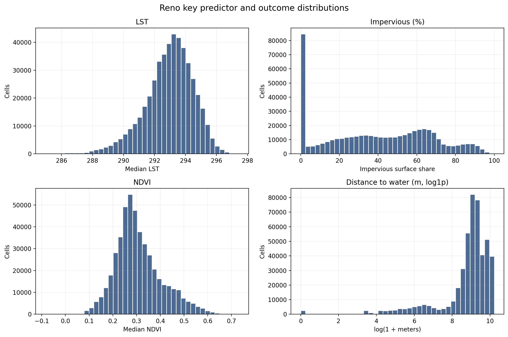
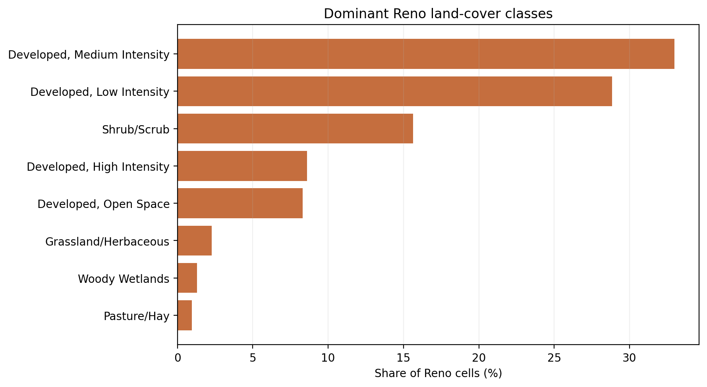
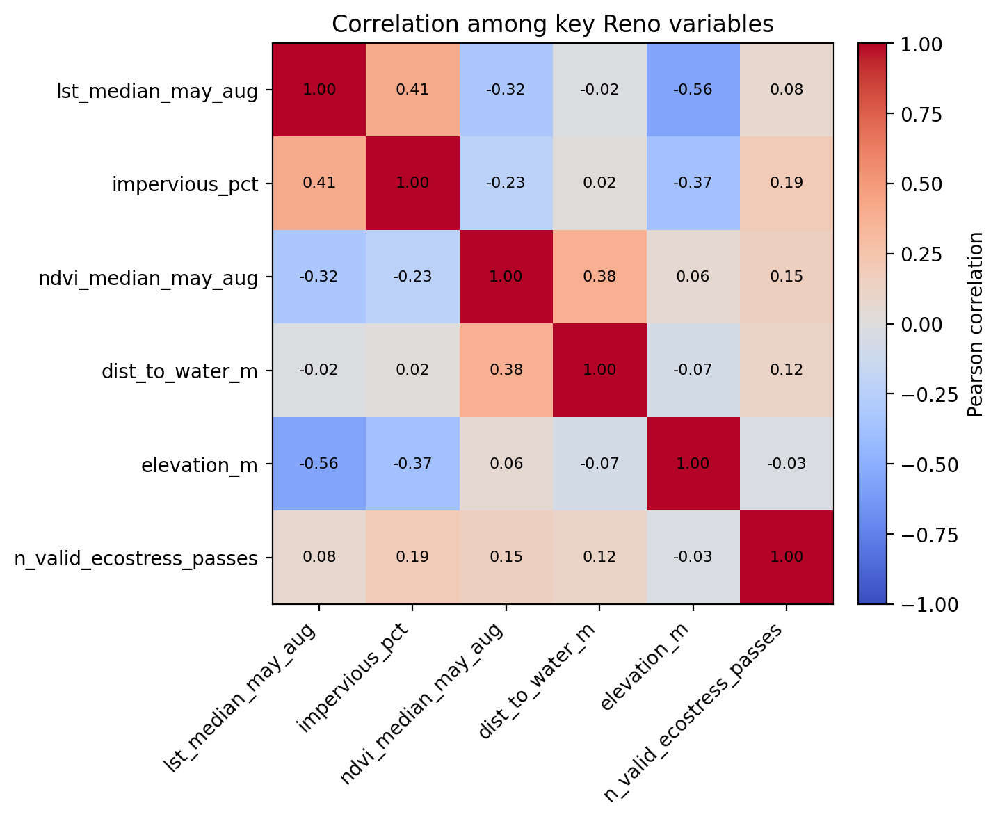
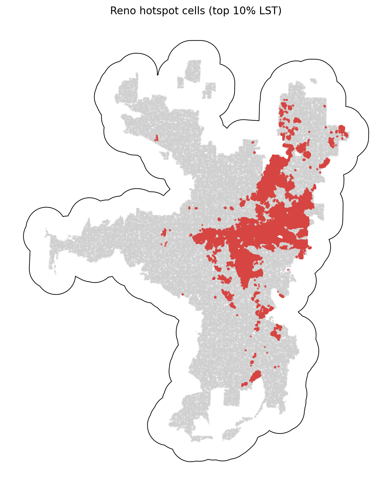

# Reno Summary of Data

The Reno summary uses `data_processed\city_features\10_reno_nv_features.parquet`, the canonical Reno-only analysis-ready feature table. Each observation represents one filtered 30 m grid cell inside the buffered Reno study area, with built-form, vegetation, elevation, hydrologic proximity, and warm-season surface-temperature attributes aligned to the same cell geometry. The table is intended for downstream urban heat modeling in a hot_arid city, including both continuous LST analysis and binary hotspot prediction.

## Overview

| metric | value |
| --- | --- |
| Primary Reno analysis file | data_processed\city_features\10_reno_nv_features.parquet |
| Dataset choice rationale | Canonical per-city filtered output intended for downstream modeling. |
| Observations | 475828 |
| Variables | 16 |
| Unit of analysis | One filtered 30 m grid cell in the buffered Reno study area |
| Geometry / CRS | Cell polygons stored in EPSG:32611; centroids stored as WGS84 lon/lat |
| Projected spatial extent | [241230, 4358340, 272580, 4397520] |
| Study-area buffer | 2,000 m around the Census urban area |

## Key Variables

| variable_name | meaning | type_unit | why_it_matters |
| --- | --- | --- | --- |
| lst_median_may_aug | Median daytime land surface temperature across May-Aug ECOSTRESS observations. | continuous; ECOSTRESS LST units from source raster | Primary heat outcome for regression, classification, and hotspot analysis. |
| hotspot_10pct | Indicator for cells at or above the city-specific 90th percentile of LST. | binary flag | Natural target for hotspot classification and spatial risk mapping. |
| impervious_pct | NLCD impervious surface share for the 30 m cell. | continuous; percent | Core urban form exposure tied to heat retention and built intensity. |
| ndvi_median_may_aug | Median warm-season greenness index from Landsat/AppEEARS NDVI layers. | continuous; NDVI index | Vegetation is a likely protective predictor against elevated surface temperatures. |
| dist_to_water_m | Distance from the cell to the nearest mapped hydro feature. | continuous; meters | Captures proximity to possible local cooling influences and riparian structure. |
| land_cover_class | NLCD land cover class code for the cell. | categorical; NLCD class | Summarizes surface type and helps separate developed, barren, and vegetated cells. |
| n_valid_ecostress_passes | Count of valid ECOSTRESS observations contributing to the LST median. | count | Important quality-control covariate because low temporal coverage can weaken inference. |

## Targeted Descriptive Results

### Preprocessing audit

| stage | n_rows | share_of_unfiltered_pct |
| --- | --- | --- |
| unfiltered_input_rows | 944,803 | 100.00 |
| dropped_open_water_rows | 8,147 | 0.86 |
| dropped_lt3_ecostress_pass_rows | 21 | 0.00 |
| final_filtered_rows | 475,828 | 50.36 |

### Key numeric summary

| variable | n_non_missing | missing_pct | mean | median | std | p10 | p90 | skew |
| --- | --- | --- | --- | --- | --- | --- | --- | --- |
| impervious_pct | 475,828 | 0.00 | 39.47 | 40.19 | 27.75 | 0.00 | 75.71 | 0.04 |
| ndvi_median_may_aug | 475,828 | 0.00 | 0.31 | 0.29 | 0.10 | 0.20 | 0.45 | 0.71 |
| lst_median_may_aug | 475,828 | 0.00 | 292.93 | 293.10 | 1.57 | 290.86 | 294.79 | -0.71 |
| dist_to_water_m | 475,828 | 0.00 | 10,103.44 | 9,141.00 | 6,683.64 | 810.56 | 20,678.71 | 0.52 |
| elevation_m | 475,828 | 0.00 | 1,445.59 | 1,419.01 | 94.93 | 1,346.30 | 1,569.13 | 1.06 |
| n_valid_ecostress_passes | 475,828 | 0.00 | 83.39 | 84.00 | 4.24 | 77.00 | 88.00 | -0.61 |

### Land-cover composition

| land_cover_class | land_cover_label | n_rows | share_pct |
| --- | --- | --- | --- |
| 23 | Developed, Medium Intensity | 156,887 | 32.97 |
| 22 | Developed, Low Intensity | 137,286 | 28.85 |
| 52 | Shrub/Scrub | 74,443 | 15.64 |
| 24 | Developed, High Intensity | 40,898 | 8.60 |
| 21 | Developed, Open Space | 39,529 | 8.31 |
| 71 | Grassland/Herbaceous | 10,865 | 2.28 |
| 90 | Woody Wetlands | 6,216 | 1.31 |
| 81 | Pasture/Hay | 4,566 | 0.96 |

### Missingness for key variables

| variable | missing_n | missing_pct | non_missing_n |
| --- | --- | --- | --- |
| dist_to_water_m | 0 | 0.0000 | 475,828 |
| elevation_m | 0 | 0.0000 | 475,828 |
| hotspot_10pct | 0 | 0.0000 | 475,828 |
| impervious_pct | 0 | 0.0000 | 475,828 |
| land_cover_class | 0 | 0.0000 | 475,828 |
| lst_median_may_aug | 0 | 0.0000 | 475,828 |
| n_valid_ecostress_passes | 0 | 0.0000 | 475,828 |
| ndvi_median_may_aug | 0 | 0.0000 | 475,828 |

### Correlation matrix

| variable | lst_median_may_aug | impervious_pct | ndvi_median_may_aug | dist_to_water_m | elevation_m | n_valid_ecostress_passes |
| --- | --- | --- | --- | --- | --- | --- |
| lst_median_may_aug | 1.00 | 0.41 | -0.32 | -0.02 | -0.56 | 0.08 |
| impervious_pct | 0.41 | 1.00 | -0.23 | 0.02 | -0.37 | 0.19 |
| ndvi_median_may_aug | -0.32 | -0.23 | 1.00 | 0.38 | 0.06 | 0.15 |
| dist_to_water_m | -0.02 | 0.02 | 0.38 | 1.00 | -0.07 | 0.12 |
| elevation_m | -0.56 | -0.37 | 0.06 | -0.07 | 1.00 | -0.03 |
| n_valid_ecostress_passes | 0.08 | 0.19 | 0.15 | 0.12 | -0.03 | 1.00 |

## Figures

## Notable Patterns

- None of the key modeling variables have missing values in the filtered Reno table.
- `hotspot_10pct` is intentionally imbalanced at 10.00% positives because it marks the Reno-specific top decile of LST.
- Land cover is concentrated in Developed, Medium Intensity cells, which make up 33.0% of the filtered Reno dataset.
- The strongest linear relationship with LST among the key numeric variables is negative for `elevation_m` (r = -0.56).
- Hotspot prevalence varies by Reno quadrant from 1.6% to 24.0%, which is consistent with non-random spatial concentration.
- `elevation_m` is strongly skewed (skew = 1.06), so transformations or robust summaries may be useful in later modeling.

## Output Notes

- The Reno-only per-city feature parquet was chosen over the merged final dataset when it was available because it is the direct analysis-ready output for this city and already reflects the row-drop rules used by the pipeline.
- Supporting CSV tables and PNG figures for this summary were generated deterministically by the companion CLI.
- City markdown and tables live under `outputs/data_processing/city_summaries/`, batch summary tables live under `outputs/data_processing/batch_reports/`, and figures live under `figures/data_processing/city_summaries/`.
- `outputs/modeling/` and `figures/modeling/` remain reserved for ML/evaluation artifacts.
