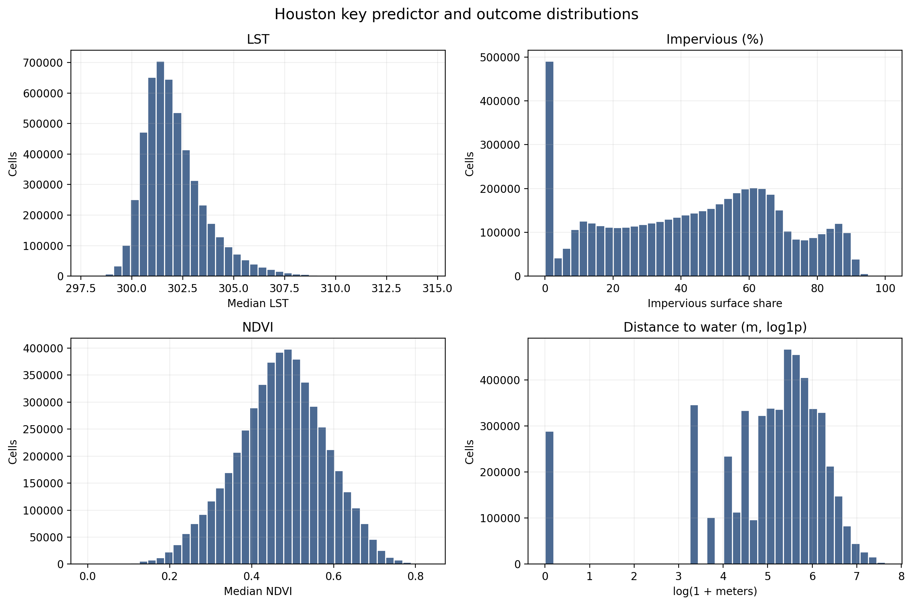
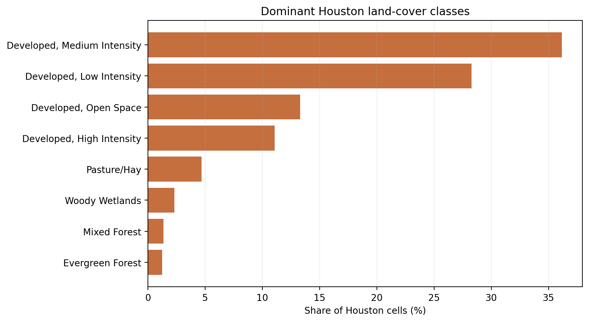
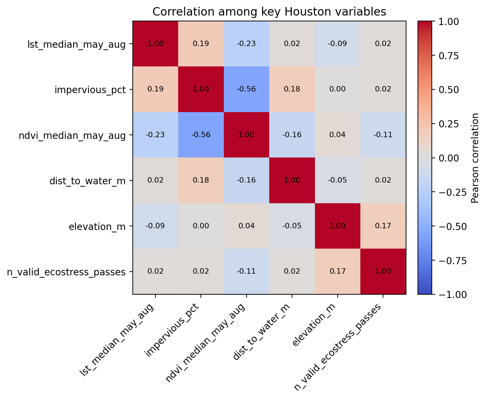
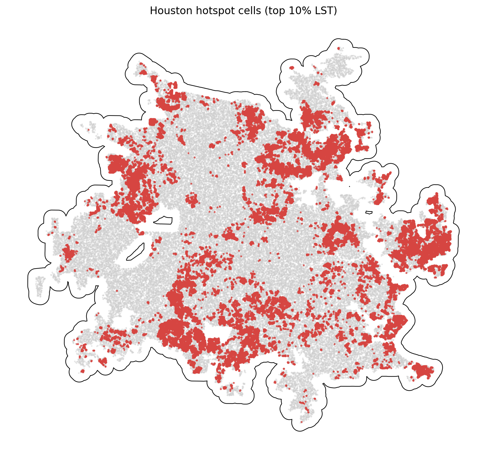

# Houston Summary of Data

The Houston summary uses `data_processed\city_features\11_houston_tx_features.parquet`, the canonical Houston-only analysis-ready feature table. Each observation represents one filtered 30 m grid cell inside the buffered Houston study area, with built-form, vegetation, elevation, hydrologic proximity, and warm-season surface-temperature attributes aligned to the same cell geometry. The table is intended for downstream urban heat modeling in a hot_humid city, including both continuous LST analysis and binary hotspot prediction.

## Overview

| metric | value |
| --- | --- |
| Primary Houston analysis file | data_processed\city_features\11_houston_tx_features.parquet |
| Dataset choice rationale | Canonical per-city filtered output intended for downstream modeling. |
| Observations | 5054661 |
| Variables | 16 |
| Unit of analysis | One filtered 30 m grid cell in the buffered Houston study area |
| Geometry / CRS | Cell polygons stored in EPSG:32615; centroids stored as WGS84 lon/lat |
| Projected spatial extent | [215070, 3250560, 319050, 3344880] |
| Study-area buffer | 2,000 m around the Census urban area |

## Key Variables

| variable_name | meaning | type_unit | why_it_matters |
| --- | --- | --- | --- |
| lst_median_may_aug | Median daytime land surface temperature across May-Aug ECOSTRESS observations. | continuous; ECOSTRESS LST units from source raster | Primary heat outcome for regression, classification, and hotspot analysis. |
| hotspot_10pct | Indicator for cells at or above the city-specific 90th percentile of LST. | binary flag | Natural target for hotspot classification and spatial risk mapping. |
| impervious_pct | NLCD impervious surface share for the 30 m cell. | continuous; percent | Core urban form exposure tied to heat retention and built intensity. |
| ndvi_median_may_aug | Median warm-season greenness index from Landsat/AppEEARS NDVI layers. | continuous; NDVI index | Vegetation is a likely protective predictor against elevated surface temperatures. |
| dist_to_water_m | Distance from the cell to the nearest mapped hydro feature. | continuous; meters | Captures proximity to possible local cooling influences and riparian structure. |
| land_cover_class | NLCD land cover class code for the cell. | categorical; NLCD class | Summarizes surface type and helps separate developed, barren, and vegetated cells. |
| n_valid_ecostress_passes | Count of valid ECOSTRESS observations contributing to the LST median. | count | Important quality-control covariate because low temporal coverage can weaken inference. |

## Targeted Descriptive Results

### Preprocessing audit

| stage | n_rows | share_of_unfiltered_pct |
| --- | --- | --- |
| unfiltered_input_rows | 7,225,370 | 100.00 |
| dropped_open_water_rows | 300,017 | 4.15 |
| dropped_lt3_ecostress_pass_rows | 502 | 0.01 |
| final_filtered_rows | 5,054,661 | 69.96 |

### Key numeric summary

| variable | n_non_missing | missing_pct | mean | median | std | p10 | p90 | skew |
| --- | --- | --- | --- | --- | --- | --- | --- | --- |
| impervious_pct | 5,054,661 | 0.00 | 43.72 | 46.50 | 26.17 | 3.36 | 79.14 | -0.13 |
| ndvi_median_may_aug | 5,053,265 | 0.03 | 0.47 | 0.47 | 0.11 | 0.32 | 0.61 | -0.17 |
| lst_median_may_aug | 5,054,661 | 0.00 | 302.09 | 301.79 | 1.56 | 300.47 | 304.11 | 1.32 |
| dist_to_water_m | 5,054,661 | 0.00 | 262.88 | 210.00 | 240.90 | 30.00 | 563.65 | 1.92 |
| elevation_m | 5,054,661 | 0.00 | 22.02 | 20.37 | 12.38 | 7.43 | 40.71 | 0.61 |
| n_valid_ecostress_passes | 5,054,661 | 0.00 | 22.84 | 22.00 | 4.19 | 20.00 | 25.00 | 3.44 |

### Land-cover composition

| land_cover_class | land_cover_label | n_rows | share_pct |
| --- | --- | --- | --- |
| 23 | Developed, Medium Intensity | 1,827,680 | 36.16 |
| 22 | Developed, Low Intensity | 1,428,571 | 28.26 |
| 21 | Developed, Open Space | 672,868 | 13.31 |
| 24 | Developed, High Intensity | 560,728 | 11.09 |
| 81 | Pasture/Hay | 236,764 | 4.68 |
| 90 | Woody Wetlands | 117,414 | 2.32 |
| 43 | Mixed Forest | 68,660 | 1.36 |
| 42 | Evergreen Forest | 63,462 | 1.26 |

### Missingness for key variables

| variable | missing_n | missing_pct | non_missing_n |
| --- | --- | --- | --- |
| ndvi_median_may_aug | 1,396 | 0.0276 | 5,053,265 |
| dist_to_water_m | 0 | 0.0000 | 5,054,661 |
| elevation_m | 0 | 0.0000 | 5,054,661 |
| hotspot_10pct | 0 | 0.0000 | 5,054,661 |
| impervious_pct | 0 | 0.0000 | 5,054,661 |
| land_cover_class | 0 | 0.0000 | 5,054,661 |
| lst_median_may_aug | 0 | 0.0000 | 5,054,661 |
| n_valid_ecostress_passes | 0 | 0.0000 | 5,054,661 |

### Correlation matrix

| variable | lst_median_may_aug | impervious_pct | ndvi_median_may_aug | dist_to_water_m | elevation_m | n_valid_ecostress_passes |
| --- | --- | --- | --- | --- | --- | --- |
| lst_median_may_aug | 1.00 | 0.19 | -0.23 | 0.02 | -0.09 | 0.02 |
| impervious_pct | 0.19 | 1.00 | -0.56 | 0.18 | 0.00 | 0.02 |
| ndvi_median_may_aug | -0.23 | -0.56 | 1.00 | -0.16 | 0.04 | -0.11 |
| dist_to_water_m | 0.02 | 0.18 | -0.16 | 1.00 | -0.05 | 0.02 |
| elevation_m | -0.09 | 0.00 | 0.04 | -0.05 | 1.00 | 0.17 |
| n_valid_ecostress_passes | 0.02 | 0.02 | -0.11 | 0.02 | 0.17 | 1.00 |

## Figures

## Notable Patterns

- Missingness is limited overall; the highest missing share is `ndvi_median_may_aug` at 0.03%.
- `hotspot_10pct` is intentionally imbalanced at 10.00% positives because it marks the Houston-specific top decile of LST.
- Land cover is concentrated in Developed, Medium Intensity cells, which make up 36.2% of the filtered Houston dataset.
- The strongest linear relationship with LST among the key numeric variables is negative for `ndvi_median_may_aug` (r = -0.23).
- Hotspot prevalence varies by Houston quadrant from 6.7% to 15.6%, which is consistent with non-random spatial concentration.
- `n_valid_ecostress_passes` is strongly skewed (skew = 3.44), so transformations or robust summaries may be useful in later modeling.

## Output Notes

- The Houston-only per-city feature parquet was chosen over the merged final dataset when it was available because it is the direct analysis-ready output for this city and already reflects the row-drop rules used by the pipeline.
- Supporting CSV tables and PNG figures for this summary were generated deterministically by the companion CLI.
- City markdown and tables live under `outputs/data_processing/city_summaries/`, batch summary tables live under `outputs/data_processing/batch_reports/`, and figures live under `figures/data_processing/city_summaries/`.
- `outputs/modeling/` and `figures/modeling/` remain reserved for ML/evaluation artifacts.
