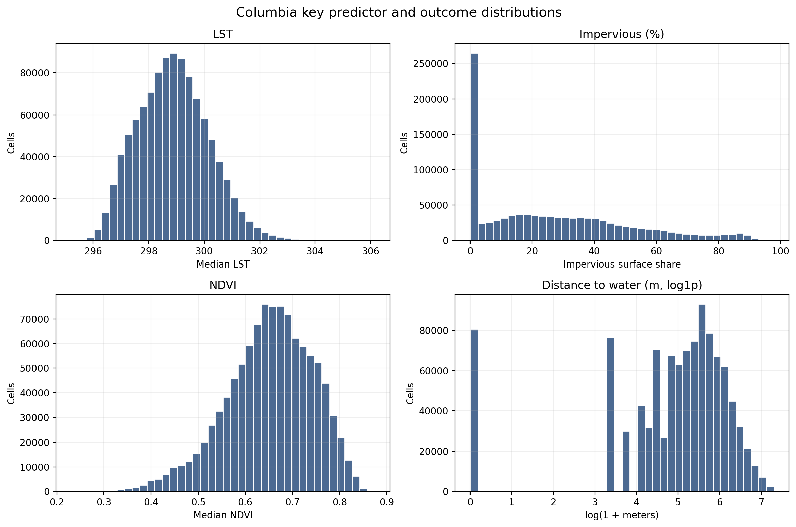
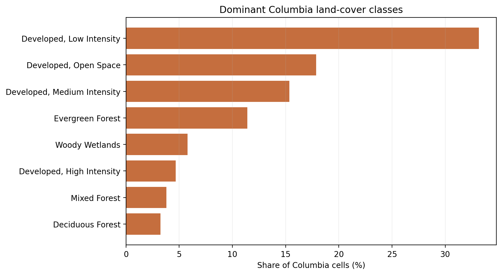
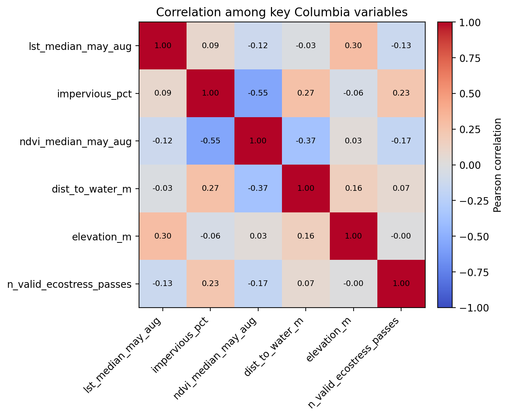
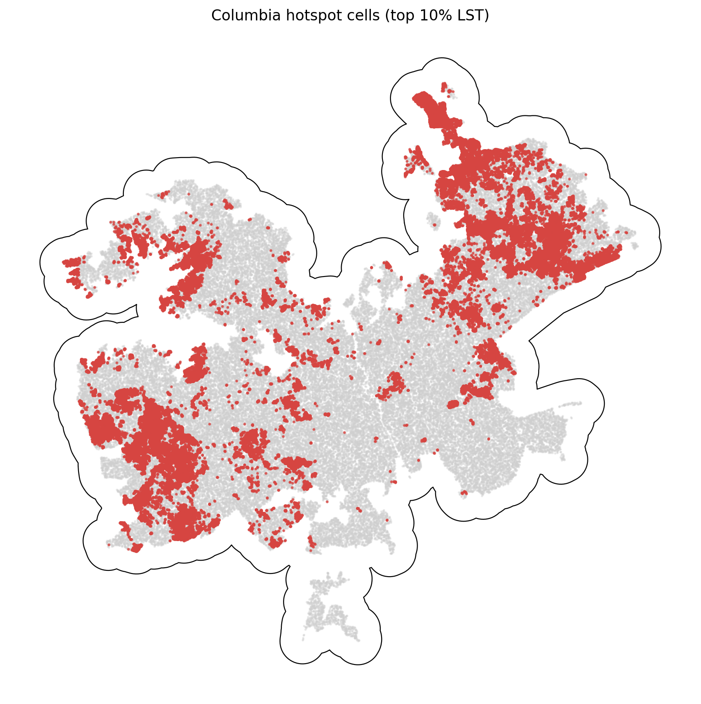

# Columbia Summary of Data

The Columbia summary uses `data_processed\city_features\12_columbia_sc_features.parquet`, the canonical Columbia-only analysis-ready feature table. Each observation represents one filtered 30 m grid cell inside the buffered Columbia study area, with built-form, vegetation, elevation, hydrologic proximity, and warm-season surface-temperature attributes aligned to the same cell geometry. The table is intended for downstream urban heat modeling in a hot_humid city, including both continuous LST analysis and binary hotspot prediction.

## Overview

| metric | value |
| --- | --- |
| Primary Columbia analysis file | data_processed\city_features\12_columbia_sc_features.parquet |
| Dataset choice rationale | Canonical per-city filtered output intended for downstream modeling. |
| Observations | 1055916 |
| Variables | 16 |
| Unit of analysis | One filtered 30 m grid cell in the buffered Columbia study area |
| Geometry / CRS | Cell polygons stored in EPSG:32617; centroids stored as WGS84 lon/lat |
| Projected spatial extent | [467460, 3740010, 518640, 3789960] |
| Study-area buffer | 2,000 m around the Census urban area |

## Key Variables

| variable_name | meaning | type_unit | why_it_matters |
| --- | --- | --- | --- |
| lst_median_may_aug | Median daytime land surface temperature across May-Aug ECOSTRESS observations. | continuous; ECOSTRESS LST units from source raster | Primary heat outcome for regression, classification, and hotspot analysis. |
| hotspot_10pct | Indicator for cells at or above the city-specific 90th percentile of LST. | binary flag | Natural target for hotspot classification and spatial risk mapping. |
| impervious_pct | NLCD impervious surface share for the 30 m cell. | continuous; percent | Core urban form exposure tied to heat retention and built intensity. |
| ndvi_median_may_aug | Median warm-season greenness index from Landsat/AppEEARS NDVI layers. | continuous; NDVI index | Vegetation is a likely protective predictor against elevated surface temperatures. |
| dist_to_water_m | Distance from the cell to the nearest mapped hydro feature. | continuous; meters | Captures proximity to possible local cooling influences and riparian structure. |
| land_cover_class | NLCD land cover class code for the cell. | categorical; NLCD class | Summarizes surface type and helps separate developed, barren, and vegetated cells. |
| n_valid_ecostress_passes | Count of valid ECOSTRESS observations contributing to the LST median. | count | Important quality-control covariate because low temporal coverage can weaken inference. |

## Targeted Descriptive Results

### Preprocessing audit

| stage | n_rows | share_of_unfiltered_pct |
| --- | --- | --- |
| unfiltered_input_rows | 1,842,275 | 100.00 |
| dropped_open_water_rows | 130,154 | 7.06 |
| dropped_lt3_ecostress_pass_rows | 306 | 0.02 |
| final_filtered_rows | 1,055,916 | 57.32 |

### Key numeric summary

| variable | n_non_missing | missing_pct | mean | median | std | p10 | p90 | skew |
| --- | --- | --- | --- | --- | --- | --- | --- | --- |
| impervious_pct | 1,055,916 | 0.00 | 26.84 | 22.65 | 24.44 | 0.00 | 62.72 | 0.71 |
| ndvi_median_may_aug | 1,055,916 | 0.00 | 0.65 | 0.66 | 0.09 | 0.53 | 0.77 | -0.48 |
| lst_median_may_aug | 1,055,916 | 0.00 | 298.89 | 298.85 | 1.28 | 297.22 | 300.56 | 0.31 |
| dist_to_water_m | 1,055,916 | 0.00 | 238.77 | 182.48 | 218.23 | 30.00 | 523.93 | 1.59 |
| elevation_m | 1,055,916 | 0.00 | 94.95 | 94.97 | 27.95 | 56.87 | 130.81 | -0.11 |
| n_valid_ecostress_passes | 1,055,916 | 0.00 | 19.79 | 20.00 | 1.74 | 18.00 | 22.00 | 0.03 |

### Land-cover composition

| land_cover_class | land_cover_label | n_rows | share_pct |
| --- | --- | --- | --- |
| 22 | Developed, Low Intensity | 350,033 | 33.15 |
| 21 | Developed, Open Space | 188,615 | 17.86 |
| 23 | Developed, Medium Intensity | 162,034 | 15.35 |
| 42 | Evergreen Forest | 120,339 | 11.40 |
| 90 | Woody Wetlands | 61,062 | 5.78 |
| 24 | Developed, High Intensity | 49,431 | 4.68 |
| 43 | Mixed Forest | 40,191 | 3.81 |
| 41 | Deciduous Forest | 34,157 | 3.23 |

### Missingness for key variables

| variable | missing_n | missing_pct | non_missing_n |
| --- | --- | --- | --- |
| dist_to_water_m | 0 | 0.0000 | 1,055,916 |
| elevation_m | 0 | 0.0000 | 1,055,916 |
| hotspot_10pct | 0 | 0.0000 | 1,055,916 |
| impervious_pct | 0 | 0.0000 | 1,055,916 |
| land_cover_class | 0 | 0.0000 | 1,055,916 |
| lst_median_may_aug | 0 | 0.0000 | 1,055,916 |
| n_valid_ecostress_passes | 0 | 0.0000 | 1,055,916 |
| ndvi_median_may_aug | 0 | 0.0000 | 1,055,916 |

### Correlation matrix

| variable | lst_median_may_aug | impervious_pct | ndvi_median_may_aug | dist_to_water_m | elevation_m | n_valid_ecostress_passes |
| --- | --- | --- | --- | --- | --- | --- |
| lst_median_may_aug | 1.00 | 0.09 | -0.12 | -0.03 | 0.30 | -0.13 |
| impervious_pct | 0.09 | 1.00 | -0.55 | 0.27 | -0.06 | 0.23 |
| ndvi_median_may_aug | -0.12 | -0.55 | 1.00 | -0.37 | 0.03 | -0.17 |
| dist_to_water_m | -0.03 | 0.27 | -0.37 | 1.00 | 0.16 | 0.07 |
| elevation_m | 0.30 | -0.06 | 0.03 | 0.16 | 1.00 | -0.00 |
| n_valid_ecostress_passes | -0.13 | 0.23 | -0.17 | 0.07 | -0.00 | 1.00 |

## Figures

## Notable Patterns

- None of the key modeling variables have missing values in the filtered Columbia table.
- `hotspot_10pct` is intentionally imbalanced at 10.00% positives because it marks the Columbia-specific top decile of LST.
- Land cover is concentrated in Developed, Low Intensity cells, which make up 33.1% of the filtered Columbia dataset.
- The strongest linear relationship with LST among the key numeric variables is positive for `elevation_m` (r = 0.30).
- Hotspot prevalence varies by Columbia quadrant from 1.2% to 15.3%, which is consistent with non-random spatial concentration.
- `dist_to_water_m` is strongly skewed (skew = 1.59), so transformations or robust summaries may be useful in later modeling.

## Output Notes

- The Columbia-only per-city feature parquet was chosen over the merged final dataset when it was available because it is the direct analysis-ready output for this city and already reflects the row-drop rules used by the pipeline.
- Supporting CSV tables and PNG figures for this summary were generated deterministically by the companion CLI.
- City markdown and tables live under `outputs/data_processing/city_summaries/`, batch summary tables live under `outputs/data_processing/batch_reports/`, and figures live under `figures/data_processing/city_summaries/`.
- `outputs/modeling/` and `figures/modeling/` remain reserved for ML/evaluation artifacts.
