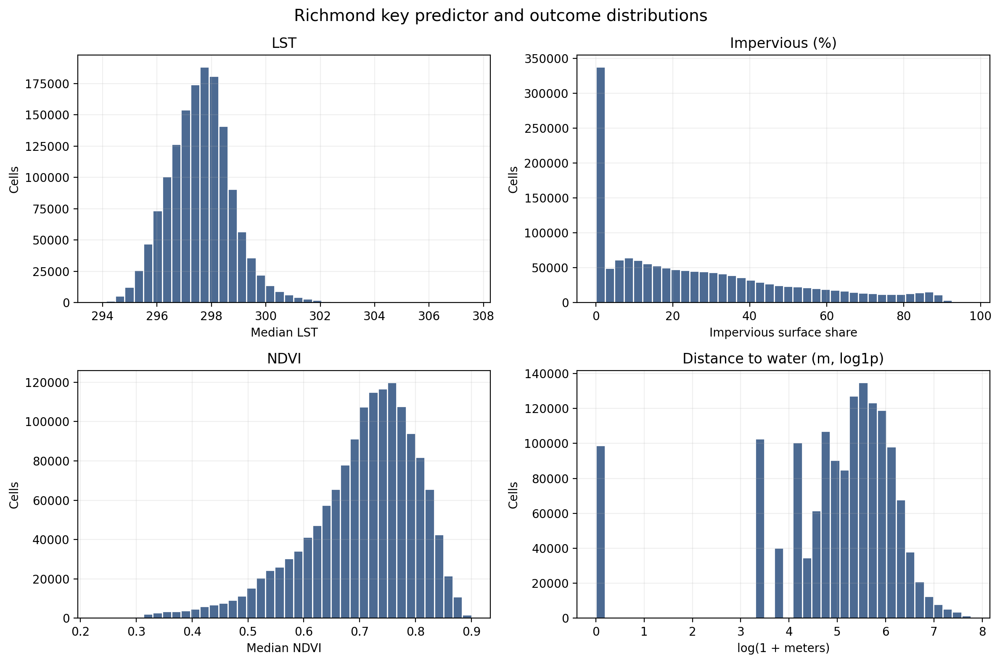
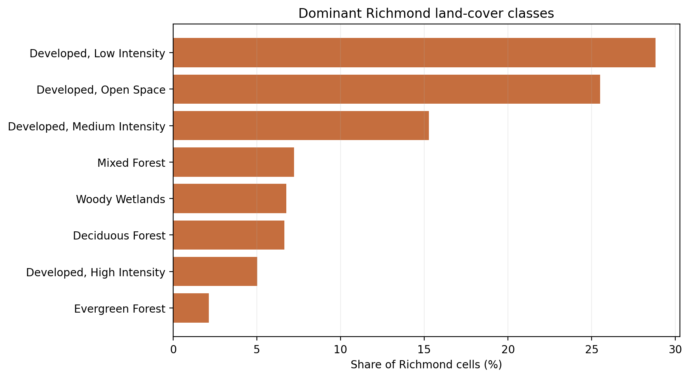
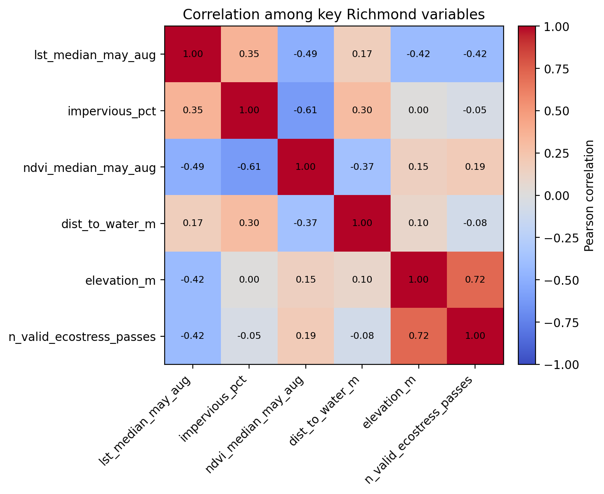
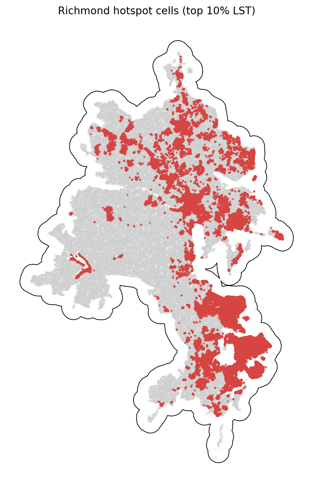

# Richmond Summary of Data

The Richmond summary uses `data_processed\city_features\13_richmond_va_features.parquet`, the canonical Richmond-only analysis-ready feature table. Each observation represents one filtered 30 m grid cell inside the buffered Richmond study area, with built-form, vegetation, elevation, hydrologic proximity, and warm-season surface-temperature attributes aligned to the same cell geometry. The table is intended for downstream urban heat modeling in a hot_humid city, including both continuous LST analysis and binary hotspot prediction.

## Overview

| metric | value |
| --- | --- |
| Primary Richmond analysis file | data_processed\city_features\13_richmond_va_features.parquet |
| Dataset choice rationale | Canonical per-city filtered output intended for downstream modeling. |
| Observations | 1481846 |
| Variables | 16 |
| Unit of analysis | One filtered 30 m grid cell in the buffered Richmond study area |
| Geometry / CRS | Cell polygons stored in EPSG:32618; centroids stored as WGS84 lon/lat |
| Projected spatial extent | [254280, 4109610, 302670, 4186320] |
| Study-area buffer | 2,000 m around the Census urban area |

## Key Variables

| variable_name | meaning | type_unit | why_it_matters |
| --- | --- | --- | --- |
| lst_median_may_aug | Median daytime land surface temperature across May-Aug ECOSTRESS observations. | continuous; ECOSTRESS LST units from source raster | Primary heat outcome for regression, classification, and hotspot analysis. |
| hotspot_10pct | Indicator for cells at or above the city-specific 90th percentile of LST. | binary flag | Natural target for hotspot classification and spatial risk mapping. |
| impervious_pct | NLCD impervious surface share for the 30 m cell. | continuous; percent | Core urban form exposure tied to heat retention and built intensity. |
| ndvi_median_may_aug | Median warm-season greenness index from Landsat/AppEEARS NDVI layers. | continuous; NDVI index | Vegetation is a likely protective predictor against elevated surface temperatures. |
| dist_to_water_m | Distance from the cell to the nearest mapped hydro feature. | continuous; meters | Captures proximity to possible local cooling influences and riparian structure. |
| land_cover_class | NLCD land cover class code for the cell. | categorical; NLCD class | Summarizes surface type and helps separate developed, barren, and vegetated cells. |
| n_valid_ecostress_passes | Count of valid ECOSTRESS observations contributing to the LST median. | count | Important quality-control covariate because low temporal coverage can weaken inference. |

## Targeted Descriptive Results

### Preprocessing audit

| stage | n_rows | share_of_unfiltered_pct |
| --- | --- | --- |
| unfiltered_input_rows | 2,389,882 | 100.00 |
| dropped_open_water_rows | 61,520 | 2.57 |
| dropped_lt3_ecostress_pass_rows | 209 | 0.01 |
| final_filtered_rows | 1,481,846 | 62.00 |

### Key numeric summary

| variable | n_non_missing | missing_pct | mean | median | std | p10 | p90 | skew |
| --- | --- | --- | --- | --- | --- | --- | --- | --- |
| impervious_pct | 1,481,846 | 0.00 | 26.02 | 19.82 | 24.74 | 0.00 | 64.59 | 0.84 |
| ndvi_median_may_aug | 1,481,846 | 0.00 | 0.70 | 0.72 | 0.10 | 0.56 | 0.82 | -1.00 |
| lst_median_may_aug | 1,481,846 | 0.00 | 297.61 | 297.61 | 1.18 | 296.12 | 299.00 | 0.47 |
| dist_to_water_m | 1,481,846 | 0.00 | 247.32 | 192.09 | 236.54 | 30.00 | 510.88 | 2.47 |
| elevation_m | 1,481,846 | 0.00 | 54.73 | 55.39 | 22.43 | 24.38 | 82.89 | -0.01 |
| n_valid_ecostress_passes | 1,481,846 | 0.00 | 30.45 | 23.00 | 12.47 | 17.00 | 48.00 | 0.35 |

### Land-cover composition

| land_cover_class | land_cover_label | n_rows | share_pct |
| --- | --- | --- | --- |
| 22 | Developed, Low Intensity | 427,068 | 28.82 |
| 21 | Developed, Open Space | 377,748 | 25.49 |
| 23 | Developed, Medium Intensity | 226,388 | 15.28 |
| 43 | Mixed Forest | 106,970 | 7.22 |
| 90 | Woody Wetlands | 100,072 | 6.75 |
| 41 | Deciduous Forest | 98,558 | 6.65 |
| 24 | Developed, High Intensity | 74,640 | 5.04 |
| 42 | Evergreen Forest | 31,623 | 2.13 |

### Missingness for key variables

| variable | missing_n | missing_pct | non_missing_n |
| --- | --- | --- | --- |
| dist_to_water_m | 0 | 0.0000 | 1,481,846 |
| elevation_m | 0 | 0.0000 | 1,481,846 |
| hotspot_10pct | 0 | 0.0000 | 1,481,846 |
| impervious_pct | 0 | 0.0000 | 1,481,846 |
| land_cover_class | 0 | 0.0000 | 1,481,846 |
| lst_median_may_aug | 0 | 0.0000 | 1,481,846 |
| n_valid_ecostress_passes | 0 | 0.0000 | 1,481,846 |
| ndvi_median_may_aug | 0 | 0.0000 | 1,481,846 |

### Correlation matrix

| variable | lst_median_may_aug | impervious_pct | ndvi_median_may_aug | dist_to_water_m | elevation_m | n_valid_ecostress_passes |
| --- | --- | --- | --- | --- | --- | --- |
| lst_median_may_aug | 1.00 | 0.35 | -0.49 | 0.17 | -0.42 | -0.42 |
| impervious_pct | 0.35 | 1.00 | -0.61 | 0.30 | 0.00 | -0.05 |
| ndvi_median_may_aug | -0.49 | -0.61 | 1.00 | -0.37 | 0.15 | 0.19 |
| dist_to_water_m | 0.17 | 0.30 | -0.37 | 1.00 | 0.10 | -0.08 |
| elevation_m | -0.42 | 0.00 | 0.15 | 0.10 | 1.00 | 0.72 |
| n_valid_ecostress_passes | -0.42 | -0.05 | 0.19 | -0.08 | 0.72 | 1.00 |

## Figures

## Notable Patterns

- None of the key modeling variables have missing values in the filtered Richmond table.
- `hotspot_10pct` is intentionally imbalanced at 10.00% positives because it marks the Richmond-specific top decile of LST.
- Land cover is concentrated in Developed, Low Intensity cells, which make up 28.8% of the filtered Richmond dataset.
- The strongest linear relationship with LST among the key numeric variables is negative for `ndvi_median_may_aug` (r = -0.49).
- Hotspot prevalence varies by Richmond quadrant from 0.5% to 21.8%, which is consistent with non-random spatial concentration.
- `dist_to_water_m` is strongly skewed (skew = 2.47), so transformations or robust summaries may be useful in later modeling.

## Output Notes

- The Richmond-only per-city feature parquet was chosen over the merged final dataset when it was available because it is the direct analysis-ready output for this city and already reflects the row-drop rules used by the pipeline.
- Supporting CSV tables and PNG figures for this summary were generated deterministically by the companion CLI.
- City markdown and tables live under `outputs/data_processing/city_summaries/`, batch summary tables live under `outputs/data_processing/batch_reports/`, and figures live under `figures/data_processing/city_summaries/`.
- `outputs/modeling/` and `figures/modeling/` remain reserved for ML/evaluation artifacts.
