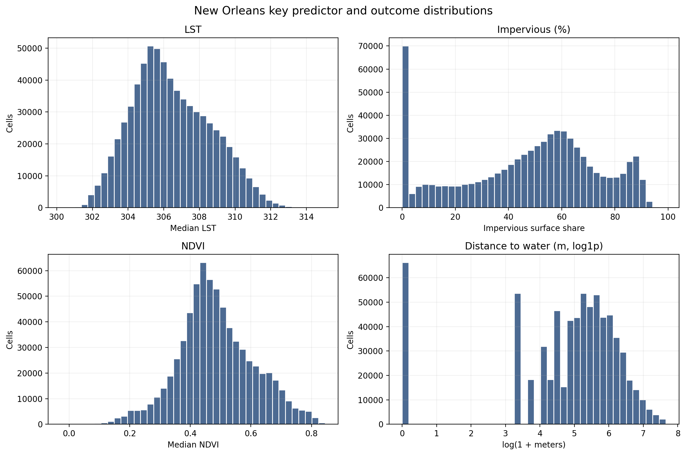
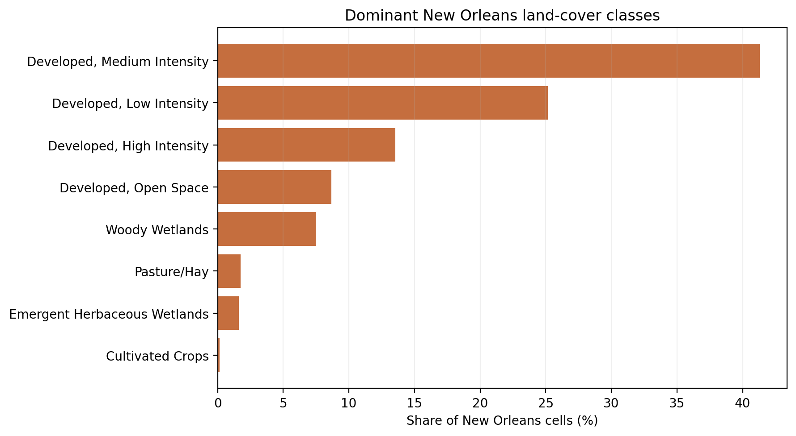
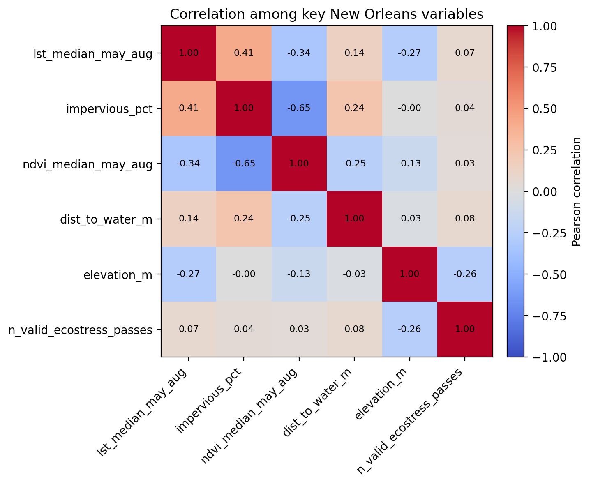
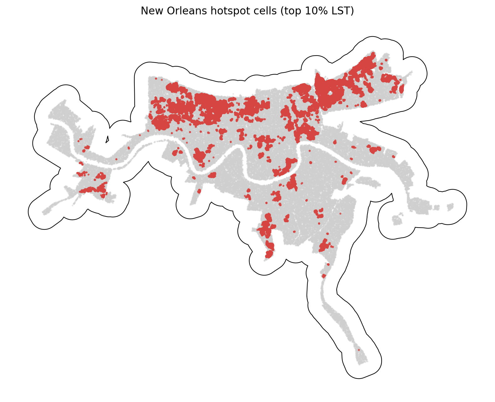

# New Orleans Summary of Data

The New Orleans summary uses `data_processed\city_features\14_new_orleans_la_features.parquet`, the canonical New Orleans-only analysis-ready feature table. Each observation represents one filtered 30 m grid cell inside the buffered New Orleans study area, with built-form, vegetation, elevation, hydrologic proximity, and warm-season surface-temperature attributes aligned to the same cell geometry. The table is intended for downstream urban heat modeling in a hot_humid city, including both continuous LST analysis and binary hotspot prediction.

## Overview

| metric | value |
| --- | --- |
| Primary New Orleans analysis file | data_processed\city_features\14_new_orleans_la_features.parquet |
| Dataset choice rationale | Canonical per-city filtered output intended for downstream modeling. |
| Observations | 700063 |
| Variables | 16 |
| Unit of analysis | One filtered 30 m grid cell in the buffered New Orleans study area |
| Geometry / CRS | Cell polygons stored in EPSG:32615; centroids stored as WGS84 lon/lat |
| Projected spatial extent | [747090, 3285900, 806070, 3331110] |
| Study-area buffer | 2,000 m around the Census urban area |

## Key Variables

| variable_name | meaning | type_unit | why_it_matters |
| --- | --- | --- | --- |
| lst_median_may_aug | Median daytime land surface temperature across May-Aug ECOSTRESS observations. | continuous; ECOSTRESS LST units from source raster | Primary heat outcome for regression, classification, and hotspot analysis. |
| hotspot_10pct | Indicator for cells at or above the city-specific 90th percentile of LST. | binary flag | Natural target for hotspot classification and spatial risk mapping. |
| impervious_pct | NLCD impervious surface share for the 30 m cell. | continuous; percent | Core urban form exposure tied to heat retention and built intensity. |
| ndvi_median_may_aug | Median warm-season greenness index from Landsat/AppEEARS NDVI layers. | continuous; NDVI index | Vegetation is a likely protective predictor against elevated surface temperatures. |
| dist_to_water_m | Distance from the cell to the nearest mapped hydro feature. | continuous; meters | Captures proximity to possible local cooling influences and riparian structure. |
| land_cover_class | NLCD land cover class code for the cell. | categorical; NLCD class | Summarizes surface type and helps separate developed, barren, and vegetated cells. |
| n_valid_ecostress_passes | Count of valid ECOSTRESS observations contributing to the LST median. | count | Important quality-control covariate because low temporal coverage can weaken inference. |

## Targeted Descriptive Results

### Preprocessing audit

| stage | n_rows | share_of_unfiltered_pct |
| --- | --- | --- |
| unfiltered_input_rows | 1,453,783 | 100.00 |
| dropped_open_water_rows | 219,961 | 15.13 |
| dropped_lt3_ecostress_pass_rows | 143 | 0.01 |
| final_filtered_rows | 700,063 | 48.15 |

### Key numeric summary

| variable | n_non_missing | missing_pct | mean | median | std | p10 | p90 | skew |
| --- | --- | --- | --- | --- | --- | --- | --- | --- |
| impervious_pct | 700,063 | 0.00 | 47.68 | 52.24 | 26.27 | 2.44 | 82.30 | -0.37 |
| ndvi_median_may_aug | 699,119 | 0.13 | 0.48 | 0.47 | 0.12 | 0.34 | 0.66 | 0.11 |
| lst_median_may_aug | 700,063 | 0.00 | 306.44 | 306.17 | 2.20 | 303.71 | 309.56 | 0.32 |
| dist_to_water_m | 700,063 | 0.00 | 262.48 | 180.00 | 282.17 | 30.00 | 600.00 | 2.20 |
| elevation_m | 700,063 | 0.00 | 0.07 | -0.11 | 1.70 | -1.82 | 2.23 | 1.10 |
| n_valid_ecostress_passes | 700,063 | 0.00 | 43.08 | 50.00 | 13.94 | 26.00 | 58.80 | -0.15 |

### Land-cover composition

| land_cover_class | land_cover_label | n_rows | share_pct |
| --- | --- | --- | --- |
| 23 | Developed, Medium Intensity | 289,312 | 41.33 |
| 22 | Developed, Low Intensity | 176,243 | 25.18 |
| 24 | Developed, High Intensity | 94,838 | 13.55 |
| 21 | Developed, Open Space | 60,616 | 8.66 |
| 90 | Woody Wetlands | 52,681 | 7.53 |
| 81 | Pasture/Hay | 12,253 | 1.75 |
| 95 | Emergent Herbaceous Wetlands | 11,333 | 1.62 |
| 82 | Cultivated Crops | 1,055 | 0.15 |

### Missingness for key variables

| variable | missing_n | missing_pct | non_missing_n |
| --- | --- | --- | --- |
| ndvi_median_may_aug | 944 | 0.1348 | 699,119 |
| dist_to_water_m | 0 | 0.0000 | 700,063 |
| elevation_m | 0 | 0.0000 | 700,063 |
| hotspot_10pct | 0 | 0.0000 | 700,063 |
| impervious_pct | 0 | 0.0000 | 700,063 |
| land_cover_class | 0 | 0.0000 | 700,063 |
| lst_median_may_aug | 0 | 0.0000 | 700,063 |
| n_valid_ecostress_passes | 0 | 0.0000 | 700,063 |

### Correlation matrix

| variable | lst_median_may_aug | impervious_pct | ndvi_median_may_aug | dist_to_water_m | elevation_m | n_valid_ecostress_passes |
| --- | --- | --- | --- | --- | --- | --- |
| lst_median_may_aug | 1.00 | 0.41 | -0.34 | 0.14 | -0.27 | 0.07 |
| impervious_pct | 0.41 | 1.00 | -0.65 | 0.24 | -0.00 | 0.04 |
| ndvi_median_may_aug | -0.34 | -0.65 | 1.00 | -0.25 | -0.13 | 0.03 |
| dist_to_water_m | 0.14 | 0.24 | -0.25 | 1.00 | -0.03 | 0.08 |
| elevation_m | -0.27 | -0.00 | -0.13 | -0.03 | 1.00 | -0.26 |
| n_valid_ecostress_passes | 0.07 | 0.04 | 0.03 | 0.08 | -0.26 | 1.00 |

## Figures

## Notable Patterns

- Missingness is limited overall; the highest missing share is `ndvi_median_may_aug` at 0.13%.
- `hotspot_10pct` is intentionally imbalanced at 10.00% positives because it marks the New Orleans-specific top decile of LST.
- Land cover is concentrated in Developed, Medium Intensity cells, which make up 41.3% of the filtered New Orleans dataset.
- The strongest linear relationship with LST among the key numeric variables is positive for `impervious_pct` (r = 0.41).
- Hotspot prevalence varies by New Orleans quadrant from 2.1% to 20.6%, which is consistent with non-random spatial concentration.
- `dist_to_water_m` is strongly skewed (skew = 2.20), so transformations or robust summaries may be useful in later modeling.

## Output Notes

- The New Orleans-only per-city feature parquet was chosen over the merged final dataset when it was available because it is the direct analysis-ready output for this city and already reflects the row-drop rules used by the pipeline.
- Supporting CSV tables and PNG figures for this summary were generated deterministically by the companion CLI.
- City markdown and tables live under `outputs/data_processing/city_summaries/`, batch summary tables live under `outputs/data_processing/batch_reports/`, and figures live under `figures/data_processing/city_summaries/`.
- `outputs/modeling/` and `figures/modeling/` remain reserved for ML/evaluation artifacts.
