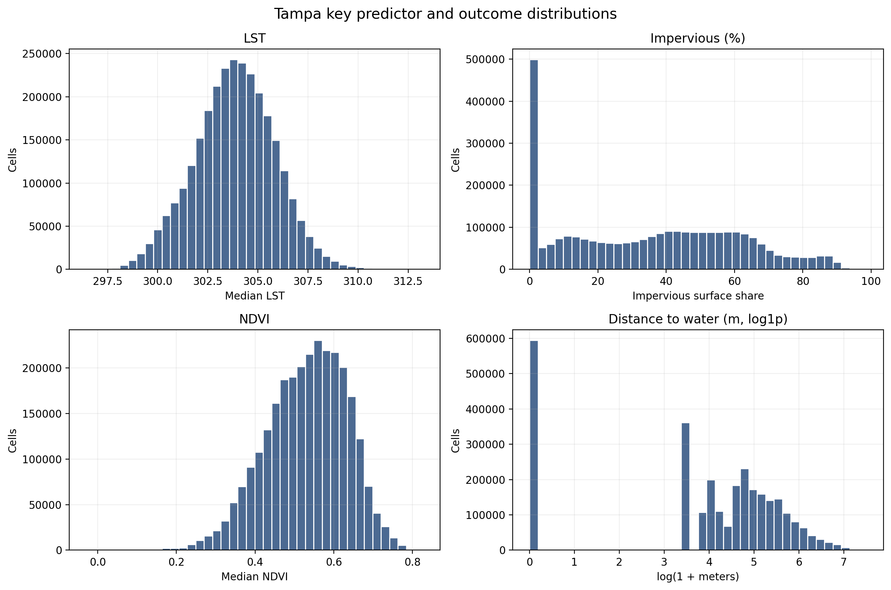
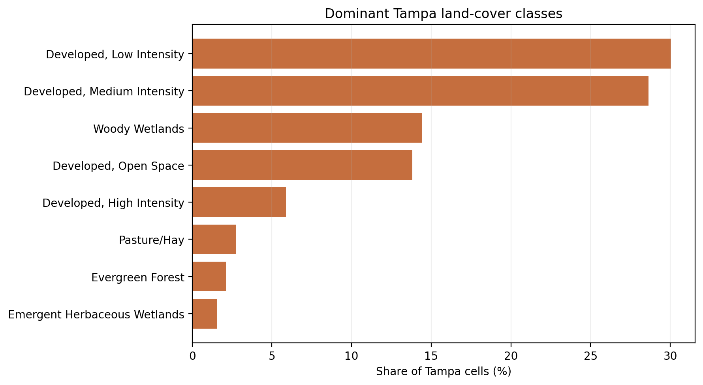
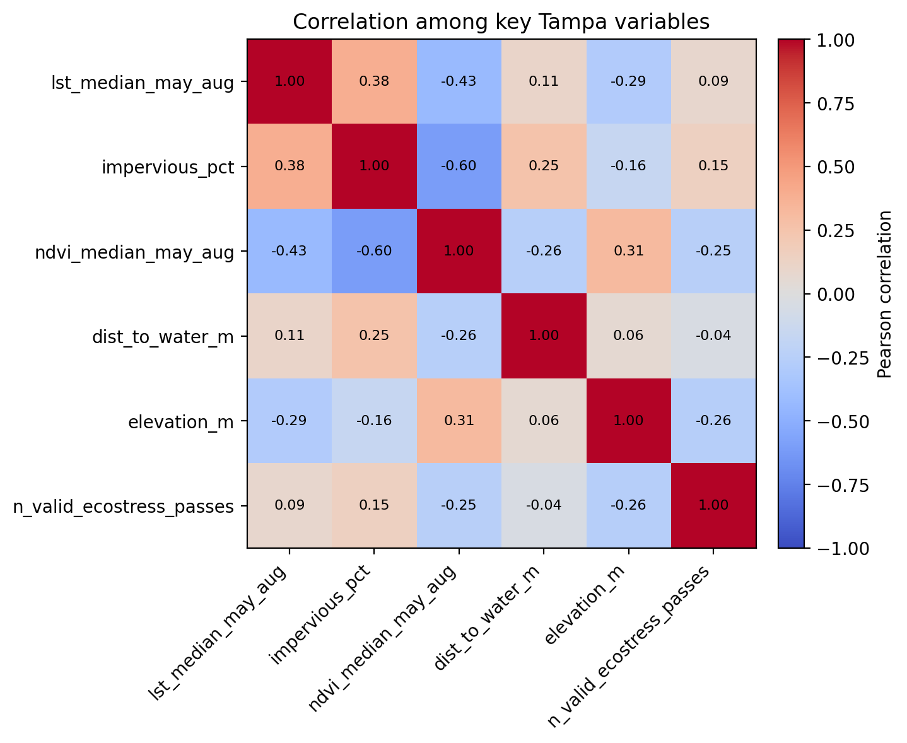
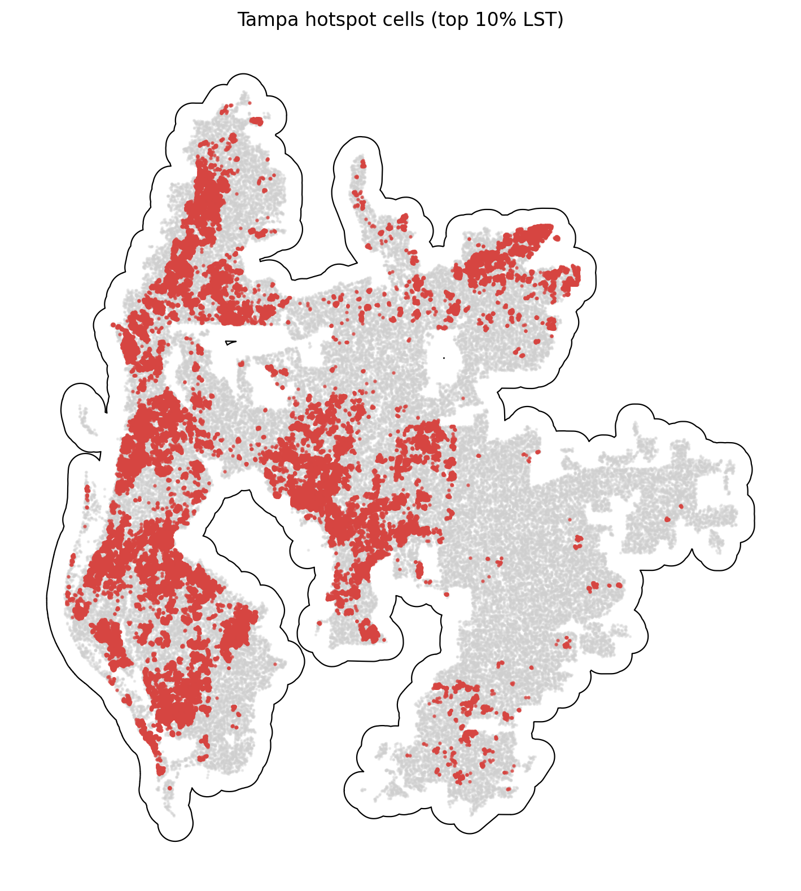

# Tampa Summary of Data

The Tampa summary uses `data_processed\city_features\15_tampa_fl_features.parquet`, the canonical Tampa-only analysis-ready feature table. Each observation represents one filtered 30 m grid cell inside the buffered Tampa study area, with built-form, vegetation, elevation, hydrologic proximity, and warm-season surface-temperature attributes aligned to the same cell geometry. The table is intended for downstream urban heat modeling in a hot_humid city, including both continuous LST analysis and binary hotspot prediction.

## Overview

| metric | value |
| --- | --- |
| Primary Tampa analysis file | data_processed\city_features\15_tampa_fl_features.parquet |
| Dataset choice rationale | Canonical per-city filtered output intended for downstream modeling. |
| Observations | 2847118 |
| Variables | 16 |
| Unit of analysis | One filtered 30 m grid cell in the buffered Tampa study area |
| Geometry / CRS | Cell polygons stored in EPSG:32617; centroids stored as WGS84 lon/lat |
| Projected spatial extent | [317730, 3059400, 396180, 3144660] |
| Study-area buffer | 2,000 m around the Census urban area |

## Key Variables

| variable_name | meaning | type_unit | why_it_matters |
| --- | --- | --- | --- |
| lst_median_may_aug | Median daytime land surface temperature across May-Aug ECOSTRESS observations. | continuous; ECOSTRESS LST units from source raster | Primary heat outcome for regression, classification, and hotspot analysis. |
| hotspot_10pct | Indicator for cells at or above the city-specific 90th percentile of LST. | binary flag | Natural target for hotspot classification and spatial risk mapping. |
| impervious_pct | NLCD impervious surface share for the 30 m cell. | continuous; percent | Core urban form exposure tied to heat retention and built intensity. |
| ndvi_median_may_aug | Median warm-season greenness index from Landsat/AppEEARS NDVI layers. | continuous; NDVI index | Vegetation is a likely protective predictor against elevated surface temperatures. |
| dist_to_water_m | Distance from the cell to the nearest mapped hydro feature. | continuous; meters | Captures proximity to possible local cooling influences and riparian structure. |
| land_cover_class | NLCD land cover class code for the cell. | categorical; NLCD class | Summarizes surface type and helps separate developed, barren, and vegetated cells. |
| n_valid_ecostress_passes | Count of valid ECOSTRESS observations contributing to the LST median. | count | Important quality-control covariate because low temporal coverage can weaken inference. |

## Targeted Descriptive Results

### Preprocessing audit

| stage | n_rows | share_of_unfiltered_pct |
| --- | --- | --- |
| unfiltered_input_rows | 4,646,746 | 100.00 |
| dropped_open_water_rows | 751,073 | 16.16 |
| dropped_lt3_ecostress_pass_rows | 555 | 0.01 |
| final_filtered_rows | 2,847,118 | 61.27 |

### Key numeric summary

| variable | n_non_missing | missing_pct | mean | median | std | p10 | p90 | skew |
| --- | --- | --- | --- | --- | --- | --- | --- | --- |
| impervious_pct | 2,847,118 | 0.00 | 35.13 | 36.16 | 25.97 | 0.00 | 69.13 | 0.16 |
| ndvi_median_may_aug | 2,823,944 | 0.81 | 0.53 | 0.54 | 0.10 | 0.39 | 0.66 | -0.40 |
| lst_median_may_aug | 2,847,118 | 0.00 | 303.84 | 303.88 | 2.00 | 301.21 | 306.34 | -0.02 |
| dist_to_water_m | 2,847,118 | 0.00 | 134.65 | 84.85 | 169.35 | 0.00 | 330.00 | 2.64 |
| elevation_m | 2,847,118 | 0.00 | 11.98 | 10.36 | 8.99 | 1.97 | 23.67 | 0.93 |
| n_valid_ecostress_passes | 2,847,118 | 0.00 | 20.90 | 21.00 | 2.06 | 18.00 | 23.00 | -0.16 |

### Land-cover composition

| land_cover_class | land_cover_label | n_rows | share_pct |
| --- | --- | --- | --- |
| 22 | Developed, Low Intensity | 855,761 | 30.06 |
| 23 | Developed, Medium Intensity | 814,882 | 28.62 |
| 90 | Woody Wetlands | 410,558 | 14.42 |
| 21 | Developed, Open Space | 393,125 | 13.81 |
| 24 | Developed, High Intensity | 167,166 | 5.87 |
| 81 | Pasture/Hay | 77,758 | 2.73 |
| 42 | Evergreen Forest | 60,414 | 2.12 |
| 95 | Emergent Herbaceous Wetlands | 44,110 | 1.55 |

### Missingness for key variables

| variable | missing_n | missing_pct | non_missing_n |
| --- | --- | --- | --- |
| ndvi_median_may_aug | 23,174 | 0.8139 | 2,823,944 |
| dist_to_water_m | 0 | 0.0000 | 2,847,118 |
| elevation_m | 0 | 0.0000 | 2,847,118 |
| hotspot_10pct | 0 | 0.0000 | 2,847,118 |
| impervious_pct | 0 | 0.0000 | 2,847,118 |
| land_cover_class | 0 | 0.0000 | 2,847,118 |
| lst_median_may_aug | 0 | 0.0000 | 2,847,118 |
| n_valid_ecostress_passes | 0 | 0.0000 | 2,847,118 |

### Correlation matrix

| variable | lst_median_may_aug | impervious_pct | ndvi_median_may_aug | dist_to_water_m | elevation_m | n_valid_ecostress_passes |
| --- | --- | --- | --- | --- | --- | --- |
| lst_median_may_aug | 1.00 | 0.38 | -0.43 | 0.11 | -0.29 | 0.09 |
| impervious_pct | 0.38 | 1.00 | -0.60 | 0.25 | -0.16 | 0.15 |
| ndvi_median_may_aug | -0.43 | -0.60 | 1.00 | -0.26 | 0.31 | -0.25 |
| dist_to_water_m | 0.11 | 0.25 | -0.26 | 1.00 | 0.06 | -0.04 |
| elevation_m | -0.29 | -0.16 | 0.31 | 0.06 | 1.00 | -0.26 |
| n_valid_ecostress_passes | 0.09 | 0.15 | -0.25 | -0.04 | -0.26 | 1.00 |

## Figures

## Notable Patterns

- Missingness is limited overall; the highest missing share is `ndvi_median_may_aug` at 0.81%.
- `hotspot_10pct` is intentionally imbalanced at 10.00% positives because it marks the Tampa-specific top decile of LST.
- Land cover is concentrated in Developed, Low Intensity cells, which make up 30.1% of the filtered Tampa dataset.
- The strongest linear relationship with LST among the key numeric variables is negative for `ndvi_median_may_aug` (r = -0.43).
- Hotspot prevalence varies by Tampa quadrant from 3.1% to 18.5%, which is consistent with non-random spatial concentration.
- `dist_to_water_m` is strongly skewed (skew = 2.64), so transformations or robust summaries may be useful in later modeling.

## Output Notes

- The Tampa-only per-city feature parquet was chosen over the merged final dataset when it was available because it is the direct analysis-ready output for this city and already reflects the row-drop rules used by the pipeline.
- Supporting CSV tables and PNG figures for this summary were generated deterministically by the companion CLI.
- City markdown and tables live under `outputs/data_processing/city_summaries/`, batch summary tables live under `outputs/data_processing/batch_reports/`, and figures live under `figures/data_processing/city_summaries/`.
- `outputs/modeling/` and `figures/modeling/` remain reserved for ML/evaluation artifacts.
