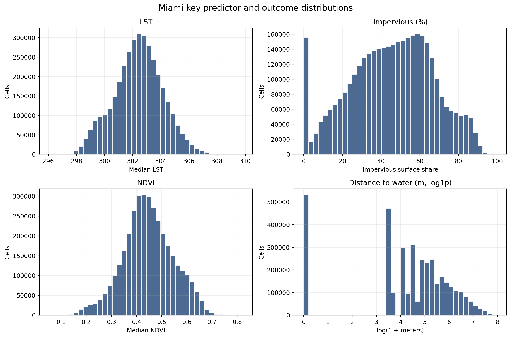
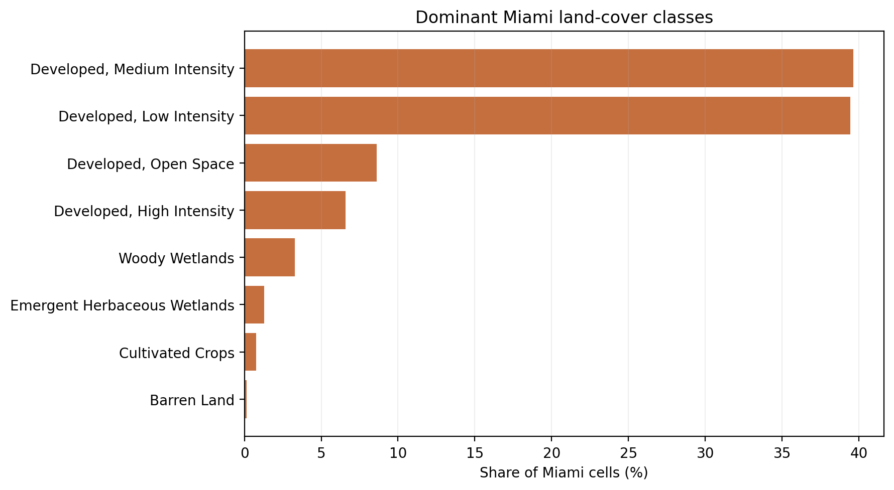
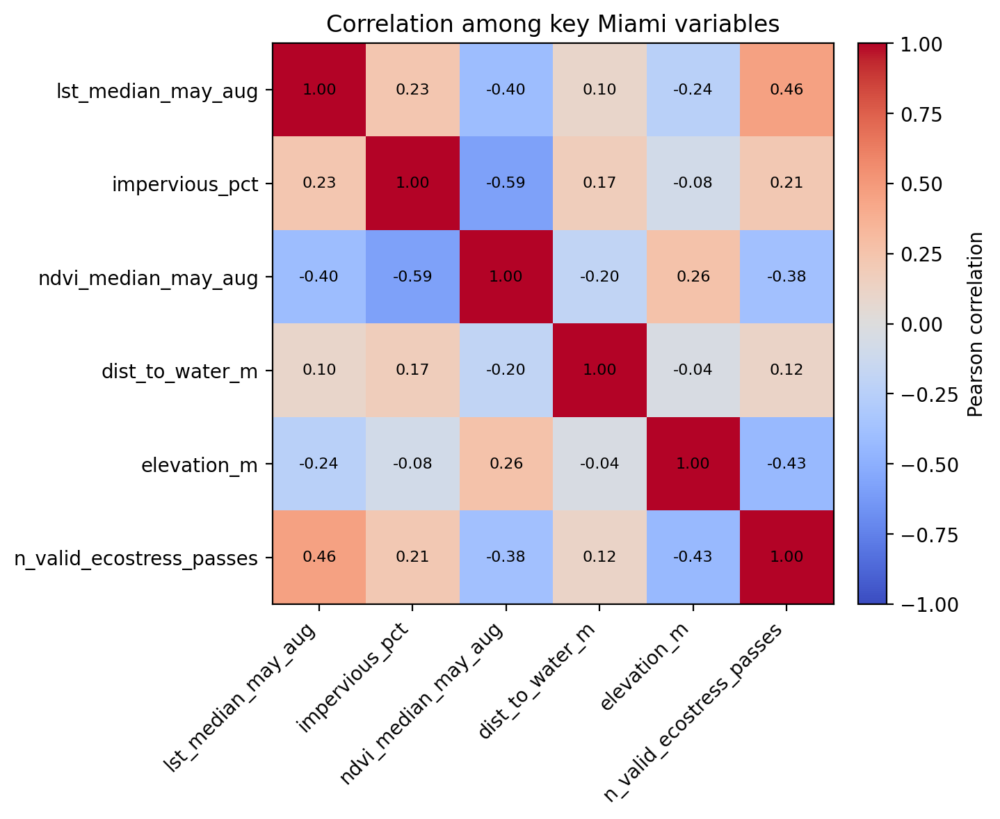
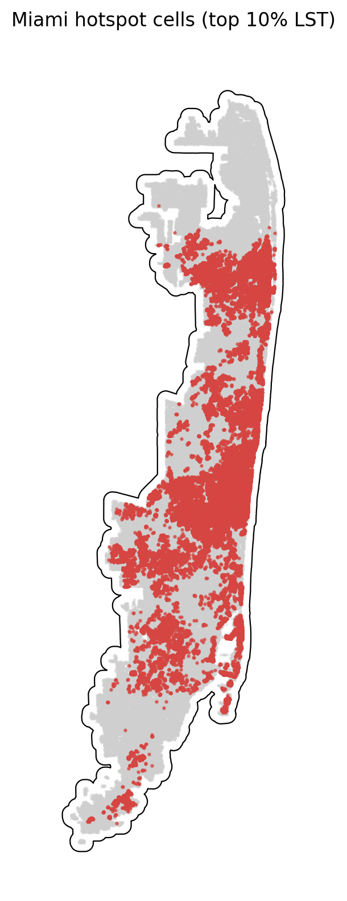

# Miami Summary of Data

The Miami summary uses `data_processed\city_features\16_miami_fl_features.parquet`, the canonical Miami-only analysis-ready feature table. Each observation represents one filtered 30 m grid cell inside the buffered Miami study area, with built-form, vegetation, elevation, hydrologic proximity, and warm-season surface-temperature attributes aligned to the same cell geometry. The table is intended for downstream urban heat modeling in a hot_humid city, including both continuous LST analysis and binary hotspot prediction.

## Overview

| metric | value |
| --- | --- |
| Primary Miami analysis file | data_processed\city_features\16_miami_fl_features.parquet |
| Dataset choice rationale | Canonical per-city filtered output intended for downstream modeling. |
| Observations | 3635068 |
| Variables | 16 |
| Unit of analysis | One filtered 30 m grid cell in the buffered Miami study area |
| Geometry / CRS | Cell polygons stored in EPSG:32617; centroids stored as WGS84 lon/lat |
| Projected spatial extent | [547620, 2810580, 596310, 2986080] |
| Study-area buffer | 2,000 m around the Census urban area |

## Key Variables

| variable_name | meaning | type_unit | why_it_matters |
| --- | --- | --- | --- |
| lst_median_may_aug | Median daytime land surface temperature across May-Aug ECOSTRESS observations. | continuous; ECOSTRESS LST units from source raster | Primary heat outcome for regression, classification, and hotspot analysis. |
| hotspot_10pct | Indicator for cells at or above the city-specific 90th percentile of LST. | binary flag | Natural target for hotspot classification and spatial risk mapping. |
| impervious_pct | NLCD impervious surface share for the 30 m cell. | continuous; percent | Core urban form exposure tied to heat retention and built intensity. |
| ndvi_median_may_aug | Median warm-season greenness index from Landsat/AppEEARS NDVI layers. | continuous; NDVI index | Vegetation is a likely protective predictor against elevated surface temperatures. |
| dist_to_water_m | Distance from the cell to the nearest mapped hydro feature. | continuous; meters | Captures proximity to possible local cooling influences and riparian structure. |
| land_cover_class | NLCD land cover class code for the cell. | categorical; NLCD class | Summarizes surface type and helps separate developed, barren, and vegetated cells. |
| n_valid_ecostress_passes | Count of valid ECOSTRESS observations contributing to the LST median. | count | Important quality-control covariate because low temporal coverage can weaken inference. |

## Targeted Descriptive Results

### Preprocessing audit

| stage | n_rows | share_of_unfiltered_pct |
| --- | --- | --- |
| unfiltered_input_rows | 5,236,892 | 100.00 |
| dropped_open_water_rows | 667,968 | 12.76 |
| dropped_lt3_ecostress_pass_rows | 754 | 0.01 |
| final_filtered_rows | 3,635,068 | 69.41 |

### Key numeric summary

| variable | n_non_missing | missing_pct | mean | median | std | p10 | p90 | skew |
| --- | --- | --- | --- | --- | --- | --- | --- | --- |
| impervious_pct | 3,635,068 | 0.00 | 45.31 | 46.56 | 21.64 | 15.32 | 72.88 | -0.18 |
| ndvi_median_may_aug | 3,625,806 | 0.25 | 0.45 | 0.44 | 0.10 | 0.32 | 0.58 | -0.03 |
| lst_median_may_aug | 3,635,068 | 0.00 | 302.39 | 302.44 | 1.72 | 300.01 | 304.57 | -0.05 |
| dist_to_water_m | 3,635,068 | 0.00 | 215.88 | 108.17 | 306.65 | 0.00 | 573.15 | 2.87 |
| elevation_m | 3,635,068 | 0.00 | 3.12 | 2.63 | 2.01 | 1.28 | 5.51 | 7.47 |
| n_valid_ecostress_passes | 3,635,068 | 0.00 | 20.23 | 20.00 | 2.50 | 17.00 | 23.00 | -0.14 |

### Land-cover composition

| land_cover_class | land_cover_label | n_rows | share_pct |
| --- | --- | --- | --- |
| 23 | Developed, Medium Intensity | 1,441,390 | 39.65 |
| 22 | Developed, Low Intensity | 1,433,330 | 39.43 |
| 21 | Developed, Open Space | 313,105 | 8.61 |
| 24 | Developed, High Intensity | 239,890 | 6.60 |
| 90 | Woody Wetlands | 119,856 | 3.30 |
| 95 | Emergent Herbaceous Wetlands | 46,840 | 1.29 |
| 82 | Cultivated Crops | 27,855 | 0.77 |
| 31 | Barren Land | 5,818 | 0.16 |

### Missingness for key variables

| variable | missing_n | missing_pct | non_missing_n |
| --- | --- | --- | --- |
| ndvi_median_may_aug | 9,262 | 0.2548 | 3,625,806 |
| dist_to_water_m | 0 | 0.0000 | 3,635,068 |
| elevation_m | 0 | 0.0000 | 3,635,068 |
| hotspot_10pct | 0 | 0.0000 | 3,635,068 |
| impervious_pct | 0 | 0.0000 | 3,635,068 |
| land_cover_class | 0 | 0.0000 | 3,635,068 |
| lst_median_may_aug | 0 | 0.0000 | 3,635,068 |
| n_valid_ecostress_passes | 0 | 0.0000 | 3,635,068 |

### Correlation matrix

| variable | lst_median_may_aug | impervious_pct | ndvi_median_may_aug | dist_to_water_m | elevation_m | n_valid_ecostress_passes |
| --- | --- | --- | --- | --- | --- | --- |
| lst_median_may_aug | 1.00 | 0.23 | -0.40 | 0.10 | -0.24 | 0.46 |
| impervious_pct | 0.23 | 1.00 | -0.59 | 0.17 | -0.08 | 0.21 |
| ndvi_median_may_aug | -0.40 | -0.59 | 1.00 | -0.20 | 0.26 | -0.38 |
| dist_to_water_m | 0.10 | 0.17 | -0.20 | 1.00 | -0.04 | 0.12 |
| elevation_m | -0.24 | -0.08 | 0.26 | -0.04 | 1.00 | -0.43 |
| n_valid_ecostress_passes | 0.46 | 0.21 | -0.38 | 0.12 | -0.43 | 1.00 |

## Figures

## Notable Patterns

- Missingness is limited overall; the highest missing share is `ndvi_median_may_aug` at 0.25%.
- `hotspot_10pct` is intentionally imbalanced at 10.00% positives because it marks the Miami-specific top decile of LST.
- Land cover is concentrated in Developed, Medium Intensity cells, which make up 39.7% of the filtered Miami dataset.
- The strongest linear relationship with LST among the key numeric variables is positive for `n_valid_ecostress_passes` (r = 0.46).
- Hotspot prevalence varies by Miami quadrant from 4.5% to 19.1%, which is consistent with non-random spatial concentration.
- `elevation_m` is strongly skewed (skew = 7.47), so transformations or robust summaries may be useful in later modeling.

## Output Notes

- The Miami-only per-city feature parquet was chosen over the merged final dataset when it was available because it is the direct analysis-ready output for this city and already reflects the row-drop rules used by the pipeline.
- Supporting CSV tables and PNG figures for this summary were generated deterministically by the companion CLI.
- City markdown and tables live under `outputs/data_processing/city_summaries/`, batch summary tables live under `outputs/data_processing/batch_reports/`, and figures live under `figures/data_processing/city_summaries/`.
- `outputs/modeling/` and `figures/modeling/` remain reserved for ML/evaluation artifacts.
