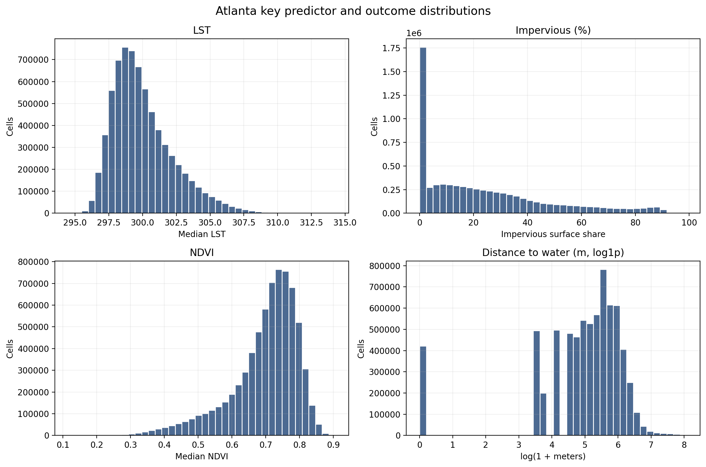
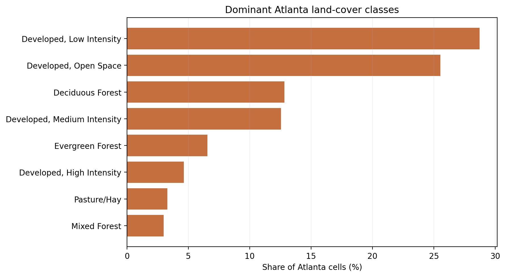
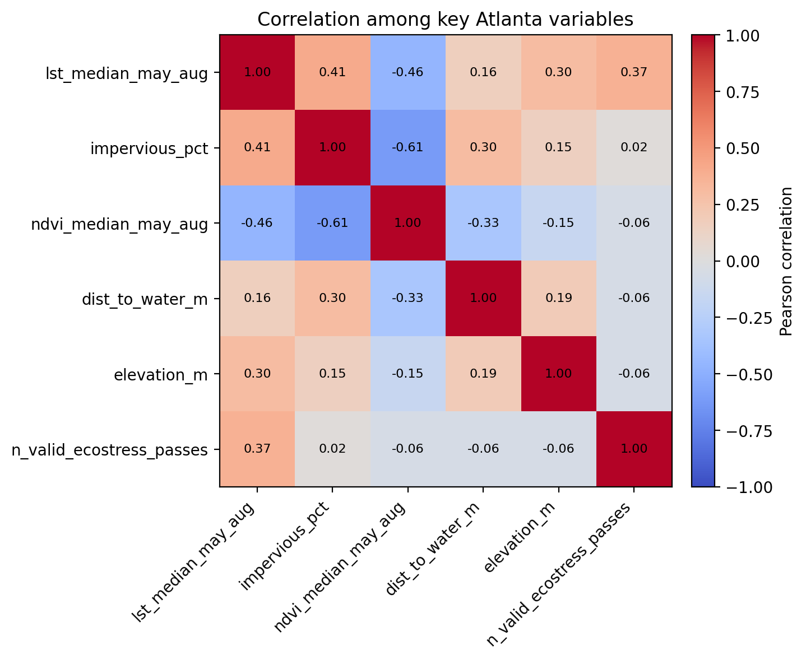
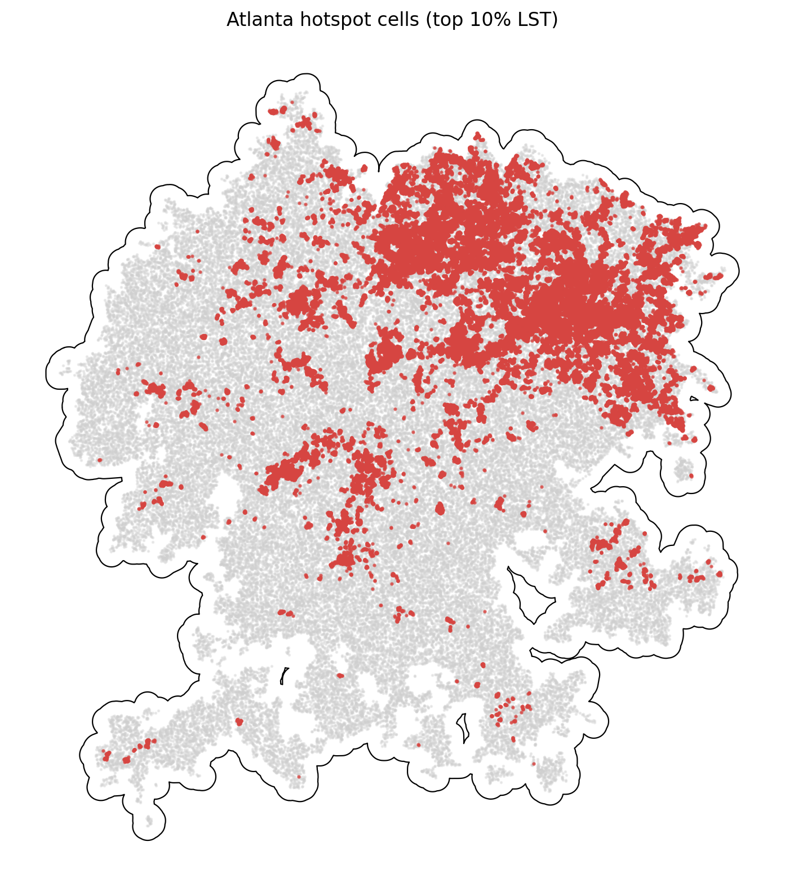

# Atlanta Summary of Data

The Atlanta summary uses `data_processed\city_features\18_atlanta_ga_features.parquet`, the canonical Atlanta-only analysis-ready feature table. Each observation represents one filtered 30 m grid cell inside the buffered Atlanta study area, with built-form, vegetation, elevation, hydrologic proximity, and warm-season surface-temperature attributes aligned to the same cell geometry. The table is intended for downstream urban heat modeling in a hot_humid city, including both continuous LST analysis and binary hotspot prediction.

## Overview

| metric | value |
| --- | --- |
| Primary Atlanta analysis file | data_processed\city_features\18_atlanta_ga_features.parquet |
| Dataset choice rationale | Canonical per-city filtered output intended for downstream modeling. |
| Observations | 7081699 |
| Variables | 16 |
| Unit of analysis | One filtered 30 m grid cell in the buffered Atlanta study area |
| Geometry / CRS | Cell polygons stored in EPSG:32616; centroids stored as WGS84 lon/lat |
| Projected spatial extent | [694260, 3684210, 796800, 3797940] |
| Study-area buffer | 2,000 m around the Census urban area |

## Key Variables

| variable_name | meaning | type_unit | why_it_matters |
| --- | --- | --- | --- |
| lst_median_may_aug | Median daytime land surface temperature across May-Aug ECOSTRESS observations. | continuous; ECOSTRESS LST units from source raster | Primary heat outcome for regression, classification, and hotspot analysis. |
| hotspot_10pct | Indicator for cells at or above the city-specific 90th percentile of LST. | binary flag | Natural target for hotspot classification and spatial risk mapping. |
| impervious_pct | NLCD impervious surface share for the 30 m cell. | continuous; percent | Core urban form exposure tied to heat retention and built intensity. |
| ndvi_median_may_aug | Median warm-season greenness index from Landsat/AppEEARS NDVI layers. | continuous; NDVI index | Vegetation is a likely protective predictor against elevated surface temperatures. |
| dist_to_water_m | Distance from the cell to the nearest mapped hydro feature. | continuous; meters | Captures proximity to possible local cooling influences and riparian structure. |
| land_cover_class | NLCD land cover class code for the cell. | categorical; NLCD class | Summarizes surface type and helps separate developed, barren, and vegetated cells. |
| n_valid_ecostress_passes | Count of valid ECOSTRESS observations contributing to the LST median. | count | Important quality-control covariate because low temporal coverage can weaken inference. |

## Targeted Descriptive Results

### Preprocessing audit

| stage | n_rows | share_of_unfiltered_pct |
| --- | --- | --- |
| unfiltered_input_rows | 9,426,812 | 100.00 |
| dropped_open_water_rows | 168,890 | 1.79 |
| dropped_lt3_ecostress_pass_rows | 456 | 0.00 |
| final_filtered_rows | 7,081,699 | 75.12 |

### Key numeric summary

| variable | n_non_missing | missing_pct | mean | median | std | p10 | p90 | skew |
| --- | --- | --- | --- | --- | --- | --- | --- | --- |
| impervious_pct | 7,081,699 | 0.00 | 23.81 | 17.51 | 23.84 | 0.00 | 61.16 | 1.02 |
| ndvi_median_may_aug | 7,081,699 | 0.00 | 0.70 | 0.72 | 0.10 | 0.55 | 0.80 | -1.29 |
| lst_median_may_aug | 7,081,699 | 0.00 | 300.02 | 299.56 | 2.28 | 297.55 | 303.22 | 1.02 |
| dist_to_water_m | 7,081,699 | 0.00 | 228.19 | 189.74 | 211.90 | 30.00 | 457.93 | 3.43 |
| elevation_m | 7,081,699 | 0.00 | 288.95 | 289.81 | 33.53 | 244.75 | 331.52 | -0.09 |
| n_valid_ecostress_passes | 7,081,699 | 0.00 | 30.00 | 23.00 | 11.97 | 19.00 | 47.00 | 0.56 |

### Land-cover composition

| land_cover_class | land_cover_label | n_rows | share_pct |
| --- | --- | --- | --- |
| 22 | Developed, Low Intensity | 2,034,504 | 28.73 |
| 21 | Developed, Open Space | 1,807,134 | 25.52 |
| 41 | Deciduous Forest | 907,481 | 12.81 |
| 23 | Developed, Medium Intensity | 888,057 | 12.54 |
| 42 | Evergreen Forest | 463,578 | 6.55 |
| 24 | Developed, High Intensity | 328,186 | 4.63 |
| 81 | Pasture/Hay | 232,700 | 3.29 |
| 43 | Mixed Forest | 212,559 | 3.00 |

### Missingness for key variables

| variable | missing_n | missing_pct | non_missing_n |
| --- | --- | --- | --- |
| dist_to_water_m | 0 | 0.0000 | 7,081,699 |
| elevation_m | 0 | 0.0000 | 7,081,699 |
| hotspot_10pct | 0 | 0.0000 | 7,081,699 |
| impervious_pct | 0 | 0.0000 | 7,081,699 |
| land_cover_class | 0 | 0.0000 | 7,081,699 |
| lst_median_may_aug | 0 | 0.0000 | 7,081,699 |
| n_valid_ecostress_passes | 0 | 0.0000 | 7,081,699 |
| ndvi_median_may_aug | 0 | 0.0000 | 7,081,699 |

### Correlation matrix

| variable | lst_median_may_aug | impervious_pct | ndvi_median_may_aug | dist_to_water_m | elevation_m | n_valid_ecostress_passes |
| --- | --- | --- | --- | --- | --- | --- |
| lst_median_may_aug | 1.00 | 0.41 | -0.46 | 0.16 | 0.30 | 0.37 |
| impervious_pct | 0.41 | 1.00 | -0.61 | 0.30 | 0.15 | 0.02 |
| ndvi_median_may_aug | -0.46 | -0.61 | 1.00 | -0.33 | -0.15 | -0.06 |
| dist_to_water_m | 0.16 | 0.30 | -0.33 | 1.00 | 0.19 | -0.06 |
| elevation_m | 0.30 | 0.15 | -0.15 | 0.19 | 1.00 | -0.06 |
| n_valid_ecostress_passes | 0.37 | 0.02 | -0.06 | -0.06 | -0.06 | 1.00 |

## Figures

## Notable Patterns

- None of the key modeling variables have missing values in the filtered Atlanta table.
- `hotspot_10pct` is intentionally imbalanced at 10.00% positives because it marks the Atlanta-specific top decile of LST.
- Land cover is concentrated in Developed, Low Intensity cells, which make up 28.7% of the filtered Atlanta dataset.
- The strongest linear relationship with LST among the key numeric variables is negative for `ndvi_median_may_aug` (r = -0.46).
- Hotspot prevalence varies by Atlanta quadrant from 1.8% to 29.8%, which is consistent with non-random spatial concentration.
- `dist_to_water_m` is strongly skewed (skew = 3.43), so transformations or robust summaries may be useful in later modeling.

## Output Notes

- The Atlanta-only per-city feature parquet was chosen over the merged final dataset when it was available because it is the direct analysis-ready output for this city and already reflects the row-drop rules used by the pipeline.
- Supporting CSV tables and PNG figures for this summary were generated deterministically by the companion CLI.
- City markdown and tables live under `outputs/data_processing/city_summaries/`, batch summary tables live under `outputs/data_processing/batch_reports/`, and figures live under `figures/data_processing/city_summaries/`.
- `outputs/modeling/` and `figures/modeling/` remain reserved for ML/evaluation artifacts.
