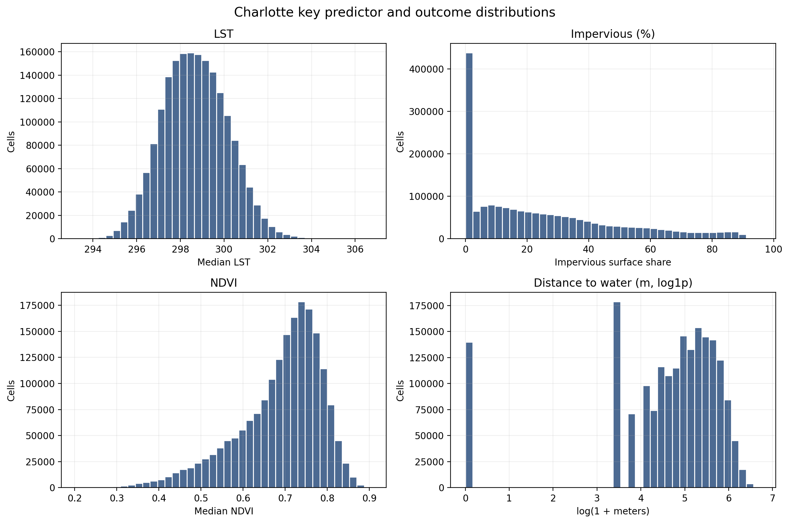
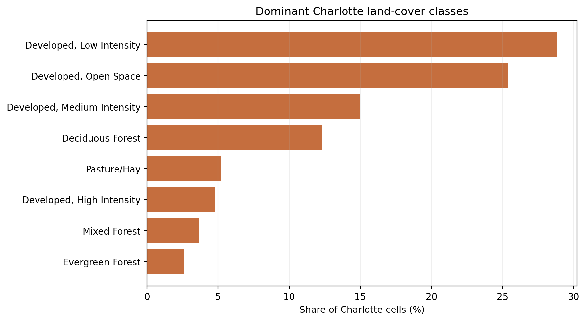
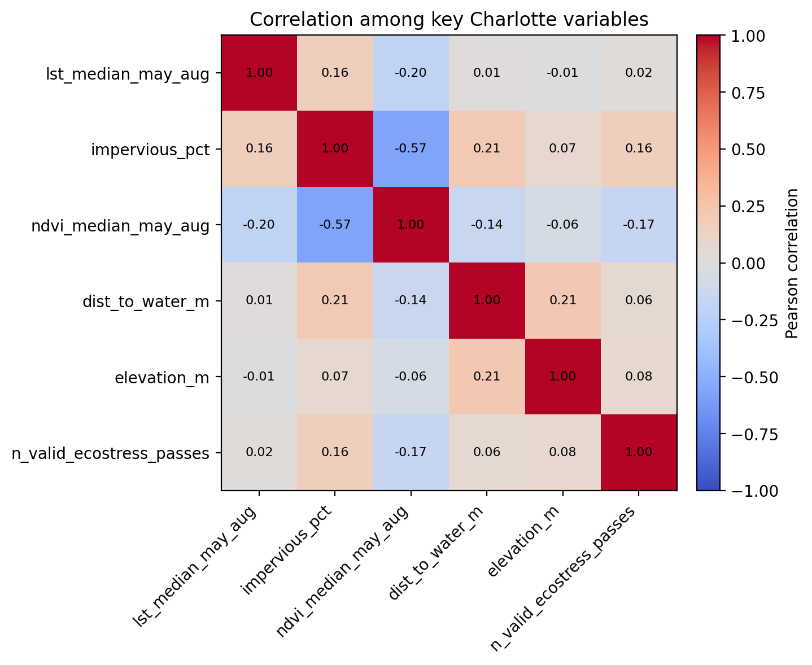
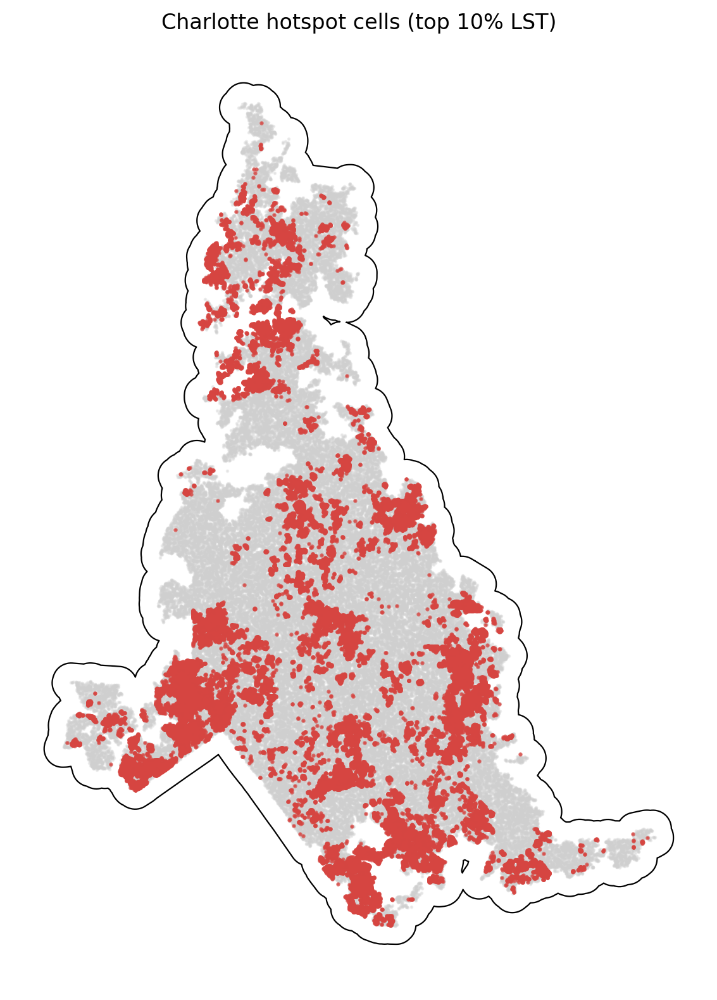

# Charlotte Summary of Data

The Charlotte summary uses `data_processed\city_features\19_charlotte_nc_features.parquet`, the canonical Charlotte-only analysis-ready feature table. Each observation represents one filtered 30 m grid cell inside the buffered Charlotte study area, with built-form, vegetation, elevation, hydrologic proximity, and warm-season surface-temperature attributes aligned to the same cell geometry. The table is intended for downstream urban heat modeling in a hot_humid city, including both continuous LST analysis and binary hotspot prediction.

## Overview

| metric | value |
| --- | --- |
| Primary Charlotte analysis file | data_processed\city_features\19_charlotte_nc_features.parquet |
| Dataset choice rationale | Canonical per-city filtered output intended for downstream modeling. |
| Observations | 1896996 |
| Variables | 16 |
| Unit of analysis | One filtered 30 m grid cell in the buffered Charlotte study area |
| Geometry / CRS | Cell polygons stored in EPSG:32617; centroids stored as WGS84 lon/lat |
| Projected spatial extent | [488640, 3863550, 553140, 3953160] |
| Study-area buffer | 2,000 m around the Census urban area |

## Key Variables

| variable_name | meaning | type_unit | why_it_matters |
| --- | --- | --- | --- |
| lst_median_may_aug | Median daytime land surface temperature across May-Aug ECOSTRESS observations. | continuous; ECOSTRESS LST units from source raster | Primary heat outcome for regression, classification, and hotspot analysis. |
| hotspot_10pct | Indicator for cells at or above the city-specific 90th percentile of LST. | binary flag | Natural target for hotspot classification and spatial risk mapping. |
| impervious_pct | NLCD impervious surface share for the 30 m cell. | continuous; percent | Core urban form exposure tied to heat retention and built intensity. |
| ndvi_median_may_aug | Median warm-season greenness index from Landsat/AppEEARS NDVI layers. | continuous; NDVI index | Vegetation is a likely protective predictor against elevated surface temperatures. |
| dist_to_water_m | Distance from the cell to the nearest mapped hydro feature. | continuous; meters | Captures proximity to possible local cooling influences and riparian structure. |
| land_cover_class | NLCD land cover class code for the cell. | categorical; NLCD class | Summarizes surface type and helps separate developed, barren, and vegetated cells. |
| n_valid_ecostress_passes | Count of valid ECOSTRESS observations contributing to the LST median. | count | Important quality-control covariate because low temporal coverage can weaken inference. |

## Targeted Descriptive Results

### Preprocessing audit

| stage | n_rows | share_of_unfiltered_pct |
| --- | --- | --- |
| unfiltered_input_rows | 2,992,259 | 100.00 |
| dropped_open_water_rows | 163,016 | 5.45 |
| dropped_lt3_ecostress_pass_rows | 344 | 0.01 |
| final_filtered_rows | 1,896,996 | 63.40 |

### Key numeric summary

| variable | n_non_missing | missing_pct | mean | median | std | p10 | p90 | skew |
| --- | --- | --- | --- | --- | --- | --- | --- | --- |
| impervious_pct | 1,896,996 | 0.00 | 25.45 | 19.26 | 24.39 | 0.00 | 63.38 | 0.87 |
| ndvi_median_may_aug | 1,896,996 | 0.00 | 0.69 | 0.71 | 0.10 | 0.54 | 0.80 | -1.02 |
| lst_median_may_aug | 1,896,996 | 0.00 | 298.68 | 298.64 | 1.49 | 296.80 | 300.62 | 0.14 |
| dist_to_water_m | 1,896,996 | 0.00 | 164.74 | 150.00 | 125.44 | 30.00 | 342.05 | 0.85 |
| elevation_m | 1,896,996 | 0.00 | 212.16 | 211.25 | 24.55 | 181.46 | 243.58 | 0.22 |
| n_valid_ecostress_passes | 1,896,996 | 0.00 | 22.69 | 23.00 | 1.76 | 20.00 | 25.00 | -0.02 |

### Land-cover composition

| land_cover_class | land_cover_label | n_rows | share_pct |
| --- | --- | --- | --- |
| 22 | Developed, Low Intensity | 546,310 | 28.80 |
| 21 | Developed, Open Space | 481,632 | 25.39 |
| 23 | Developed, Medium Intensity | 284,097 | 14.98 |
| 41 | Deciduous Forest | 233,880 | 12.33 |
| 81 | Pasture/Hay | 99,390 | 5.24 |
| 24 | Developed, High Intensity | 89,904 | 4.74 |
| 43 | Mixed Forest | 69,750 | 3.68 |
| 42 | Evergreen Forest | 49,652 | 2.62 |

### Missingness for key variables

| variable | missing_n | missing_pct | non_missing_n |
| --- | --- | --- | --- |
| dist_to_water_m | 0 | 0.0000 | 1,896,996 |
| elevation_m | 0 | 0.0000 | 1,896,996 |
| hotspot_10pct | 0 | 0.0000 | 1,896,996 |
| impervious_pct | 0 | 0.0000 | 1,896,996 |
| land_cover_class | 0 | 0.0000 | 1,896,996 |
| lst_median_may_aug | 0 | 0.0000 | 1,896,996 |
| n_valid_ecostress_passes | 0 | 0.0000 | 1,896,996 |
| ndvi_median_may_aug | 0 | 0.0000 | 1,896,996 |

### Correlation matrix

| variable | lst_median_may_aug | impervious_pct | ndvi_median_may_aug | dist_to_water_m | elevation_m | n_valid_ecostress_passes |
| --- | --- | --- | --- | --- | --- | --- |
| lst_median_may_aug | 1.00 | 0.16 | -0.20 | 0.01 | -0.01 | 0.02 |
| impervious_pct | 0.16 | 1.00 | -0.57 | 0.21 | 0.07 | 0.16 |
| ndvi_median_may_aug | -0.20 | -0.57 | 1.00 | -0.14 | -0.06 | -0.17 |
| dist_to_water_m | 0.01 | 0.21 | -0.14 | 1.00 | 0.21 | 0.06 |
| elevation_m | -0.01 | 0.07 | -0.06 | 0.21 | 1.00 | 0.08 |
| n_valid_ecostress_passes | 0.02 | 0.16 | -0.17 | 0.06 | 0.08 | 1.00 |

## Figures

## Notable Patterns

- None of the key modeling variables have missing values in the filtered Charlotte table.
- `hotspot_10pct` is intentionally imbalanced at 10.00% positives because it marks the Charlotte-specific top decile of LST.
- Land cover is concentrated in Developed, Low Intensity cells, which make up 28.8% of the filtered Charlotte dataset.
- The strongest linear relationship with LST among the key numeric variables is negative for `ndvi_median_may_aug` (r = -0.20).
- Hotspot prevalence varies by Charlotte quadrant from 6.8% to 14.0%, which is consistent with non-random spatial concentration.
- `ndvi_median_may_aug` is strongly skewed (skew = -1.02), so transformations or robust summaries may be useful in later modeling.

## Output Notes

- The Charlotte-only per-city feature parquet was chosen over the merged final dataset when it was available because it is the direct analysis-ready output for this city and already reflects the row-drop rules used by the pipeline.
- Supporting CSV tables and PNG figures for this summary were generated deterministically by the companion CLI.
- City markdown and tables live under `outputs/data_processing/city_summaries/`, batch summary tables live under `outputs/data_processing/batch_reports/`, and figures live under `figures/data_processing/city_summaries/`.
- `outputs/modeling/` and `figures/modeling/` remain reserved for ML/evaluation artifacts.
