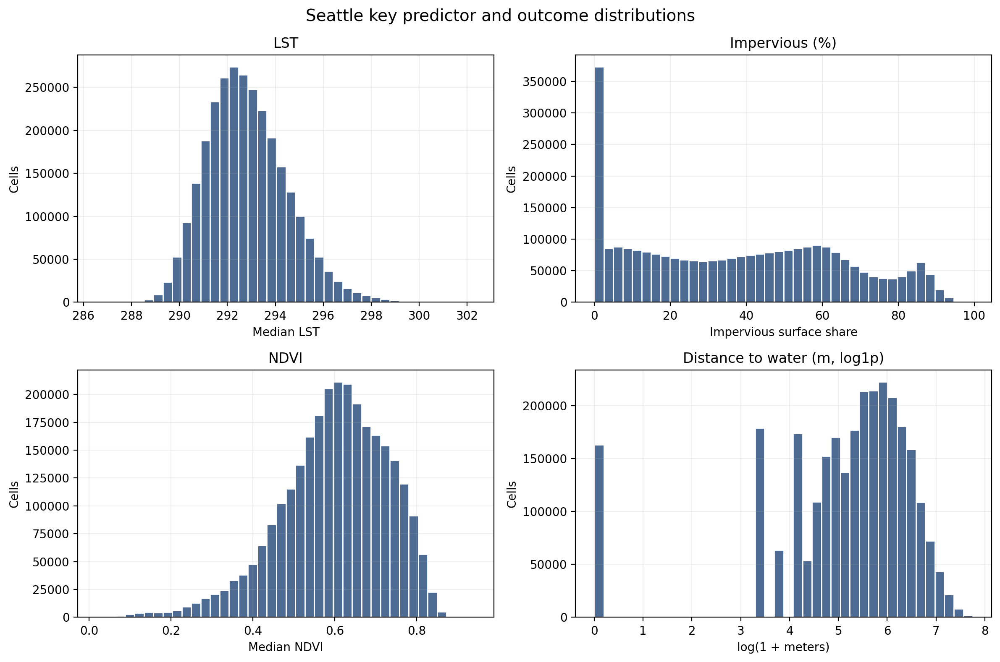
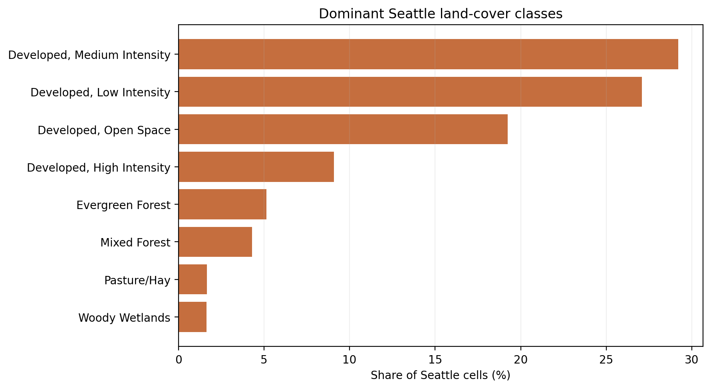
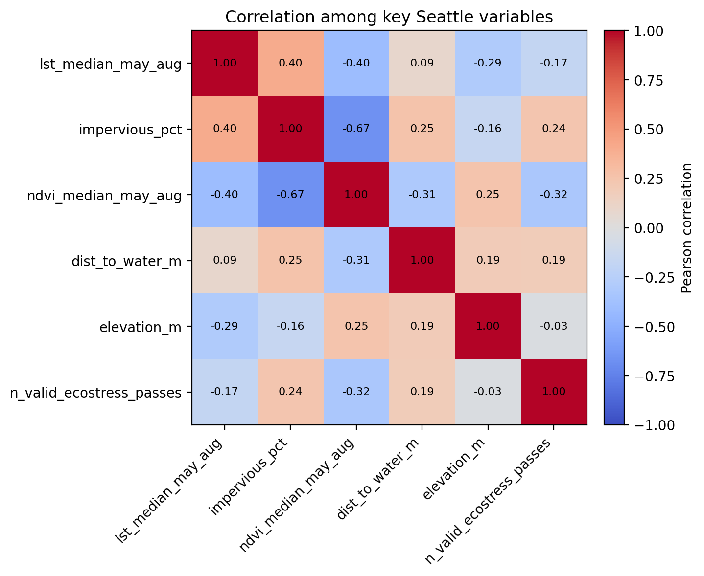
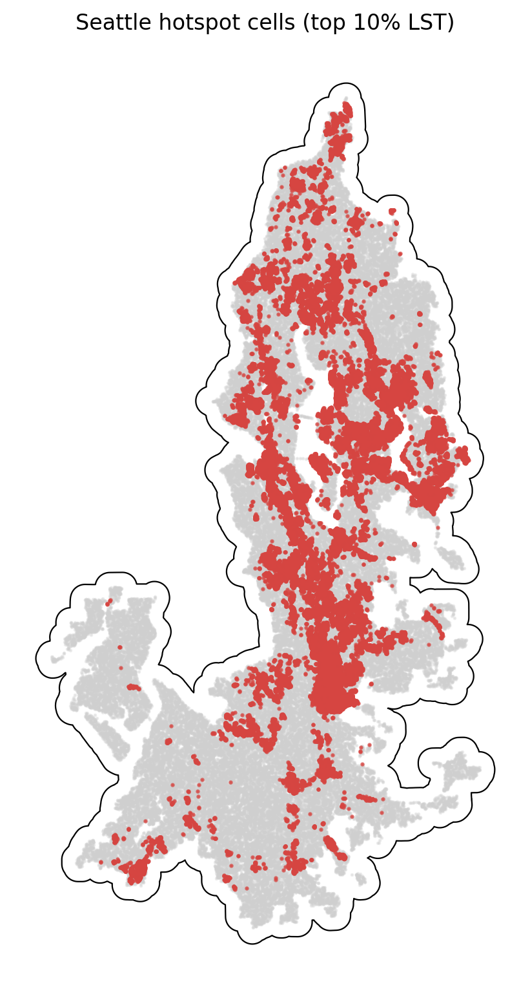

# Seattle Summary of Data

The Seattle summary uses `data_processed\city_features\21_seattle_wa_features.parquet`, the canonical Seattle-only analysis-ready feature table. Each observation represents one filtered 30 m grid cell inside the buffered Seattle study area, with built-form, vegetation, elevation, hydrologic proximity, and warm-season surface-temperature attributes aligned to the same cell geometry. The table is intended for downstream urban heat modeling in a mild_cool city, including both continuous LST analysis and binary hotspot prediction.

## Overview

| metric | value |
| --- | --- |
| Primary Seattle analysis file | data_processed\city_features\21_seattle_wa_features.parquet |
| Dataset choice rationale | Canonical per-city filtered output intended for downstream modeling. |
| Observations | 2831875 |
| Variables | 16 |
| Unit of analysis | One filtered 30 m grid cell in the buffered Seattle study area |
| Geometry / CRS | Cell polygons stored in EPSG:32610; centroids stored as WGS84 lon/lat |
| Projected spatial extent | [520290, 5206230, 579420, 5320530] |
| Study-area buffer | 2,000 m around the Census urban area |

## Key Variables

| variable_name | meaning | type_unit | why_it_matters |
| --- | --- | --- | --- |
| lst_median_may_aug | Median daytime land surface temperature across May-Aug ECOSTRESS observations. | continuous; ECOSTRESS LST units from source raster | Primary heat outcome for regression, classification, and hotspot analysis. |
| hotspot_10pct | Indicator for cells at or above the city-specific 90th percentile of LST. | binary flag | Natural target for hotspot classification and spatial risk mapping. |
| impervious_pct | NLCD impervious surface share for the 30 m cell. | continuous; percent | Core urban form exposure tied to heat retention and built intensity. |
| ndvi_median_may_aug | Median warm-season greenness index from Landsat/AppEEARS NDVI layers. | continuous; NDVI index | Vegetation is a likely protective predictor against elevated surface temperatures. |
| dist_to_water_m | Distance from the cell to the nearest mapped hydro feature. | continuous; meters | Captures proximity to possible local cooling influences and riparian structure. |
| land_cover_class | NLCD land cover class code for the cell. | categorical; NLCD class | Summarizes surface type and helps separate developed, barren, and vegetated cells. |
| n_valid_ecostress_passes | Count of valid ECOSTRESS observations contributing to the LST median. | count | Important quality-control covariate because low temporal coverage can weaken inference. |

## Targeted Descriptive Results

### Preprocessing audit

| stage | n_rows | share_of_unfiltered_pct |
| --- | --- | --- |
| unfiltered_input_rows | 4,386,289 | 100.00 |
| dropped_open_water_rows | 621,485 | 14.17 |
| dropped_lt3_ecostress_pass_rows | 630 | 0.01 |
| final_filtered_rows | 2,831,875 | 64.56 |

### Key numeric summary

| variable | n_non_missing | missing_pct | mean | median | std | p10 | p90 | skew |
| --- | --- | --- | --- | --- | --- | --- | --- | --- |
| impervious_pct | 2,831,875 | 0.00 | 37.51 | 37.34 | 27.11 | 0.00 | 76.01 | 0.18 |
| ndvi_median_may_aug | 2,822,503 | 0.33 | 0.60 | 0.61 | 0.13 | 0.43 | 0.76 | -0.66 |
| lst_median_may_aug | 2,831,875 | 0.00 | 292.81 | 292.66 | 1.67 | 290.79 | 295.04 | 0.50 |
| dist_to_water_m | 2,831,875 | 0.00 | 313.02 | 234.31 | 290.65 | 30.00 | 700.36 | 1.61 |
| elevation_m | 2,831,875 | 0.00 | 96.18 | 100.23 | 54.28 | 16.32 | 161.38 | 0.21 |
| n_valid_ecostress_passes | 2,831,875 | 0.00 | 44.14 | 44.00 | 2.68 | 41.00 | 48.00 | -0.22 |

### Land-cover composition

| land_cover_class | land_cover_label | n_rows | share_pct |
| --- | --- | --- | --- |
| 23 | Developed, Medium Intensity | 826,862 | 29.20 |
| 22 | Developed, Low Intensity | 767,119 | 27.09 |
| 21 | Developed, Open Space | 545,048 | 19.25 |
| 24 | Developed, High Intensity | 257,470 | 9.09 |
| 42 | Evergreen Forest | 145,829 | 5.15 |
| 43 | Mixed Forest | 121,559 | 4.29 |
| 81 | Pasture/Hay | 47,369 | 1.67 |
| 90 | Woody Wetlands | 46,790 | 1.65 |

### Missingness for key variables

| variable | missing_n | missing_pct | non_missing_n |
| --- | --- | --- | --- |
| ndvi_median_may_aug | 9,372 | 0.3309 | 2,822,503 |
| dist_to_water_m | 0 | 0.0000 | 2,831,875 |
| elevation_m | 0 | 0.0000 | 2,831,875 |
| hotspot_10pct | 0 | 0.0000 | 2,831,875 |
| impervious_pct | 0 | 0.0000 | 2,831,875 |
| land_cover_class | 0 | 0.0000 | 2,831,875 |
| lst_median_may_aug | 0 | 0.0000 | 2,831,875 |
| n_valid_ecostress_passes | 0 | 0.0000 | 2,831,875 |

### Correlation matrix

| variable | lst_median_may_aug | impervious_pct | ndvi_median_may_aug | dist_to_water_m | elevation_m | n_valid_ecostress_passes |
| --- | --- | --- | --- | --- | --- | --- |
| lst_median_may_aug | 1.00 | 0.40 | -0.40 | 0.09 | -0.29 | -0.17 |
| impervious_pct | 0.40 | 1.00 | -0.67 | 0.25 | -0.16 | 0.24 |
| ndvi_median_may_aug | -0.40 | -0.67 | 1.00 | -0.31 | 0.25 | -0.32 |
| dist_to_water_m | 0.09 | 0.25 | -0.31 | 1.00 | 0.19 | 0.19 |
| elevation_m | -0.29 | -0.16 | 0.25 | 0.19 | 1.00 | -0.03 |
| n_valid_ecostress_passes | -0.17 | 0.24 | -0.32 | 0.19 | -0.03 | 1.00 |

## Figures

## Notable Patterns

- Missingness is limited overall; the highest missing share is `ndvi_median_may_aug` at 0.33%.
- `hotspot_10pct` is intentionally imbalanced at 10.00% positives because it marks the Seattle-specific top decile of LST.
- Land cover is concentrated in Developed, Medium Intensity cells, which make up 29.2% of the filtered Seattle dataset.
- The strongest linear relationship with LST among the key numeric variables is negative for `ndvi_median_may_aug` (r = -0.40).
- Hotspot prevalence varies by Seattle quadrant from 2.3% to 14.5%, which is consistent with non-random spatial concentration.
- `dist_to_water_m` is strongly skewed (skew = 1.61), so transformations or robust summaries may be useful in later modeling.

## Output Notes

- The Seattle-only per-city feature parquet was chosen over the merged final dataset when it was available because it is the direct analysis-ready output for this city and already reflects the row-drop rules used by the pipeline.
- Supporting CSV tables and PNG figures for this summary were generated deterministically by the companion CLI.
- City markdown and tables live under `outputs/data_processing/city_summaries/`, batch summary tables live under `outputs/data_processing/batch_reports/`, and figures live under `figures/data_processing/city_summaries/`.
- `outputs/modeling/` and `figures/modeling/` remain reserved for ML/evaluation artifacts.
