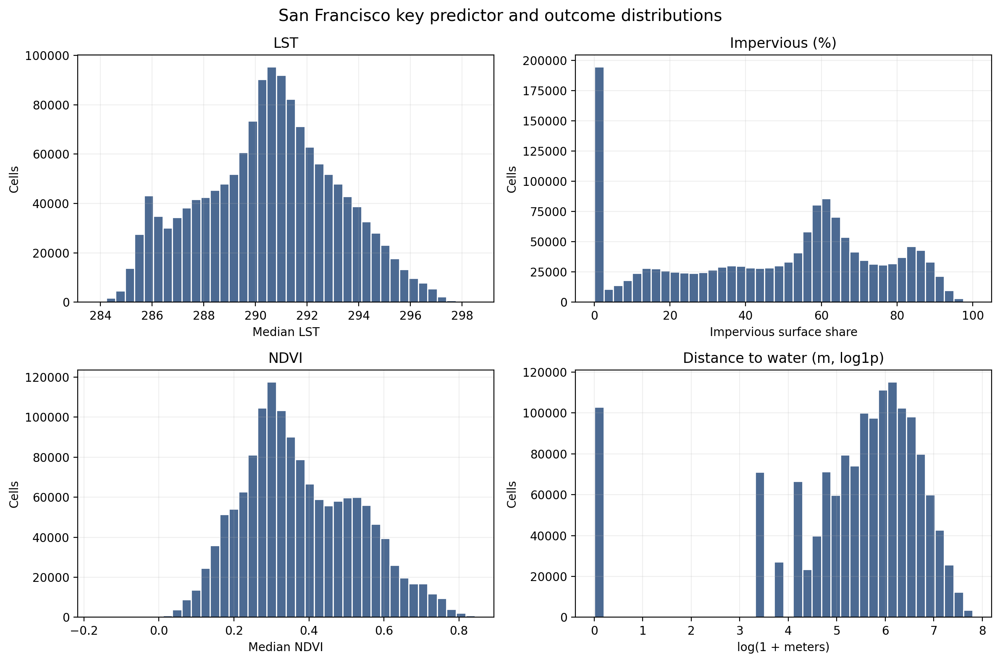
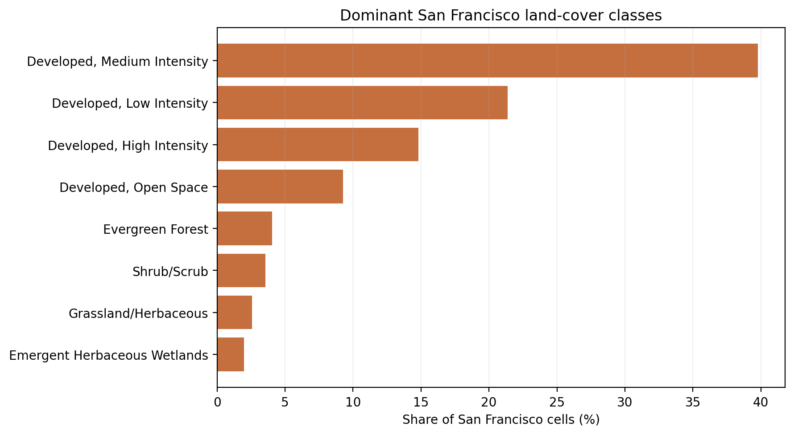
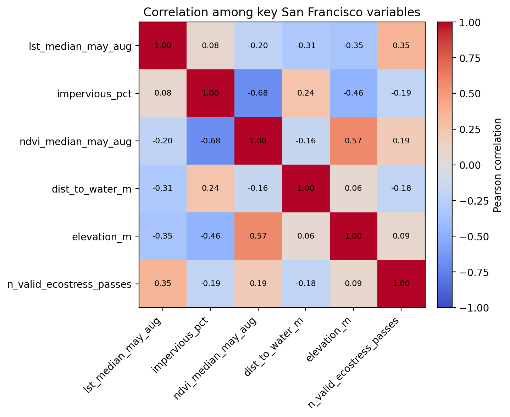
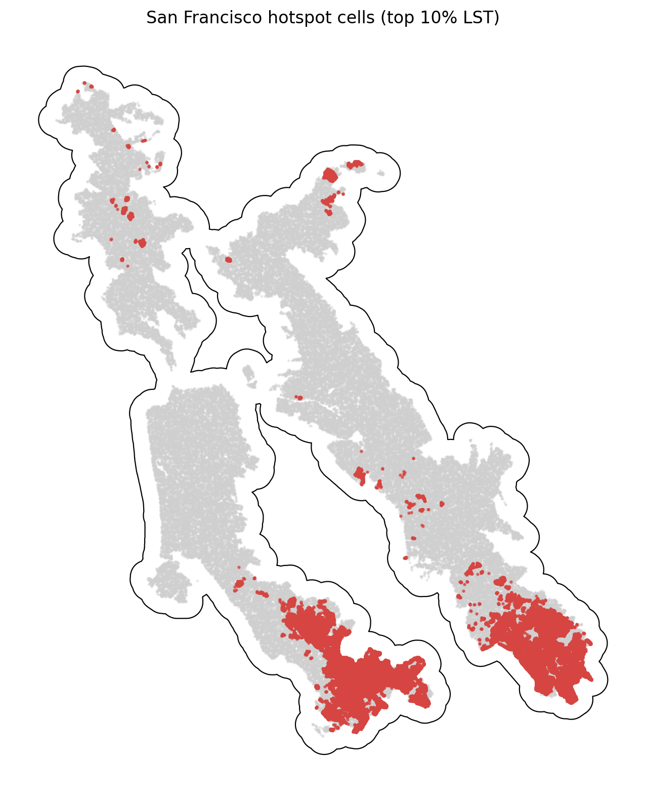

# San Francisco Summary of Data

The San Francisco summary uses `data_processed\city_features\23_san_francisco_ca_features.parquet`, the canonical San Francisco-only analysis-ready feature table. Each observation represents one filtered 30 m grid cell inside the buffered San Francisco study area, with built-form, vegetation, elevation, hydrologic proximity, and warm-season surface-temperature attributes aligned to the same cell geometry. The table is intended for downstream urban heat modeling in a mild_cool city, including both continuous LST analysis and binary hotspot prediction.

## Overview

| metric | value |
| --- | --- |
| Primary San Francisco analysis file | data_processed\city_features\23_san_francisco_ca_features.parquet |
| Dataset choice rationale | Canonical per-city filtered output intended for downstream modeling. |
| Observations | 1466276 |
| Variables | 16 |
| Unit of analysis | One filtered 30 m grid cell in the buffered San Francisco study area |
| Geometry / CRS | Cell polygons stored in EPSG:32610; centroids stored as WGS84 lon/lat |
| Projected spatial extent | [531600, 4141500, 597600, 4222200] |
| Study-area buffer | 2,000 m around the Census urban area |

## Key Variables

| variable_name | meaning | type_unit | why_it_matters |
| --- | --- | --- | --- |
| lst_median_may_aug | Median daytime land surface temperature across May-Aug ECOSTRESS observations. | continuous; ECOSTRESS LST units from source raster | Primary heat outcome for regression, classification, and hotspot analysis. |
| hotspot_10pct | Indicator for cells at or above the city-specific 90th percentile of LST. | binary flag | Natural target for hotspot classification and spatial risk mapping. |
| impervious_pct | NLCD impervious surface share for the 30 m cell. | continuous; percent | Core urban form exposure tied to heat retention and built intensity. |
| ndvi_median_may_aug | Median warm-season greenness index from Landsat/AppEEARS NDVI layers. | continuous; NDVI index | Vegetation is a likely protective predictor against elevated surface temperatures. |
| dist_to_water_m | Distance from the cell to the nearest mapped hydro feature. | continuous; meters | Captures proximity to possible local cooling influences and riparian structure. |
| land_cover_class | NLCD land cover class code for the cell. | categorical; NLCD class | Summarizes surface type and helps separate developed, barren, and vegetated cells. |
| n_valid_ecostress_passes | Count of valid ECOSTRESS observations contributing to the LST median. | count | Important quality-control covariate because low temporal coverage can weaken inference. |

## Targeted Descriptive Results

### Preprocessing audit

| stage | n_rows | share_of_unfiltered_pct |
| --- | --- | --- |
| unfiltered_input_rows | 2,820,884 | 100.00 |
| dropped_open_water_rows | 638,605 | 22.64 |
| dropped_lt3_ecostress_pass_rows | 659 | 0.02 |
| final_filtered_rows | 1,466,276 | 51.98 |

### Key numeric summary

| variable | n_non_missing | missing_pct | mean | median | std | p10 | p90 | skew |
| --- | --- | --- | --- | --- | --- | --- | --- | --- |
| impervious_pct | 1,466,276 | 0.00 | 46.66 | 54.07 | 28.34 | 0.00 | 83.18 | -0.30 |
| ndvi_median_may_aug | 1,445,251 | 1.43 | 0.38 | 0.35 | 0.15 | 0.19 | 0.59 | 0.34 |
| lst_median_may_aug | 1,466,276 | 0.00 | 290.53 | 290.64 | 2.67 | 286.66 | 294.05 | -0.03 |
| dist_to_water_m | 1,466,276 | 0.00 | 402.01 | 300.00 | 377.23 | 30.00 | 915.86 | 1.48 |
| elevation_m | 1,466,276 | 0.00 | 57.56 | 24.31 | 73.03 | 2.92 | 160.19 | 1.92 |
| n_valid_ecostress_passes | 1,466,276 | 0.00 | 41.26 | 42.00 | 3.17 | 37.00 | 45.00 | -0.56 |

### Land-cover composition

| land_cover_class | land_cover_label | n_rows | share_pct |
| --- | --- | --- | --- |
| 23 | Developed, Medium Intensity | 583,507 | 39.80 |
| 22 | Developed, Low Intensity | 313,489 | 21.38 |
| 24 | Developed, High Intensity | 217,103 | 14.81 |
| 21 | Developed, Open Space | 135,858 | 9.27 |
| 42 | Evergreen Forest | 59,194 | 4.04 |
| 52 | Shrub/Scrub | 52,380 | 3.57 |
| 71 | Grassland/Herbaceous | 37,657 | 2.57 |
| 95 | Emergent Herbaceous Wetlands | 28,833 | 1.97 |

### Missingness for key variables

| variable | missing_n | missing_pct | non_missing_n |
| --- | --- | --- | --- |
| ndvi_median_may_aug | 21,025 | 1.4339 | 1,445,251 |
| dist_to_water_m | 0 | 0.0000 | 1,466,276 |
| elevation_m | 0 | 0.0000 | 1,466,276 |
| hotspot_10pct | 0 | 0.0000 | 1,466,276 |
| impervious_pct | 0 | 0.0000 | 1,466,276 |
| land_cover_class | 0 | 0.0000 | 1,466,276 |
| lst_median_may_aug | 0 | 0.0000 | 1,466,276 |
| n_valid_ecostress_passes | 0 | 0.0000 | 1,466,276 |

### Correlation matrix

| variable | lst_median_may_aug | impervious_pct | ndvi_median_may_aug | dist_to_water_m | elevation_m | n_valid_ecostress_passes |
| --- | --- | --- | --- | --- | --- | --- |
| lst_median_may_aug | 1.00 | 0.08 | -0.20 | -0.31 | -0.35 | 0.35 |
| impervious_pct | 0.08 | 1.00 | -0.68 | 0.24 | -0.46 | -0.19 |
| ndvi_median_may_aug | -0.20 | -0.68 | 1.00 | -0.16 | 0.57 | 0.19 |
| dist_to_water_m | -0.31 | 0.24 | -0.16 | 1.00 | 0.06 | -0.18 |
| elevation_m | -0.35 | -0.46 | 0.57 | 0.06 | 1.00 | 0.09 |
| n_valid_ecostress_passes | 0.35 | -0.19 | 0.19 | -0.18 | 0.09 | 1.00 |

## Figures

## Notable Patterns

- Missingness is limited overall; the highest missing share is `ndvi_median_may_aug` at 1.43%.
- `hotspot_10pct` is intentionally imbalanced at 10.00% positives because it marks the San Francisco-specific top decile of LST.
- Land cover is concentrated in Developed, Medium Intensity cells, which make up 39.8% of the filtered San Francisco dataset.
- The strongest linear relationship with LST among the key numeric variables is positive for `n_valid_ecostress_passes` (r = 0.35).
- Hotspot prevalence varies by San Francisco quadrant from 0.2% to 27.8%, which is consistent with non-random spatial concentration.
- `elevation_m` is strongly skewed (skew = 1.92), so transformations or robust summaries may be useful in later modeling.

## Output Notes

- The San Francisco-only per-city feature parquet was chosen over the merged final dataset when it was available because it is the direct analysis-ready output for this city and already reflects the row-drop rules used by the pipeline.
- Supporting CSV tables and PNG figures for this summary were generated deterministically by the companion CLI.
- City markdown and tables live under `outputs/data_processing/city_summaries/`, batch summary tables live under `outputs/data_processing/batch_reports/`, and figures live under `figures/data_processing/city_summaries/`.
- `outputs/modeling/` and `figures/modeling/` remain reserved for ML/evaluation artifacts.
