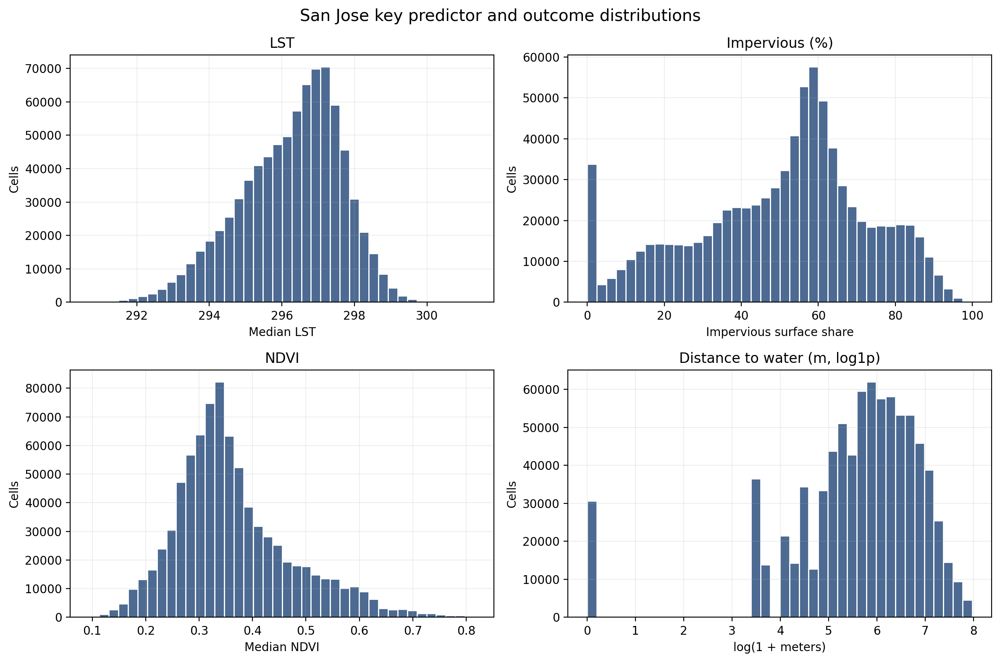
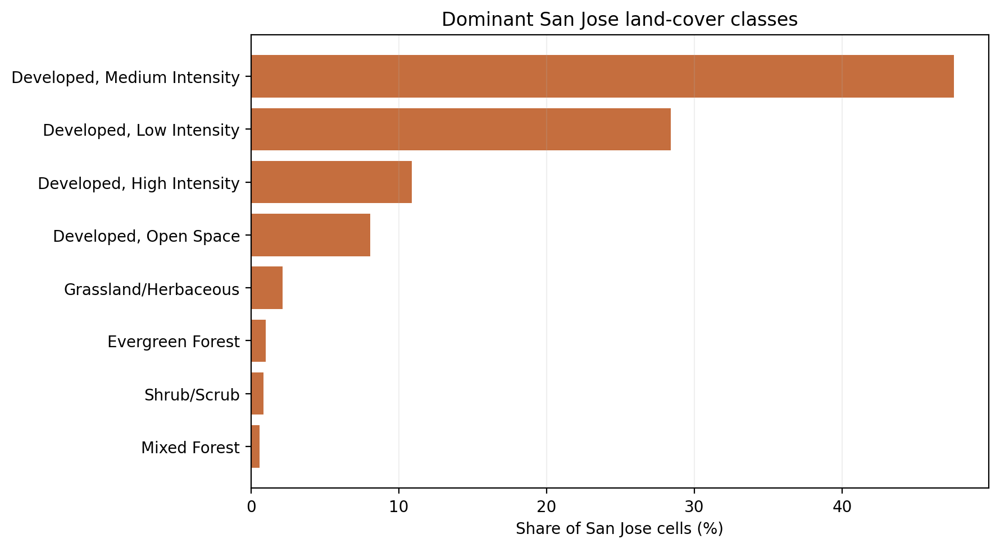
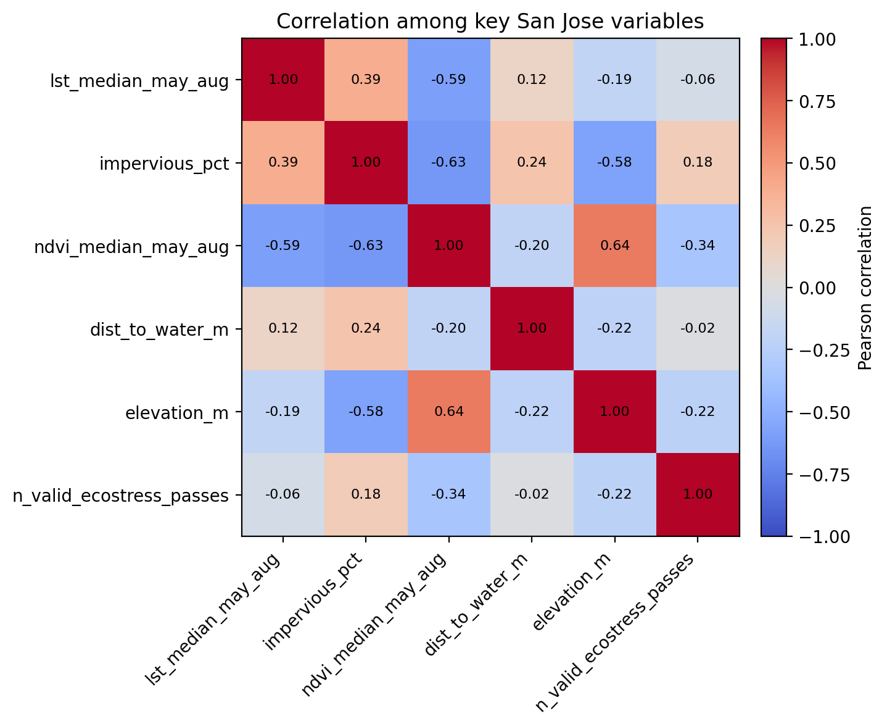
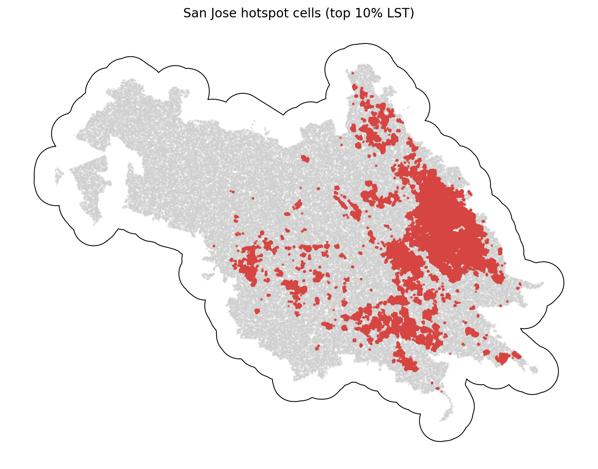

# San Jose Summary of Data

The San Jose summary uses `data_processed\city_features\24_san_jose_ca_features.parquet`, the canonical San Jose-only analysis-ready feature table. Each observation represents one filtered 30 m grid cell inside the buffered San Jose study area, with built-form, vegetation, elevation, hydrologic proximity, and warm-season surface-temperature attributes aligned to the same cell geometry. The table is intended for downstream urban heat modeling in a mild_cool city, including both continuous LST analysis and binary hotspot prediction.

## Overview

| metric | value |
| --- | --- |
| Primary San Jose analysis file | data_processed\city_features\24_san_jose_ca_features.parquet |
| Dataset choice rationale | Canonical per-city filtered output intended for downstream modeling. |
| Observations | 817627 |
| Variables | 16 |
| Unit of analysis | One filtered 30 m grid cell in the buffered San Jose study area |
| Geometry / CRS | Cell polygons stored in EPSG:32610; centroids stored as WGS84 lon/lat |
| Projected spatial extent | [566430, 4114230, 614130, 4149090] |
| Study-area buffer | 2,000 m around the Census urban area |

## Key Variables

| variable_name | meaning | type_unit | why_it_matters |
| --- | --- | --- | --- |
| lst_median_may_aug | Median daytime land surface temperature across May-Aug ECOSTRESS observations. | continuous; ECOSTRESS LST units from source raster | Primary heat outcome for regression, classification, and hotspot analysis. |
| hotspot_10pct | Indicator for cells at or above the city-specific 90th percentile of LST. | binary flag | Natural target for hotspot classification and spatial risk mapping. |
| impervious_pct | NLCD impervious surface share for the 30 m cell. | continuous; percent | Core urban form exposure tied to heat retention and built intensity. |
| ndvi_median_may_aug | Median warm-season greenness index from Landsat/AppEEARS NDVI layers. | continuous; NDVI index | Vegetation is a likely protective predictor against elevated surface temperatures. |
| dist_to_water_m | Distance from the cell to the nearest mapped hydro feature. | continuous; meters | Captures proximity to possible local cooling influences and riparian structure. |
| land_cover_class | NLCD land cover class code for the cell. | categorical; NLCD class | Summarizes surface type and helps separate developed, barren, and vegetated cells. |
| n_valid_ecostress_passes | Count of valid ECOSTRESS observations contributing to the LST median. | count | Important quality-control covariate because low temporal coverage can weaken inference. |

## Targeted Descriptive Results

### Preprocessing audit

| stage | n_rows | share_of_unfiltered_pct |
| --- | --- | --- |
| unfiltered_input_rows | 1,284,985 | 100.00 |
| dropped_open_water_rows | 46,036 | 3.58 |
| dropped_lt3_ecostress_pass_rows | 177 | 0.01 |
| final_filtered_rows | 817,627 | 63.63 |

### Key numeric summary

| variable | n_non_missing | missing_pct | mean | median | std | p10 | p90 | skew |
| --- | --- | --- | --- | --- | --- | --- | --- | --- |
| impervious_pct | 817,627 | 0.00 | 50.32 | 54.62 | 22.65 | 16.19 | 79.28 | -0.44 |
| ndvi_median_may_aug | 817,562 | 0.01 | 0.36 | 0.34 | 0.11 | 0.25 | 0.52 | 0.86 |
| lst_median_may_aug | 817,627 | 0.00 | 296.26 | 296.47 | 1.40 | 294.30 | 297.88 | -0.48 |
| dist_to_water_m | 817,627 | 0.00 | 485.60 | 339.41 | 468.77 | 60.00 | 1,126.10 | 1.65 |
| elevation_m | 817,627 | 0.00 | 62.49 | 49.30 | 55.91 | 8.28 | 138.65 | 1.84 |
| n_valid_ecostress_passes | 817,627 | 0.00 | 41.04 | 41.00 | 1.45 | 39.00 | 43.00 | 0.24 |

### Land-cover composition

| land_cover_class | land_cover_label | n_rows | share_pct |
| --- | --- | --- | --- |
| 23 | Developed, Medium Intensity | 388,858 | 47.56 |
| 22 | Developed, Low Intensity | 232,322 | 28.41 |
| 24 | Developed, High Intensity | 89,078 | 10.89 |
| 21 | Developed, Open Space | 66,023 | 8.07 |
| 71 | Grassland/Herbaceous | 17,624 | 2.16 |
| 42 | Evergreen Forest | 8,326 | 1.02 |
| 52 | Shrub/Scrub | 6,899 | 0.84 |
| 43 | Mixed Forest | 4,637 | 0.57 |

### Missingness for key variables

| variable | missing_n | missing_pct | non_missing_n |
| --- | --- | --- | --- |
| ndvi_median_may_aug | 65 | 0.0079 | 817,562 |
| dist_to_water_m | 0 | 0.0000 | 817,627 |
| elevation_m | 0 | 0.0000 | 817,627 |
| hotspot_10pct | 0 | 0.0000 | 817,627 |
| impervious_pct | 0 | 0.0000 | 817,627 |
| land_cover_class | 0 | 0.0000 | 817,627 |
| lst_median_may_aug | 0 | 0.0000 | 817,627 |
| n_valid_ecostress_passes | 0 | 0.0000 | 817,627 |

### Correlation matrix

| variable | lst_median_may_aug | impervious_pct | ndvi_median_may_aug | dist_to_water_m | elevation_m | n_valid_ecostress_passes |
| --- | --- | --- | --- | --- | --- | --- |
| lst_median_may_aug | 1.00 | 0.39 | -0.59 | 0.12 | -0.19 | -0.06 |
| impervious_pct | 0.39 | 1.00 | -0.63 | 0.24 | -0.58 | 0.18 |
| ndvi_median_may_aug | -0.59 | -0.63 | 1.00 | -0.20 | 0.64 | -0.34 |
| dist_to_water_m | 0.12 | 0.24 | -0.20 | 1.00 | -0.22 | -0.02 |
| elevation_m | -0.19 | -0.58 | 0.64 | -0.22 | 1.00 | -0.22 |
| n_valid_ecostress_passes | -0.06 | 0.18 | -0.34 | -0.02 | -0.22 | 1.00 |

## Figures

## Notable Patterns

- Missingness is negligible: only 65 `ndvi_median_may_aug` values are missing (0.0079%).
- `hotspot_10pct` is intentionally imbalanced at 10.00% positives because it marks the San Jose-specific top decile of LST.
- Land cover is concentrated in Developed, Medium Intensity cells, which make up 47.6% of the filtered San Jose dataset.
- The strongest linear relationship with LST among the key numeric variables is negative for `ndvi_median_may_aug` (r = -0.59).
- Hotspot prevalence varies by San Jose quadrant from 0.1% to 18.7%, which is consistent with non-random spatial concentration.
- `elevation_m` is strongly skewed (skew = 1.84), so transformations or robust summaries may be useful in later modeling.

## Output Notes

- The San Jose-only per-city feature parquet was chosen over the merged final dataset when it was available because it is the direct analysis-ready output for this city and already reflects the row-drop rules used by the pipeline.
- Supporting CSV tables and PNG figures for this summary were generated deterministically by the companion CLI.
- City markdown and tables live under `outputs/data_processing/city_summaries/`, batch summary tables live under `outputs/data_processing/batch_reports/`, and figures live under `figures/data_processing/city_summaries/`.
- `outputs/modeling/` and `figures/modeling/` remain reserved for ML/evaluation artifacts.
