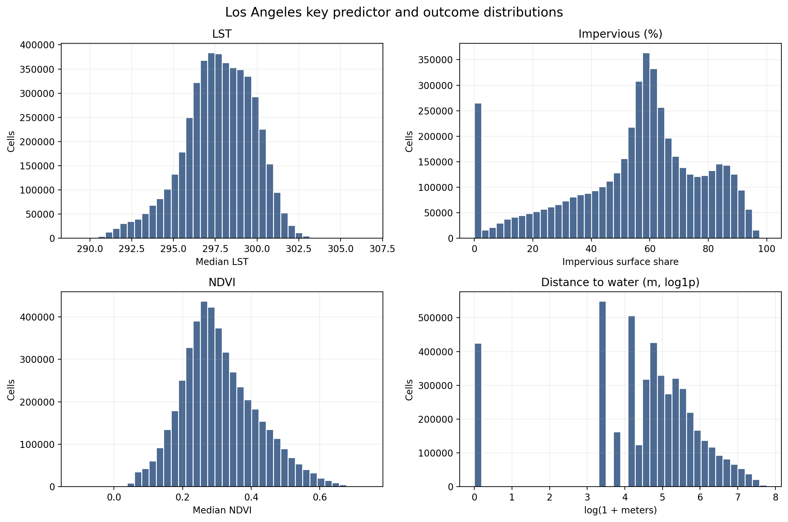
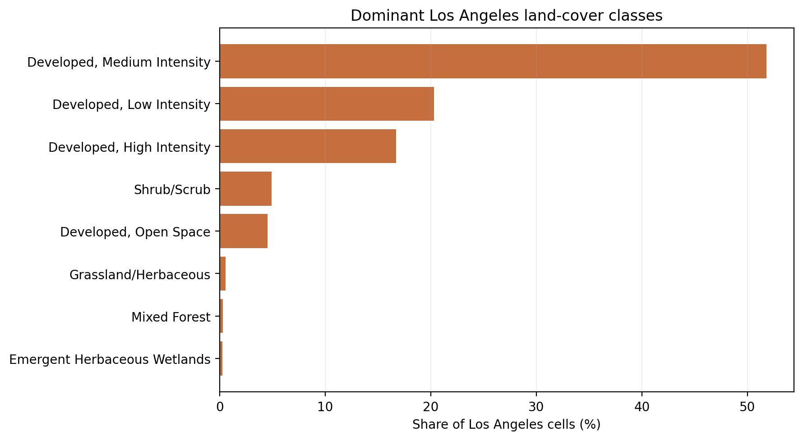
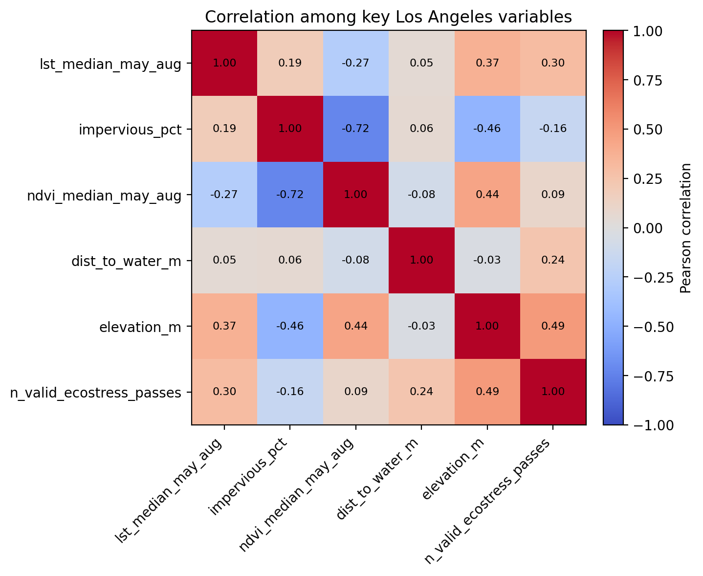
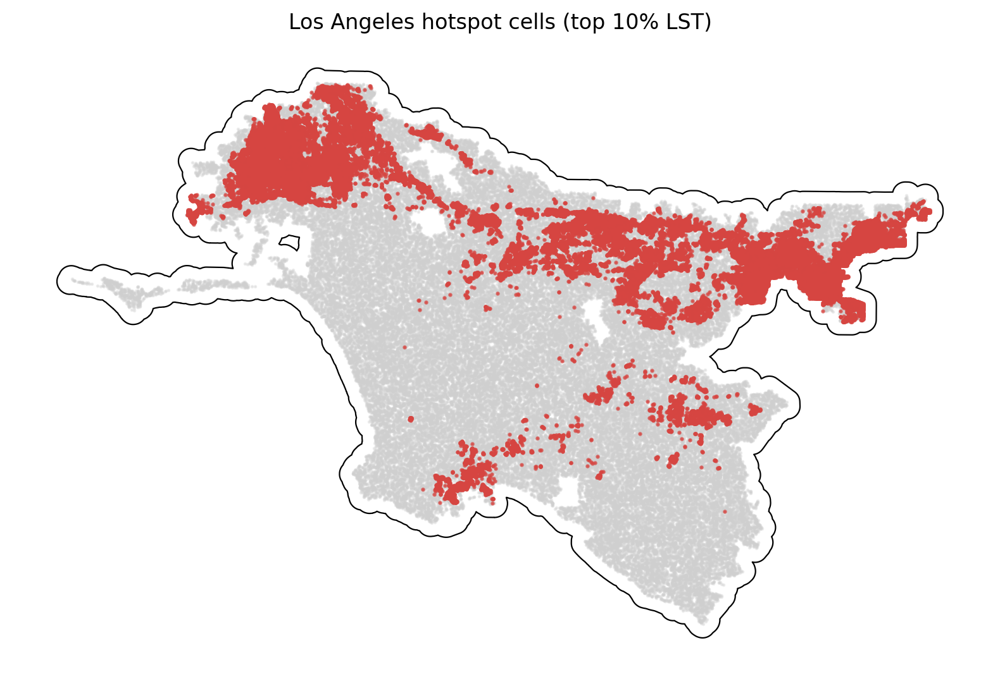

# Los Angeles Summary of Data

The Los Angeles summary uses `data_processed\city_features\25_los_angeles_ca_features.parquet`, the canonical Los Angeles-only analysis-ready feature table. Each observation represents one filtered 30 m grid cell inside the buffered Los Angeles study area, with built-form, vegetation, elevation, hydrologic proximity, and warm-season surface-temperature attributes aligned to the same cell geometry. The table is intended for downstream urban heat modeling in a mild_cool city, including both continuous LST analysis and binary hotspot prediction.

## Overview

| metric | value |
| --- | --- |
| Primary Los Angeles analysis file | data_processed\city_features\25_los_angeles_ca_features.parquet |
| Dataset choice rationale | Canonical per-city filtered output intended for downstream modeling. |
| Observations | 4736063 |
| Variables | 16 |
| Unit of analysis | One filtered 30 m grid cell in the buffered Los Angeles study area |
| Geometry / CRS | Cell polygons stored in EPSG:32611; centroids stored as WGS84 lon/lat |
| Projected spatial extent | [323190, 3714120, 458970, 3800130] |
| Study-area buffer | 2,000 m around the Census urban area |

## Key Variables

| variable_name | meaning | type_unit | why_it_matters |
| --- | --- | --- | --- |
| lst_median_may_aug | Median daytime land surface temperature across May-Aug ECOSTRESS observations. | continuous; ECOSTRESS LST units from source raster | Primary heat outcome for regression, classification, and hotspot analysis. |
| hotspot_10pct | Indicator for cells at or above the city-specific 90th percentile of LST. | binary flag | Natural target for hotspot classification and spatial risk mapping. |
| impervious_pct | NLCD impervious surface share for the 30 m cell. | continuous; percent | Core urban form exposure tied to heat retention and built intensity. |
| ndvi_median_may_aug | Median warm-season greenness index from Landsat/AppEEARS NDVI layers. | continuous; NDVI index | Vegetation is a likely protective predictor against elevated surface temperatures. |
| dist_to_water_m | Distance from the cell to the nearest mapped hydro feature. | continuous; meters | Captures proximity to possible local cooling influences and riparian structure. |
| land_cover_class | NLCD land cover class code for the cell. | categorical; NLCD class | Summarizes surface type and helps separate developed, barren, and vegetated cells. |
| n_valid_ecostress_passes | Count of valid ECOSTRESS observations contributing to the LST median. | count | Important quality-control covariate because low temporal coverage can weaken inference. |

## Targeted Descriptive Results

### Preprocessing audit

| stage | n_rows | share_of_unfiltered_pct |
| --- | --- | --- |
| unfiltered_input_rows | 6,193,535 | 100.00 |
| dropped_open_water_rows | 376,510 | 6.08 |
| dropped_lt3_ecostress_pass_rows | 196 | 0.00 |
| final_filtered_rows | 4,736,063 | 76.47 |

### Key numeric summary

| variable | n_non_missing | missing_pct | mean | median | std | p10 | p90 | skew |
| --- | --- | --- | --- | --- | --- | --- | --- | --- |
| impervious_pct | 4,736,063 | 0.00 | 54.99 | 58.70 | 23.71 | 18.26 | 84.43 | -0.68 |
| ndvi_median_may_aug | 4,717,234 | 0.40 | 0.31 | 0.29 | 0.11 | 0.18 | 0.46 | 0.50 |
| lst_median_may_aug | 4,736,063 | 0.00 | 297.69 | 297.79 | 2.12 | 294.94 | 300.28 | -0.45 |
| dist_to_water_m | 4,736,063 | 0.00 | 212.74 | 120.00 | 279.51 | 30.00 | 510.00 | 2.91 |
| elevation_m | 4,736,063 | 0.00 | 151.77 | 102.17 | 142.34 | 13.40 | 355.67 | 1.09 |
| n_valid_ecostress_passes | 4,736,063 | 0.00 | 32.56 | 32.00 | 2.04 | 30.00 | 35.00 | 0.45 |

### Land-cover composition

| land_cover_class | land_cover_label | n_rows | share_pct |
| --- | --- | --- | --- |
| 23 | Developed, Medium Intensity | 2,454,185 | 51.82 |
| 22 | Developed, Low Intensity | 961,057 | 20.29 |
| 24 | Developed, High Intensity | 792,697 | 16.74 |
| 52 | Shrub/Scrub | 232,864 | 4.92 |
| 21 | Developed, Open Space | 215,338 | 4.55 |
| 71 | Grassland/Herbaceous | 26,258 | 0.55 |
| 43 | Mixed Forest | 14,895 | 0.31 |
| 95 | Emergent Herbaceous Wetlands | 12,593 | 0.27 |

### Missingness for key variables

| variable | missing_n | missing_pct | non_missing_n |
| --- | --- | --- | --- |
| ndvi_median_may_aug | 18,829 | 0.3976 | 4,717,234 |
| dist_to_water_m | 0 | 0.0000 | 4,736,063 |
| elevation_m | 0 | 0.0000 | 4,736,063 |
| hotspot_10pct | 0 | 0.0000 | 4,736,063 |
| impervious_pct | 0 | 0.0000 | 4,736,063 |
| land_cover_class | 0 | 0.0000 | 4,736,063 |
| lst_median_may_aug | 0 | 0.0000 | 4,736,063 |
| n_valid_ecostress_passes | 0 | 0.0000 | 4,736,063 |

### Correlation matrix

| variable | lst_median_may_aug | impervious_pct | ndvi_median_may_aug | dist_to_water_m | elevation_m | n_valid_ecostress_passes |
| --- | --- | --- | --- | --- | --- | --- |
| lst_median_may_aug | 1.00 | 0.19 | -0.27 | 0.05 | 0.37 | 0.30 |
| impervious_pct | 0.19 | 1.00 | -0.72 | 0.06 | -0.46 | -0.16 |
| ndvi_median_may_aug | -0.27 | -0.72 | 1.00 | -0.08 | 0.44 | 0.09 |
| dist_to_water_m | 0.05 | 0.06 | -0.08 | 1.00 | -0.03 | 0.24 |
| elevation_m | 0.37 | -0.46 | 0.44 | -0.03 | 1.00 | 0.49 |
| n_valid_ecostress_passes | 0.30 | -0.16 | 0.09 | 0.24 | 0.49 | 1.00 |

## Figures

## Notable Patterns

- Missingness is limited overall; the highest missing share is `ndvi_median_may_aug` at 0.40%.
- `hotspot_10pct` is intentionally imbalanced at 10.00% positives because it marks the Los Angeles-specific top decile of LST.
- Land cover is concentrated in Developed, Medium Intensity cells, which make up 51.8% of the filtered Los Angeles dataset.
- The strongest linear relationship with LST among the key numeric variables is positive for `elevation_m` (r = 0.37).
- Hotspot prevalence varies by Los Angeles quadrant from 1.3% to 24.4%, which is consistent with non-random spatial concentration.
- `dist_to_water_m` is strongly skewed (skew = 2.91), so transformations or robust summaries may be useful in later modeling.

## Output Notes

- The Los Angeles-only per-city feature parquet was chosen over the merged final dataset when it was available because it is the direct analysis-ready output for this city and already reflects the row-drop rules used by the pipeline.
- Supporting CSV tables and PNG figures for this summary were generated deterministically by the companion CLI.
- City markdown and tables live under `outputs/data_processing/city_summaries/`, batch summary tables live under `outputs/data_processing/batch_reports/`, and figures live under `figures/data_processing/city_summaries/`.
- `outputs/modeling/` and `figures/modeling/` remain reserved for ML/evaluation artifacts.
