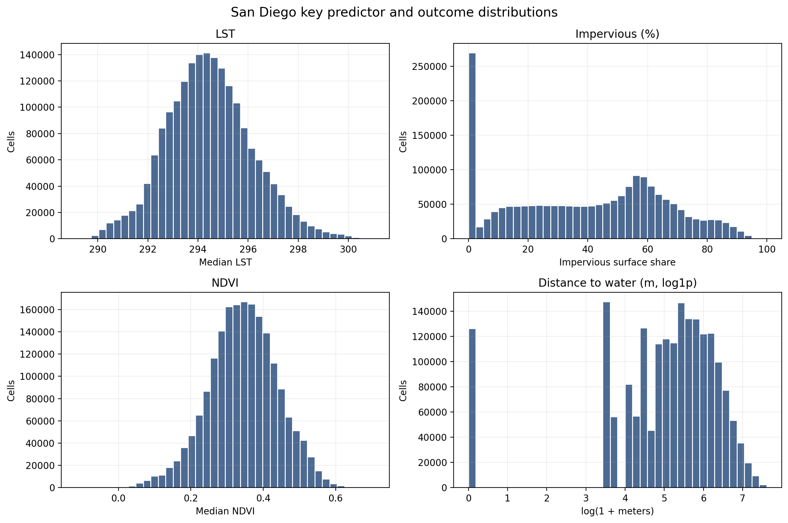
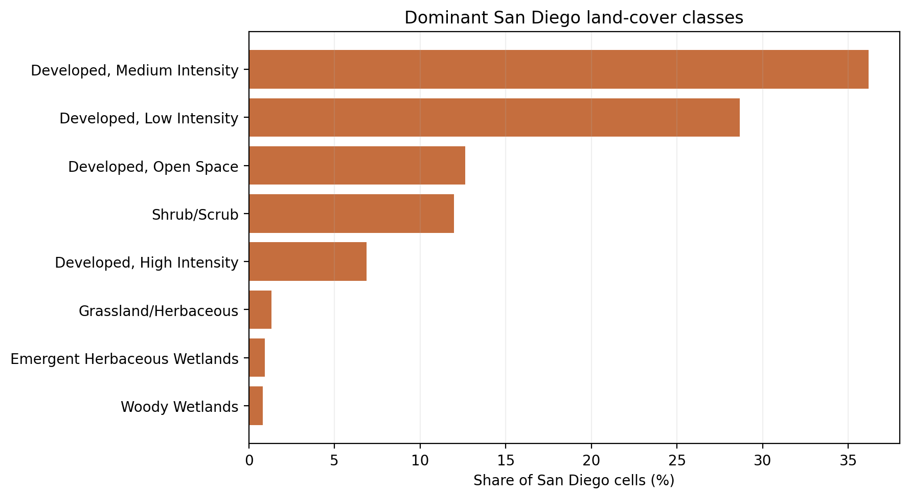
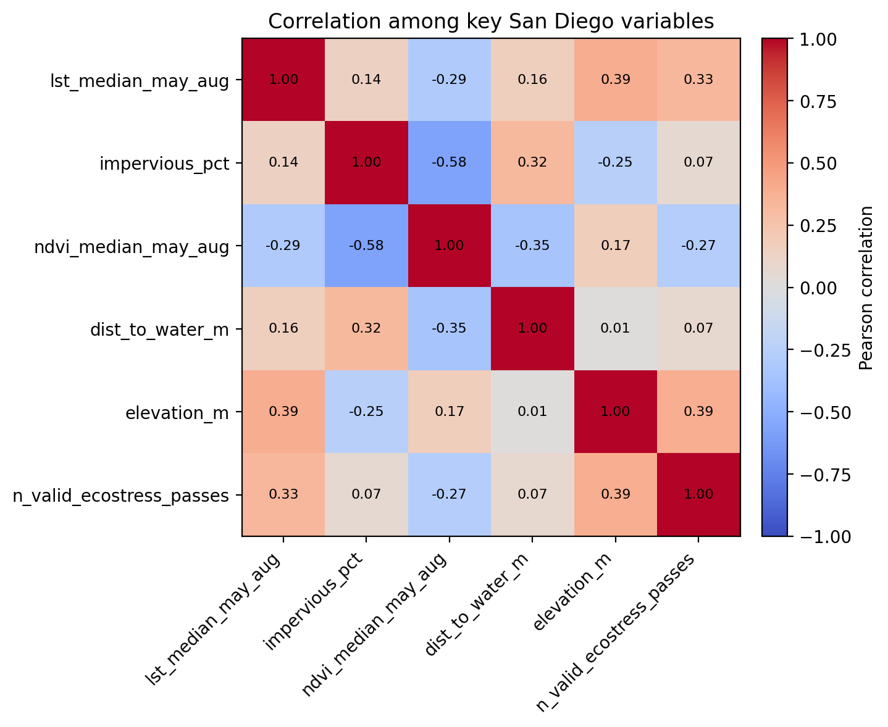
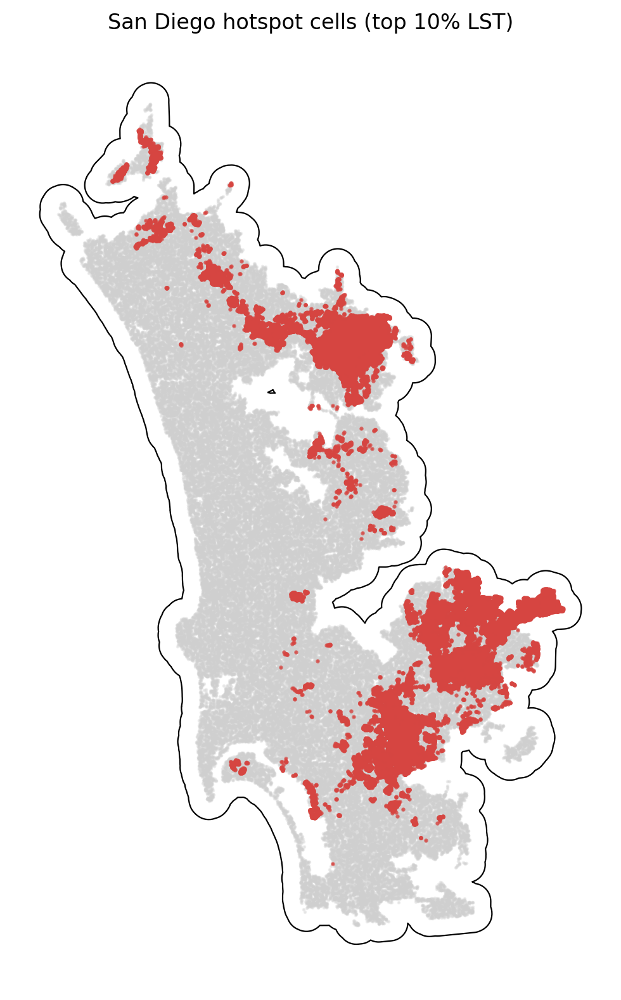

# San Diego Summary of Data

The San Diego summary uses `data_processed\city_features\26_san_diego_ca_features.parquet`, the canonical San Diego-only analysis-ready feature table. Each observation represents one filtered 30 m grid cell inside the buffered San Diego study area, with built-form, vegetation, elevation, hydrologic proximity, and warm-season surface-temperature attributes aligned to the same cell geometry. The table is intended for downstream urban heat modeling in a mild_cool city, including both continuous LST analysis and binary hotspot prediction.

## Overview

| metric | value |
| --- | --- |
| Primary San Diego analysis file | data_processed\city_features\26_san_diego_ca_features.parquet |
| Dataset choice rationale | Canonical per-city filtered output intended for downstream modeling. |
| Observations | 1948679 |
| Variables | 16 |
| Unit of analysis | One filtered 30 m grid cell in the buffered San Diego study area |
| Geometry / CRS | Cell polygons stored in EPSG:32611; centroids stored as WGS84 lon/lat |
| Projected spatial extent | [460350, 3600210, 516900, 3692520] |
| Study-area buffer | 2,000 m around the Census urban area |

## Key Variables

| variable_name | meaning | type_unit | why_it_matters |
| --- | --- | --- | --- |
| lst_median_may_aug | Median daytime land surface temperature across May-Aug ECOSTRESS observations. | continuous; ECOSTRESS LST units from source raster | Primary heat outcome for regression, classification, and hotspot analysis. |
| hotspot_10pct | Indicator for cells at or above the city-specific 90th percentile of LST. | binary flag | Natural target for hotspot classification and spatial risk mapping. |
| impervious_pct | NLCD impervious surface share for the 30 m cell. | continuous; percent | Core urban form exposure tied to heat retention and built intensity. |
| ndvi_median_may_aug | Median warm-season greenness index from Landsat/AppEEARS NDVI layers. | continuous; NDVI index | Vegetation is a likely protective predictor against elevated surface temperatures. |
| dist_to_water_m | Distance from the cell to the nearest mapped hydro feature. | continuous; meters | Captures proximity to possible local cooling influences and riparian structure. |
| land_cover_class | NLCD land cover class code for the cell. | categorical; NLCD class | Summarizes surface type and helps separate developed, barren, and vegetated cells. |
| n_valid_ecostress_passes | Count of valid ECOSTRESS observations contributing to the LST median. | count | Important quality-control covariate because low temporal coverage can weaken inference. |

## Targeted Descriptive Results

### Preprocessing audit

| stage | n_rows | share_of_unfiltered_pct |
| --- | --- | --- |
| unfiltered_input_rows | 3,067,570 | 100.00 |
| dropped_open_water_rows | 290,004 | 9.45 |
| dropped_lt3_ecostress_pass_rows | 464 | 0.02 |
| final_filtered_rows | 1,948,679 | 63.53 |

### Key numeric summary

| variable | n_non_missing | missing_pct | mean | median | std | p10 | p90 | skew |
| --- | --- | --- | --- | --- | --- | --- | --- | --- |
| impervious_pct | 1,948,679 | 0.00 | 39.88 | 42.49 | 26.14 | 0.00 | 73.15 | -0.05 |
| ndvi_median_may_aug | 1,937,765 | 0.56 | 0.34 | 0.35 | 0.10 | 0.22 | 0.47 | -0.14 |
| lst_median_may_aug | 1,948,679 | 0.00 | 294.45 | 294.38 | 1.72 | 292.35 | 296.70 | 0.23 |
| dist_to_water_m | 1,948,679 | 0.00 | 282.23 | 201.25 | 277.32 | 30.00 | 657.95 | 1.72 |
| elevation_m | 1,948,679 | 0.00 | 120.54 | 113.46 | 82.18 | 16.94 | 224.51 | 0.84 |
| n_valid_ecostress_passes | 1,948,679 | 0.00 | 33.51 | 34.00 | 2.21 | 31.00 | 36.00 | -0.34 |

### Land-cover composition

| land_cover_class | land_cover_label | n_rows | share_pct |
| --- | --- | --- | --- |
| 23 | Developed, Medium Intensity | 705,453 | 36.20 |
| 22 | Developed, Low Intensity | 558,789 | 28.68 |
| 21 | Developed, Open Space | 246,547 | 12.65 |
| 52 | Shrub/Scrub | 233,370 | 11.98 |
| 24 | Developed, High Intensity | 134,100 | 6.88 |
| 71 | Grassland/Herbaceous | 26,046 | 1.34 |
| 95 | Emergent Herbaceous Wetlands | 18,352 | 0.94 |
| 90 | Woody Wetlands | 16,087 | 0.83 |

### Missingness for key variables

| variable | missing_n | missing_pct | non_missing_n |
| --- | --- | --- | --- |
| ndvi_median_may_aug | 10,914 | 0.5601 | 1,937,765 |
| dist_to_water_m | 0 | 0.0000 | 1,948,679 |
| elevation_m | 0 | 0.0000 | 1,948,679 |
| hotspot_10pct | 0 | 0.0000 | 1,948,679 |
| impervious_pct | 0 | 0.0000 | 1,948,679 |
| land_cover_class | 0 | 0.0000 | 1,948,679 |
| lst_median_may_aug | 0 | 0.0000 | 1,948,679 |
| n_valid_ecostress_passes | 0 | 0.0000 | 1,948,679 |

### Correlation matrix

| variable | lst_median_may_aug | impervious_pct | ndvi_median_may_aug | dist_to_water_m | elevation_m | n_valid_ecostress_passes |
| --- | --- | --- | --- | --- | --- | --- |
| lst_median_may_aug | 1.00 | 0.14 | -0.29 | 0.16 | 0.39 | 0.33 |
| impervious_pct | 0.14 | 1.00 | -0.58 | 0.32 | -0.25 | 0.07 |
| ndvi_median_may_aug | -0.29 | -0.58 | 1.00 | -0.35 | 0.17 | -0.27 |
| dist_to_water_m | 0.16 | 0.32 | -0.35 | 1.00 | 0.01 | 0.07 |
| elevation_m | 0.39 | -0.25 | 0.17 | 0.01 | 1.00 | 0.39 |
| n_valid_ecostress_passes | 0.33 | 0.07 | -0.27 | 0.07 | 0.39 | 1.00 |

## Figures

## Notable Patterns

- Missingness is limited overall; the highest missing share is `ndvi_median_may_aug` at 0.56%.
- `hotspot_10pct` is intentionally imbalanced at 10.00% positives because it marks the San Diego-specific top decile of LST.
- Land cover is concentrated in Developed, Medium Intensity cells, which make up 36.2% of the filtered San Diego dataset.
- The strongest linear relationship with LST among the key numeric variables is positive for `elevation_m` (r = 0.39).
- Hotspot prevalence varies by San Diego quadrant from 0.5% to 18.9%, which is consistent with non-random spatial concentration.
- `dist_to_water_m` is strongly skewed (skew = 1.72), so transformations or robust summaries may be useful in later modeling.

## Output Notes

- The San Diego-only per-city feature parquet was chosen over the merged final dataset when it was available because it is the direct analysis-ready output for this city and already reflects the row-drop rules used by the pipeline.
- Supporting CSV tables and PNG figures for this summary were generated deterministically by the companion CLI.
- City markdown and tables live under `outputs/data_processing/city_summaries/`, batch summary tables live under `outputs/data_processing/batch_reports/`, and figures live under `figures/data_processing/city_summaries/`.
- `outputs/modeling/` and `figures/modeling/` remain reserved for ML/evaluation artifacts.
