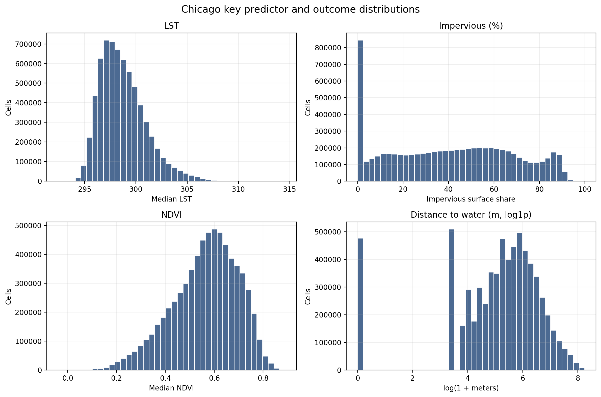
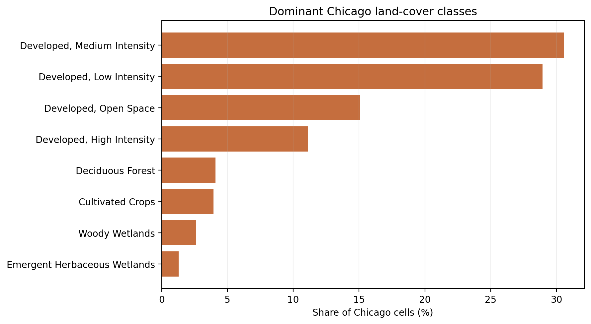
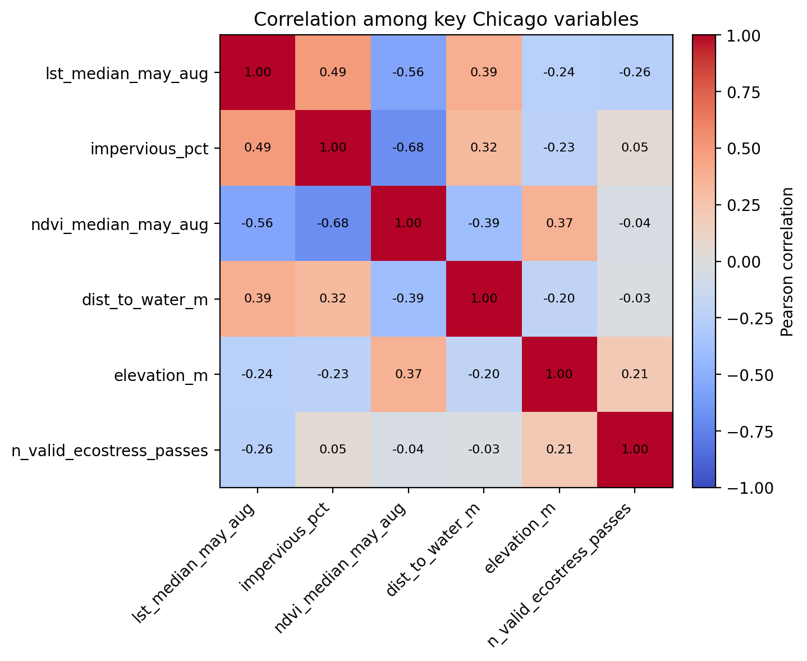
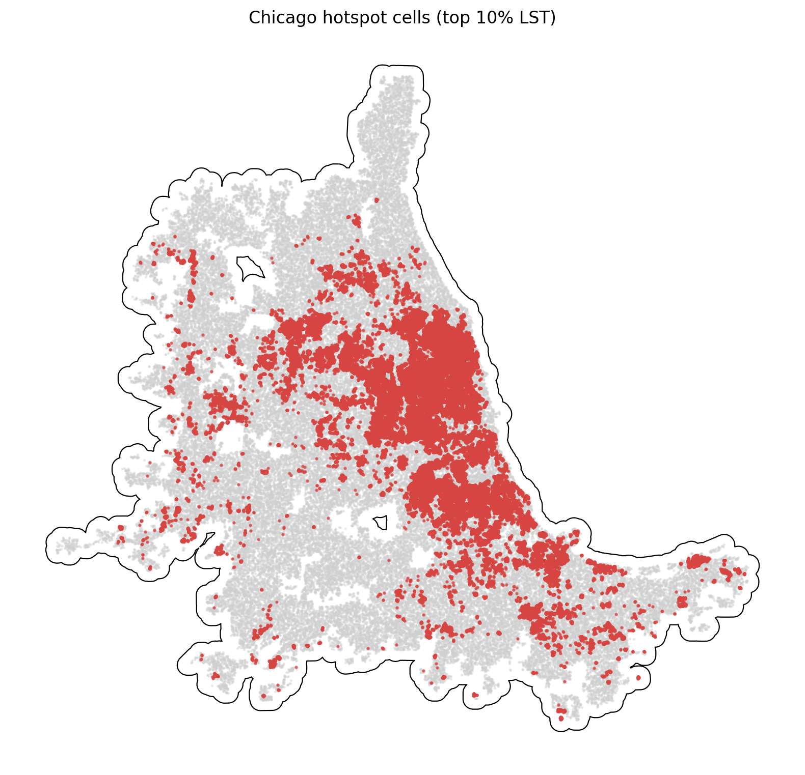

# Chicago Summary of Data

The Chicago summary uses `data_processed\city_features\27_chicago_il_features.parquet`, the canonical Chicago-only analysis-ready feature table. Each observation represents one filtered 30 m grid cell inside the buffered Chicago study area, with built-form, vegetation, elevation, hydrologic proximity, and warm-season surface-temperature attributes aligned to the same cell geometry. The table is intended for downstream urban heat modeling in a mild_cool city, including both continuous LST analysis and binary hotspot prediction.

## Overview

| metric | value |
| --- | --- |
| Primary Chicago analysis file | data_processed\city_features\27_chicago_il_features.parquet |
| Dataset choice rationale | Canonical per-city filtered output intended for downstream modeling. |
| Observations | 6722963 |
| Variables | 16 |
| Unit of analysis | One filtered 30 m grid cell in the buffered Chicago study area |
| Geometry / CRS | Cell polygons stored in EPSG:32616; centroids stored as WGS84 lon/lat |
| Projected spatial extent | [362340, 4577190, 499230, 4704990] |
| Study-area buffer | 2,000 m around the Census urban area |

## Key Variables

| variable_name | meaning | type_unit | why_it_matters |
| --- | --- | --- | --- |
| lst_median_may_aug | Median daytime land surface temperature across May-Aug ECOSTRESS observations. | continuous; ECOSTRESS LST units from source raster | Primary heat outcome for regression, classification, and hotspot analysis. |
| hotspot_10pct | Indicator for cells at or above the city-specific 90th percentile of LST. | binary flag | Natural target for hotspot classification and spatial risk mapping. |
| impervious_pct | NLCD impervious surface share for the 30 m cell. | continuous; percent | Core urban form exposure tied to heat retention and built intensity. |
| ndvi_median_may_aug | Median warm-season greenness index from Landsat/AppEEARS NDVI layers. | continuous; NDVI index | Vegetation is a likely protective predictor against elevated surface temperatures. |
| dist_to_water_m | Distance from the cell to the nearest mapped hydro feature. | continuous; meters | Captures proximity to possible local cooling influences and riparian structure. |
| land_cover_class | NLCD land cover class code for the cell. | categorical; NLCD class | Summarizes surface type and helps separate developed, barren, and vegetated cells. |
| n_valid_ecostress_passes | Count of valid ECOSTRESS observations contributing to the LST median. | count | Important quality-control covariate because low temporal coverage can weaken inference. |

## Targeted Descriptive Results

### Preprocessing audit

| stage | n_rows | share_of_unfiltered_pct |
| --- | --- | --- |
| unfiltered_input_rows | 9,440,662 | 100.00 |
| dropped_open_water_rows | 484,009 | 5.13 |
| dropped_lt3_ecostress_pass_rows | 588 | 0.01 |
| final_filtered_rows | 6,722,963 | 71.21 |

### Key numeric summary

| variable | n_non_missing | missing_pct | mean | median | std | p10 | p90 | skew |
| --- | --- | --- | --- | --- | --- | --- | --- | --- |
| impervious_pct | 6,722,963 | 0.00 | 40.66 | 41.22 | 27.41 | 0.00 | 79.66 | 0.06 |
| ndvi_median_may_aug | 6,722,963 | 0.00 | 0.56 | 0.58 | 0.13 | 0.37 | 0.73 | -0.52 |
| lst_median_may_aug | 6,722,963 | 0.00 | 298.73 | 298.38 | 2.26 | 296.18 | 301.73 | 0.90 |
| dist_to_water_m | 6,722,963 | 0.00 | 364.50 | 216.33 | 444.98 | 30.00 | 870.00 | 2.63 |
| elevation_m | 6,722,963 | 0.00 | 209.14 | 205.43 | 24.34 | 181.88 | 243.24 | 0.79 |
| n_valid_ecostress_passes | 6,722,963 | 0.00 | 24.77 | 25.00 | 2.82 | 21.00 | 29.00 | 0.33 |

### Land-cover composition

| land_cover_class | land_cover_label | n_rows | share_pct |
| --- | --- | --- | --- |
| 23 | Developed, Medium Intensity | 2,056,029 | 30.58 |
| 22 | Developed, Low Intensity | 1,944,849 | 28.93 |
| 21 | Developed, Open Space | 1,012,546 | 15.06 |
| 24 | Developed, High Intensity | 748,745 | 11.14 |
| 41 | Deciduous Forest | 276,081 | 4.11 |
| 82 | Cultivated Crops | 264,755 | 3.94 |
| 90 | Woody Wetlands | 176,851 | 2.63 |
| 95 | Emergent Herbaceous Wetlands | 87,070 | 1.30 |

### Missingness for key variables

| variable | missing_n | missing_pct | non_missing_n |
| --- | --- | --- | --- |
| dist_to_water_m | 0 | 0.0000 | 6,722,963 |
| elevation_m | 0 | 0.0000 | 6,722,963 |
| hotspot_10pct | 0 | 0.0000 | 6,722,963 |
| impervious_pct | 0 | 0.0000 | 6,722,963 |
| land_cover_class | 0 | 0.0000 | 6,722,963 |
| lst_median_may_aug | 0 | 0.0000 | 6,722,963 |
| n_valid_ecostress_passes | 0 | 0.0000 | 6,722,963 |
| ndvi_median_may_aug | 0 | 0.0000 | 6,722,963 |

### Correlation matrix

| variable | lst_median_may_aug | impervious_pct | ndvi_median_may_aug | dist_to_water_m | elevation_m | n_valid_ecostress_passes |
| --- | --- | --- | --- | --- | --- | --- |
| lst_median_may_aug | 1.00 | 0.49 | -0.56 | 0.39 | -0.24 | -0.26 |
| impervious_pct | 0.49 | 1.00 | -0.68 | 0.32 | -0.23 | 0.05 |
| ndvi_median_may_aug | -0.56 | -0.68 | 1.00 | -0.39 | 0.37 | -0.04 |
| dist_to_water_m | 0.39 | 0.32 | -0.39 | 1.00 | -0.20 | -0.03 |
| elevation_m | -0.24 | -0.23 | 0.37 | -0.20 | 1.00 | 0.21 |
| n_valid_ecostress_passes | -0.26 | 0.05 | -0.04 | -0.03 | 0.21 | 1.00 |

## Figures

## Notable Patterns

- None of the key modeling variables have missing values in the filtered Chicago table.
- `hotspot_10pct` is intentionally imbalanced at 10.00% positives because it marks the Chicago-specific top decile of LST.
- Land cover is concentrated in Developed, Medium Intensity cells, which make up 30.6% of the filtered Chicago dataset.
- The strongest linear relationship with LST among the key numeric variables is negative for `ndvi_median_may_aug` (r = -0.56).
- Hotspot prevalence varies by Chicago quadrant from 0.9% to 26.2%, which is consistent with non-random spatial concentration.
- `dist_to_water_m` is strongly skewed (skew = 2.63), so transformations or robust summaries may be useful in later modeling.

## Output Notes

- The Chicago-only per-city feature parquet was chosen over the merged final dataset when it was available because it is the direct analysis-ready output for this city and already reflects the row-drop rules used by the pipeline.
- Supporting CSV tables and PNG figures for this summary were generated deterministically by the companion CLI.
- City markdown and tables live under `outputs/data_processing/city_summaries/`, batch summary tables live under `outputs/data_processing/batch_reports/`, and figures live under `figures/data_processing/city_summaries/`.
- `outputs/modeling/` and `figures/modeling/` remain reserved for ML/evaluation artifacts.
