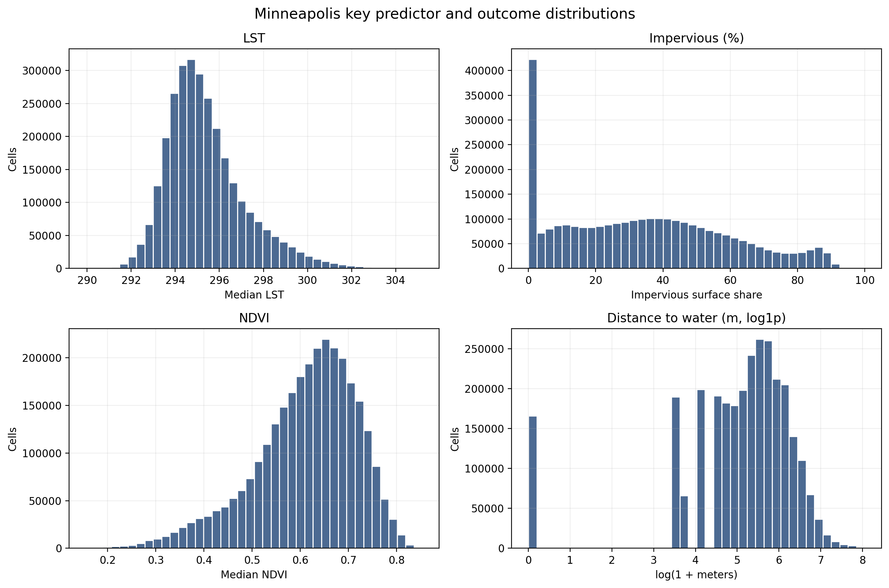
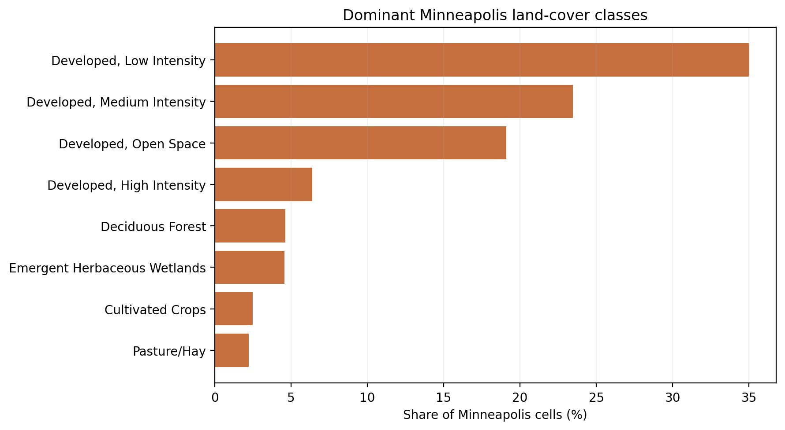
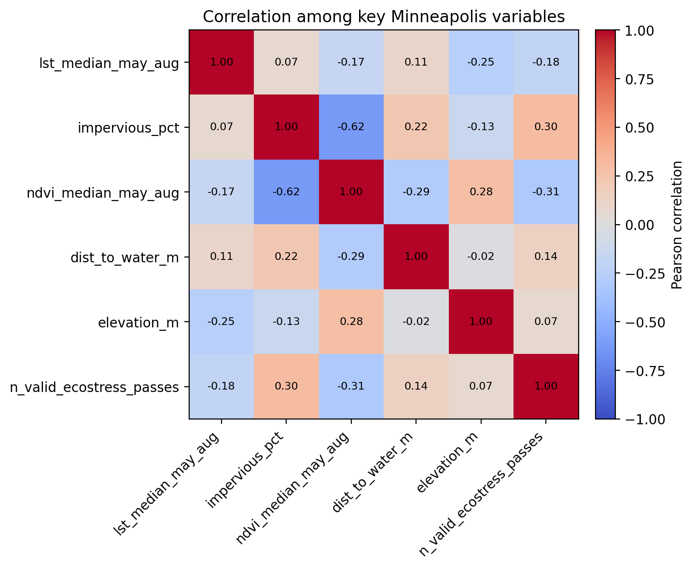
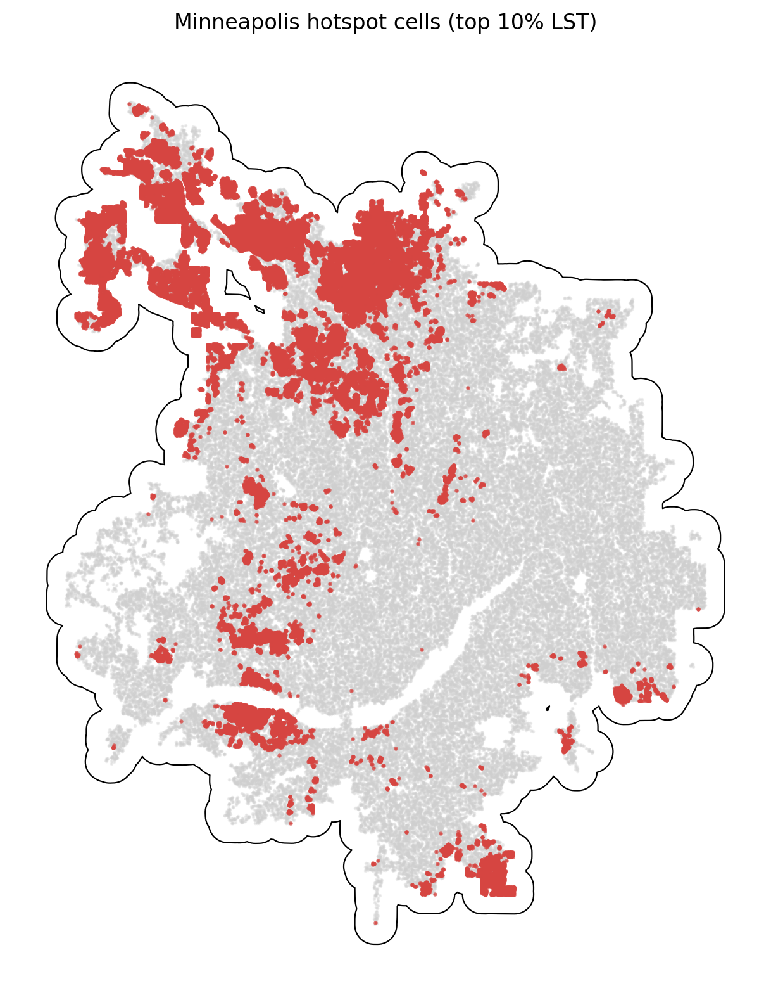

# Minneapolis Summary of Data

The Minneapolis summary uses `data_processed\city_features\28_minneapolis_mn_features.parquet`, the canonical Minneapolis-only analysis-ready feature table. Each observation represents one filtered 30 m grid cell inside the buffered Minneapolis study area, with built-form, vegetation, elevation, hydrologic proximity, and warm-season surface-temperature attributes aligned to the same cell geometry. The table is intended for downstream urban heat modeling in a mild_cool city, including both continuous LST analysis and binary hotspot prediction.

## Overview

| metric | value |
| --- | --- |
| Primary Minneapolis analysis file | data_processed\city_features\28_minneapolis_mn_features.parquet |
| Dataset choice rationale | Canonical per-city filtered output intended for downstream modeling. |
| Observations | 2946162 |
| Variables | 16 |
| Unit of analysis | One filtered 30 m grid cell in the buffered Minneapolis study area |
| Geometry / CRS | Cell polygons stored in EPSG:32615; centroids stored as WGS84 lon/lat |
| Projected spatial extent | [444180, 4937970, 510870, 5023650] |
| Study-area buffer | 2,000 m around the Census urban area |

## Key Variables

| variable_name | meaning | type_unit | why_it_matters |
| --- | --- | --- | --- |
| lst_median_may_aug | Median daytime land surface temperature across May-Aug ECOSTRESS observations. | continuous; ECOSTRESS LST units from source raster | Primary heat outcome for regression, classification, and hotspot analysis. |
| hotspot_10pct | Indicator for cells at or above the city-specific 90th percentile of LST. | binary flag | Natural target for hotspot classification and spatial risk mapping. |
| impervious_pct | NLCD impervious surface share for the 30 m cell. | continuous; percent | Core urban form exposure tied to heat retention and built intensity. |
| ndvi_median_may_aug | Median warm-season greenness index from Landsat/AppEEARS NDVI layers. | continuous; NDVI index | Vegetation is a likely protective predictor against elevated surface temperatures. |
| dist_to_water_m | Distance from the cell to the nearest mapped hydro feature. | continuous; meters | Captures proximity to possible local cooling influences and riparian structure. |
| land_cover_class | NLCD land cover class code for the cell. | categorical; NLCD class | Summarizes surface type and helps separate developed, barren, and vegetated cells. |
| n_valid_ecostress_passes | Count of valid ECOSTRESS observations contributing to the LST median. | count | Important quality-control covariate because low temporal coverage can weaken inference. |

## Targeted Descriptive Results

### Preprocessing audit

| stage | n_rows | share_of_unfiltered_pct |
| --- | --- | --- |
| unfiltered_input_rows | 4,523,004 | 100.00 |
| dropped_open_water_rows | 297,258 | 6.57 |
| dropped_lt3_ecostress_pass_rows | 279 | 0.01 |
| final_filtered_rows | 2,946,162 | 65.14 |

### Key numeric summary

| variable | n_non_missing | missing_pct | mean | median | std | p10 | p90 | skew |
| --- | --- | --- | --- | --- | --- | --- | --- | --- |
| impervious_pct | 2,946,162 | 0.00 | 34.11 | 32.89 | 25.07 | 0.00 | 69.76 | 0.34 |
| ndvi_median_may_aug | 2,946,162 | 0.00 | 0.61 | 0.63 | 0.11 | 0.46 | 0.73 | -0.79 |
| lst_median_may_aug | 2,946,162 | 0.00 | 295.39 | 295.07 | 1.78 | 293.47 | 297.86 | 0.99 |
| dist_to_water_m | 2,946,162 | 0.00 | 271.81 | 210.00 | 265.40 | 30.00 | 582.49 | 2.62 |
| elevation_m | 2,946,162 | 0.00 | 276.69 | 276.24 | 19.73 | 253.45 | 301.67 | -0.28 |
| n_valid_ecostress_passes | 2,946,162 | 0.00 | 25.55 | 26.00 | 2.76 | 22.00 | 29.00 | -0.15 |

### Land-cover composition

| land_cover_class | land_cover_label | n_rows | share_pct |
| --- | --- | --- | --- |
| 22 | Developed, Low Intensity | 1,032,065 | 35.03 |
| 23 | Developed, Medium Intensity | 691,514 | 23.47 |
| 21 | Developed, Open Space | 562,510 | 19.09 |
| 24 | Developed, High Intensity | 188,176 | 6.39 |
| 41 | Deciduous Forest | 136,504 | 4.63 |
| 95 | Emergent Herbaceous Wetlands | 134,818 | 4.58 |
| 82 | Cultivated Crops | 73,645 | 2.50 |
| 81 | Pasture/Hay | 65,652 | 2.23 |

### Missingness for key variables

| variable | missing_n | missing_pct | non_missing_n |
| --- | --- | --- | --- |
| dist_to_water_m | 0 | 0.0000 | 2,946,162 |
| elevation_m | 0 | 0.0000 | 2,946,162 |
| hotspot_10pct | 0 | 0.0000 | 2,946,162 |
| impervious_pct | 0 | 0.0000 | 2,946,162 |
| land_cover_class | 0 | 0.0000 | 2,946,162 |
| lst_median_may_aug | 0 | 0.0000 | 2,946,162 |
| n_valid_ecostress_passes | 0 | 0.0000 | 2,946,162 |
| ndvi_median_may_aug | 0 | 0.0000 | 2,946,162 |

### Correlation matrix

| variable | lst_median_may_aug | impervious_pct | ndvi_median_may_aug | dist_to_water_m | elevation_m | n_valid_ecostress_passes |
| --- | --- | --- | --- | --- | --- | --- |
| lst_median_may_aug | 1.00 | 0.07 | -0.17 | 0.11 | -0.25 | -0.18 |
| impervious_pct | 0.07 | 1.00 | -0.62 | 0.22 | -0.13 | 0.30 |
| ndvi_median_may_aug | -0.17 | -0.62 | 1.00 | -0.29 | 0.28 | -0.31 |
| dist_to_water_m | 0.11 | 0.22 | -0.29 | 1.00 | -0.02 | 0.14 |
| elevation_m | -0.25 | -0.13 | 0.28 | -0.02 | 1.00 | 0.07 |
| n_valid_ecostress_passes | -0.18 | 0.30 | -0.31 | 0.14 | 0.07 | 1.00 |

## Figures

## Notable Patterns

- None of the key modeling variables have missing values in the filtered Minneapolis table.
- `hotspot_10pct` is intentionally imbalanced at 10.00% positives because it marks the Minneapolis-specific top decile of LST.
- Land cover is concentrated in Developed, Low Intensity cells, which make up 35.0% of the filtered Minneapolis dataset.
- The strongest linear relationship with LST among the key numeric variables is negative for `elevation_m` (r = -0.25).
- Hotspot prevalence varies by Minneapolis quadrant from 1.9% to 28.4%, which is consistent with non-random spatial concentration.
- `dist_to_water_m` is strongly skewed (skew = 2.62), so transformations or robust summaries may be useful in later modeling.

## Output Notes

- The Minneapolis-only per-city feature parquet was chosen over the merged final dataset when it was available because it is the direct analysis-ready output for this city and already reflects the row-drop rules used by the pipeline.
- Supporting CSV tables and PNG figures for this summary were generated deterministically by the companion CLI.
- City markdown and tables live under `outputs/data_processing/city_summaries/`, batch summary tables live under `outputs/data_processing/batch_reports/`, and figures live under `figures/data_processing/city_summaries/`.
- `outputs/modeling/` and `figures/modeling/` remain reserved for ML/evaluation artifacts.
