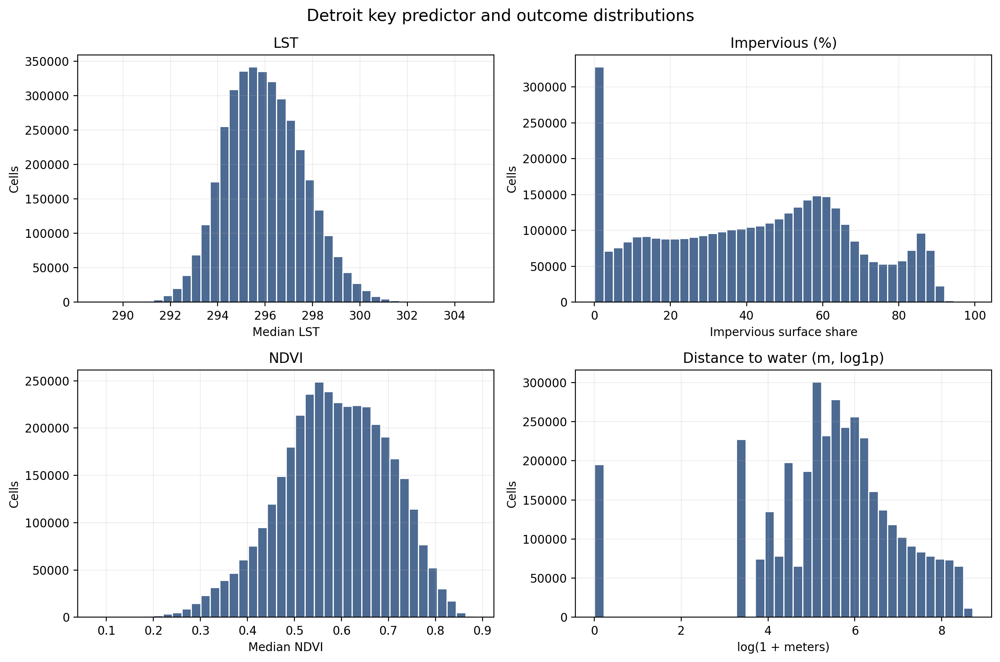
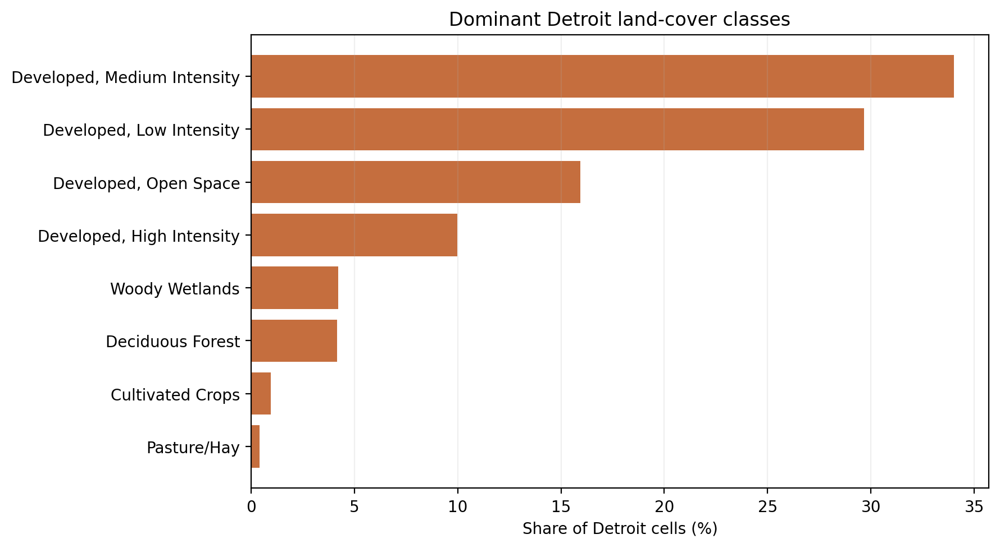
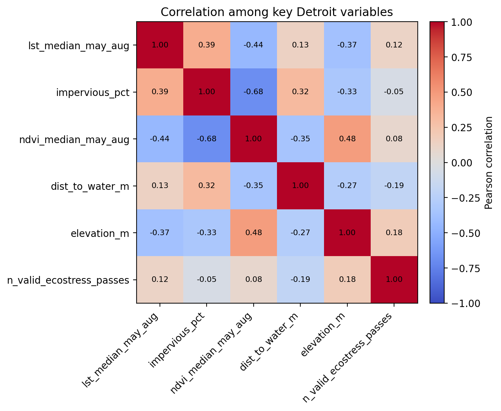
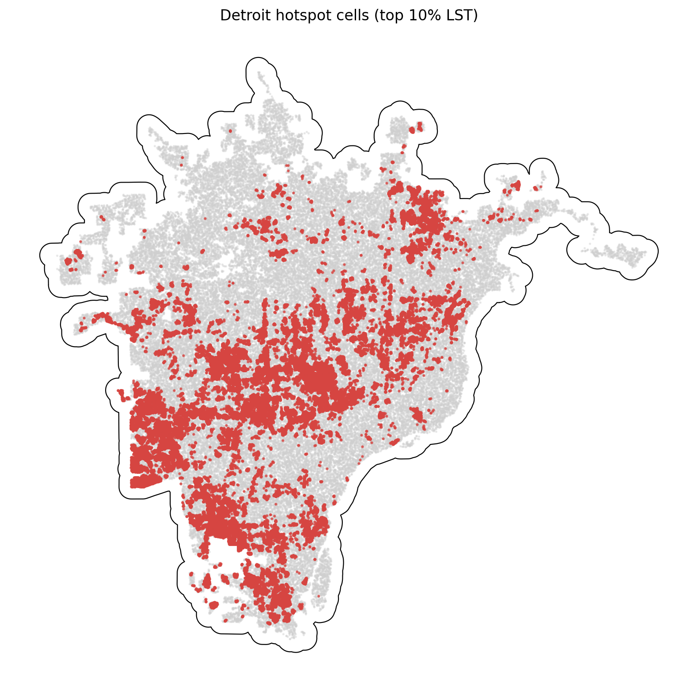

# Detroit Summary of Data

The Detroit summary uses `data_processed\city_features\29_detroit_mi_features.parquet`, the canonical Detroit-only analysis-ready feature table. Each observation represents one filtered 30 m grid cell inside the buffered Detroit study area, with built-form, vegetation, elevation, hydrologic proximity, and warm-season surface-temperature attributes aligned to the same cell geometry. The table is intended for downstream urban heat modeling in a mild_cool city, including both continuous LST analysis and binary hotspot prediction.

## Overview

| metric | value |
| --- | --- |
| Primary Detroit analysis file | data_processed\city_features\29_detroit_mi_features.parquet |
| Dataset choice rationale | Canonical per-city filtered output intended for downstream modeling. |
| Observations | 3702849 |
| Variables | 16 |
| Unit of analysis | One filtered 30 m grid cell in the buffered Detroit study area |
| Geometry / CRS | Cell polygons stored in EPSG:32617; centroids stored as WGS84 lon/lat |
| Projected spatial extent | [277050, 4656690, 375690, 4751310] |
| Study-area buffer | 2,000 m around the Census urban area |

## Key Variables

| variable_name | meaning | type_unit | why_it_matters |
| --- | --- | --- | --- |
| lst_median_may_aug | Median daytime land surface temperature across May-Aug ECOSTRESS observations. | continuous; ECOSTRESS LST units from source raster | Primary heat outcome for regression, classification, and hotspot analysis. |
| hotspot_10pct | Indicator for cells at or above the city-specific 90th percentile of LST. | binary flag | Natural target for hotspot classification and spatial risk mapping. |
| impervious_pct | NLCD impervious surface share for the 30 m cell. | continuous; percent | Core urban form exposure tied to heat retention and built intensity. |
| ndvi_median_may_aug | Median warm-season greenness index from Landsat/AppEEARS NDVI layers. | continuous; NDVI index | Vegetation is a likely protective predictor against elevated surface temperatures. |
| dist_to_water_m | Distance from the cell to the nearest mapped hydro feature. | continuous; meters | Captures proximity to possible local cooling influences and riparian structure. |
| land_cover_class | NLCD land cover class code for the cell. | categorical; NLCD class | Summarizes surface type and helps separate developed, barren, and vegetated cells. |
| n_valid_ecostress_passes | Count of valid ECOSTRESS observations contributing to the LST median. | count | Important quality-control covariate because low temporal coverage can weaken inference. |

## Targeted Descriptive Results

### Preprocessing audit

| stage | n_rows | share_of_unfiltered_pct |
| --- | --- | --- |
| unfiltered_input_rows | 5,212,718 | 100.00 |
| dropped_open_water_rows | 343,604 | 6.59 |
| dropped_lt3_ecostress_pass_rows | 405 | 0.01 |
| final_filtered_rows | 3,702,849 | 71.03 |

### Key numeric summary

| variable | n_non_missing | missing_pct | mean | median | std | p10 | p90 | skew |
| --- | --- | --- | --- | --- | --- | --- | --- | --- |
| impervious_pct | 3,702,849 | 0.00 | 41.88 | 43.73 | 25.81 | 4.00 | 77.53 | -0.03 |
| ndvi_median_may_aug | 3,702,849 | 0.00 | 0.58 | 0.59 | 0.12 | 0.43 | 0.73 | -0.28 |
| lst_median_may_aug | 3,702,849 | 0.00 | 295.98 | 295.88 | 1.66 | 293.95 | 298.17 | 0.27 |
| dist_to_water_m | 3,702,849 | 0.00 | 612.58 | 258.07 | 930.30 | 30.00 | 1,722.85 | 2.64 |
| elevation_m | 3,702,849 | 0.00 | 222.81 | 199.61 | 46.20 | 180.22 | 296.05 | 0.83 |
| n_valid_ecostress_passes | 3,702,849 | 0.00 | 27.78 | 23.00 | 10.49 | 17.00 | 43.00 | 0.50 |

### Land-cover composition

| land_cover_class | land_cover_label | n_rows | share_pct |
| --- | --- | --- | --- |
| 23 | Developed, Medium Intensity | 1,259,178 | 34.01 |
| 22 | Developed, Low Intensity | 1,098,790 | 29.67 |
| 21 | Developed, Open Space | 589,655 | 15.92 |
| 24 | Developed, High Intensity | 369,837 | 9.99 |
| 90 | Woody Wetlands | 156,161 | 4.22 |
| 41 | Deciduous Forest | 154,521 | 4.17 |
| 82 | Cultivated Crops | 35,766 | 0.97 |
| 81 | Pasture/Hay | 15,013 | 0.41 |

### Missingness for key variables

| variable | missing_n | missing_pct | non_missing_n |
| --- | --- | --- | --- |
| dist_to_water_m | 0 | 0.0000 | 3,702,849 |
| elevation_m | 0 | 0.0000 | 3,702,849 |
| hotspot_10pct | 0 | 0.0000 | 3,702,849 |
| impervious_pct | 0 | 0.0000 | 3,702,849 |
| land_cover_class | 0 | 0.0000 | 3,702,849 |
| lst_median_may_aug | 0 | 0.0000 | 3,702,849 |
| n_valid_ecostress_passes | 0 | 0.0000 | 3,702,849 |
| ndvi_median_may_aug | 0 | 0.0000 | 3,702,849 |

### Correlation matrix

| variable | lst_median_may_aug | impervious_pct | ndvi_median_may_aug | dist_to_water_m | elevation_m | n_valid_ecostress_passes |
| --- | --- | --- | --- | --- | --- | --- |
| lst_median_may_aug | 1.00 | 0.39 | -0.44 | 0.13 | -0.37 | 0.12 |
| impervious_pct | 0.39 | 1.00 | -0.68 | 0.32 | -0.33 | -0.05 |
| ndvi_median_may_aug | -0.44 | -0.68 | 1.00 | -0.35 | 0.48 | 0.08 |
| dist_to_water_m | 0.13 | 0.32 | -0.35 | 1.00 | -0.27 | -0.19 |
| elevation_m | -0.37 | -0.33 | 0.48 | -0.27 | 1.00 | 0.18 |
| n_valid_ecostress_passes | 0.12 | -0.05 | 0.08 | -0.19 | 0.18 | 1.00 |

## Figures

## Notable Patterns

- None of the key modeling variables have missing values in the filtered Detroit table.
- `hotspot_10pct` is intentionally imbalanced at 10.00% positives because it marks the Detroit-specific top decile of LST.
- Land cover is concentrated in Developed, Medium Intensity cells, which make up 34.0% of the filtered Detroit dataset.
- The strongest linear relationship with LST among the key numeric variables is negative for `ndvi_median_may_aug` (r = -0.44).
- Hotspot prevalence varies by Detroit quadrant from 2.7% to 20.0%, which is consistent with non-random spatial concentration.
- `dist_to_water_m` is strongly skewed (skew = 2.64), so transformations or robust summaries may be useful in later modeling.

## Output Notes

- The Detroit-only per-city feature parquet was chosen over the merged final dataset when it was available because it is the direct analysis-ready output for this city and already reflects the row-drop rules used by the pipeline.
- Supporting CSV tables and PNG figures for this summary were generated deterministically by the companion CLI.
- City markdown and tables live under `outputs/data_processing/city_summaries/`, batch summary tables live under `outputs/data_processing/batch_reports/`, and figures live under `figures/data_processing/city_summaries/`.
- `outputs/modeling/` and `figures/modeling/` remain reserved for ML/evaluation artifacts.
